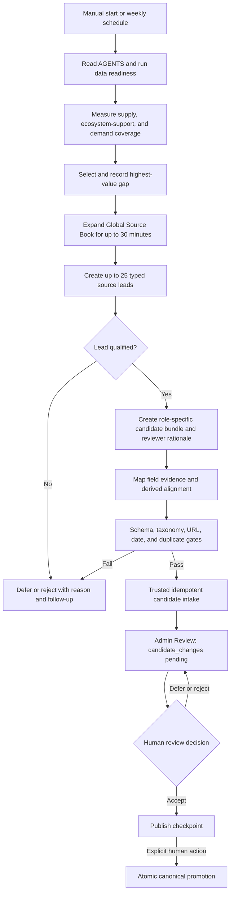
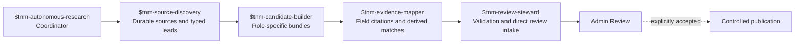
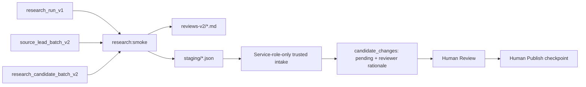
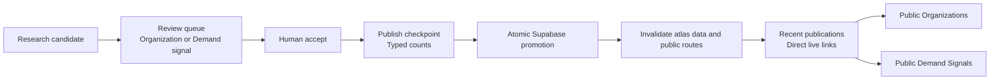

# Autonomous Ecosystem Research Pipeline

Date: 2026-07-18
Status: implemented, live-tested, and review-integrated
Public brand: True North Map
Canonical domain: `https://truenorthmap.ca`

## Outcome

True North Map now has a bounded Codex-native research system that can run manually or on a weekly schedule. It measures coverage, selects one gap, expands durable sources, creates typed source leads, produces role-appropriate private candidates, applies deterministic evidence and duplicate gates, and sends successful candidates directly into the existing private Admin Review workflow.

The system never treats review intake as publication. The public-beta corpus currently contains 35 organizations and 31 technologies or offerings; any expansion requires a human to accept an organization or public-demand candidate in Review and use the explicit Publish checkpoint. `research_runs` is hidden audit metadata, not another queue or approval step. A completed run must place every validated candidate directly into `candidate_changes` with a generated reviewer rationale; file-only artifacts are not a successful terminal state.

## Coordinator flow

## Agent and skill handoff

## Organization and demand model

Organizations and public demand are independent typed records. This prevents a NATO policy page from being mistaken for an organization or a company press release from being treated as government demand.

Supported public-demand issuers include NATO, the Government of Canada, DND, CAF, RCN, RCAF, Canadian Army, PSPC, DRDC, and IDEaS. The migration stores the hierarchy separately from individual demand sources, allowing co-issuers, sponsors, and beneficiaries to be represented without duplicating the source.

## Evidence contracts by organization kind

| Kind | Required review evidence |
| --- | --- |
| Company | At least one concrete cited capability |
| Accelerator | At least one cited program, cohort, or challenge |
| Incubator | At least one cited program, cohort, or incubation offering |
| Investor or funder | Sourced mandate and a public portfolio or funding relationship |
| Research or test centre | Sourced technical mandate |
| Ecosystem organization | Sourced mandate plus a program or relationship |
| Government innovation office | Sourced mandate plus a program or relationship |

## Bounded operation

- One coordinator per run.
- 90 minutes maximum, including 30 minutes maximum for recursive Source Book expansion.
- 25 qualified leads maximum and 10 candidates maximum.
- Canada-first geography, all active Mission Areas eligible.
- Canonical durable HTTPS sources first.
- Stop on unresolved duplicates, taxonomy drift, missing evidence, access failures, or rate limits.
- Resume an interrupted manifest instead of creating a second run for the same work.

## Validation and artifacts

The executable contract is `app/src/lib/research/pipeline-schema.ts`. The orchestrator is `app/scripts/autonomous-research.ts`. Portable JSON contracts live under `research/ingestion/schema/`.

The first test cycle created four review candidates spanning company, accelerator, incubator, and investor contracts. The second selected the uncovered research/test-centre gap and created one additional candidate. A third demand-targeted cycle created the Canadian Army and IDEaS `True North Precision` innovation challenge as a first-class public-demand candidate. All three passed with zero schema, taxonomy, evidence, or duplicate errors. The six candidates were reviewed and explicitly published on July 19: five became public organizations and one became a public demand source with a reviewed requirement.

## Publication visibility contract

Successful publication is a database transaction, not a deployment event. Public organization and demand indexes render dynamically from the invalidatable atlas snapshot so an older full-route render cannot hide newly published records. The publication checkpoint shows separate organization and demand counts before promotion and provides direct public links under `Recent publications` after promotion. A reviewer should never need to redeploy the application to make a successfully published candidate visible.

## Schedule

The production cadence is one local Codex run every Monday at 06:00 America/Halifax. The scheduled prompt invokes `$tnm-autonomous-research`, selects across supply, ecosystem support, and non-NATO or NATO public-demand gaps, uses the repository skills for each handoff, runs the same deterministic validators as a manual cycle, and stops only after every private candidate and generated reviewer rationale enter Admin Review. Failed runs notify the operator; successful runs leave their run manifest, review packet, and staging export in `research/ingestion/` as reproducible audit artifacts.

Manual execution remains available through `pnpm research:prepare`, `pnpm research:validate`, and `pnpm research:smoke`. Scheduling grants only the private candidate-intake write performed by the trusted function. It does not grant authority to accept, publish, or mutate canonical ecosystem records.
