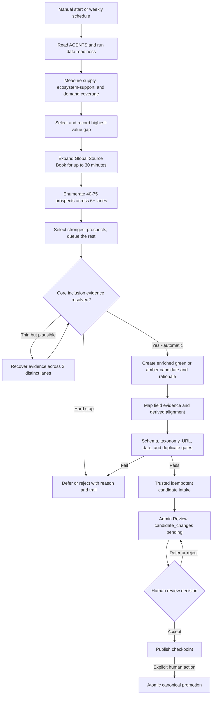
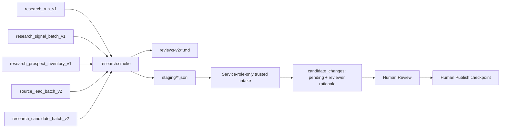
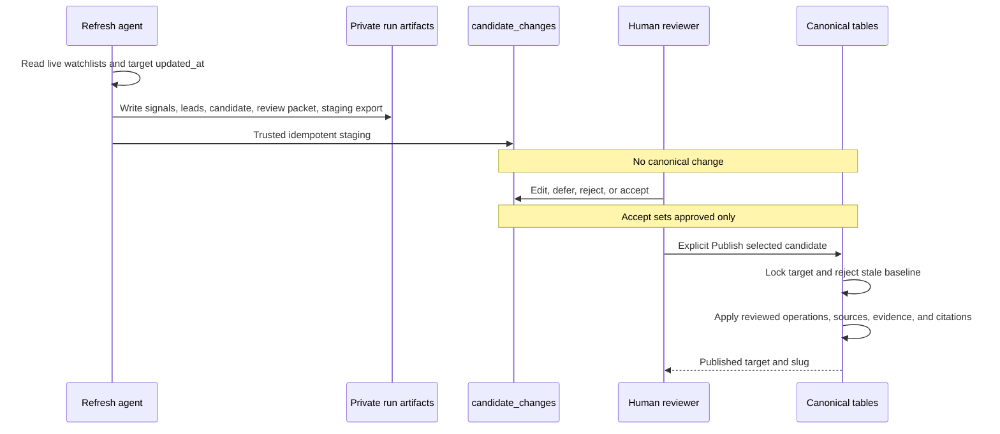
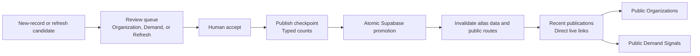

# Autonomous Ecosystem Research Pipeline

Date: 2026-07-23
Status: implemented, live-tested, and review-integrated
Public brand: True North Map
Canonical domain: `https://truenorthmap.ca`

## Outcome

True North Map now has a bounded Codex-native research and signal-refresh system that can run manually, weekly, or on a weekday refresh schedule. It measures saturation rather than zero-count coverage alone, ranks durable sources, builds a broad prospect inventory, monitors material changes across multiple source families, recovers durable evidence, creates typed new-record or refresh leads, produces green or amber private candidates, and sends successful candidates directly into the existing private Admin Review workflow.

The system never treats review intake as publication. Live corpus counts come from the canonical production database rather than this operating document. Any expansion requires a human to review and accept an organization or public-demand candidate in Review and use the explicit Publish checkpoint. `research_runs` is hidden audit metadata, not another queue or approval step. A completed run must place every validated candidate directly into `candidate_changes` with a generated reviewer rationale; file-only artifacts are not a successful terminal state.

One deliberate exception protects deployment order. Before live intake, the importer reads the deployed `/api/system/research-contract` endpoint and confirms end-to-end Review and Publish support for each candidate kind and schema. If support is missing, the run stops safely with validated file-only artifacts rather than creating an unreadable or unpublishable queue item.

## Coordinator flow

## Agent and skill handoff

```mermaid
flowchart LR
  CO["$tnm-autonomous-research\nCoordinator"] --> SR["$tnm-signal-refresh\nWatchlists, atomic signals, entity matching"]
  SR --> SD["$tnm-source-discovery\nProspects, recovery, typed leads"]
  SD --> CB["$tnm-candidate-builder\nGreen or amber bundles"]
  CB --> EM["$tnm-evidence-mapper\nField citations and derived matches"]
  EM --> RS["$tnm-review-steward\nValidation and direct review intake"]
  RS --> HR["Admin Review"]
  HR -. "explicitly accepted" .-> PUB["Controlled publication"]
```

## Organization and demand model

Organizations and public demand are independent typed records. This prevents a NATO policy page from being mistaken for an organization or a company press release from being treated as government demand.

Supported public-demand issuers include NATO, the Government of Canada, DND, CAF, RCN, RCAF, Canadian Army, PSPC, DRDC, and IDEaS. The migration stores the hierarchy separately from individual demand sources, allowing co-issuers, sponsors, and beneficiaries to be represented without duplicating the source.

## Evidence contracts by organization kind

| Kind | Required review evidence |
| --- | --- |
| Company | At least one concrete cited capability |
| Accelerator | At least one cited program, cohort, or challenge |
| Incubator | At least one cited program, cohort, or incubation offering |
| Investor or funder | Sourced mandate and a public portfolio or funding relationship |
| Research or test centre | Sourced technical mandate |
| Ecosystem organization | Sourced mandate plus a program or relationship |
| Government innovation office | Sourced mandate plus a program or relationship |

## Bounded operation

- One coordinator per run.
- 90 minutes maximum, including 30 minutes maximum for recursive Source Book expansion.
- Broad discovery: 40-75 unique prospects across at least six lanes; target 10 private candidates and require at least eight unless specific exhaustion evidence is recorded.
- Deep dossier: 1-5 named organizations across at least three complementary lanes.
- 25 qualified leads maximum and 10 candidates maximum.
- Canada-first geography, all active Mission Areas eligible.
- Canonical durable HTTPS sources first.
- Hard-stop unresolved duplicates, unresolvable identity or Canadian presence, no concrete offering or mandate, no durable evidence, defunct status, taxonomy drift, access failures, or rate limits.
- Keep missing legal names, direct contacts, exact addresses, and incomplete relationships as amber reviewer warnings when the core inclusion case is supported.
- Resume an interrupted manifest instead of creating a second run for the same work.

## Validation and artifacts

The executable contract is `app/src/lib/research/pipeline-schema.ts`. The orchestrator is `app/scripts/autonomous-research.ts`. Portable JSON contracts live under `research/ingestion/schema/`.

Earlier test cycles proved the typed organization and demand paths but also exposed low discovery yield. The July 21 upgrade adds explicit prospect, lane, recovery, backlog, green/amber, and under-target controls so a passing broad run demonstrates research coverage rather than merely producing one schema-valid record.

## Existing-record enrichment integration

The weekday refresh is integrated into the same pipeline and review queue as new organization and demand discovery. It does not run an alternate database writer.

Refresh candidates use `organization_refresh_bundle_v1` or `demand_refresh_bundle_v1`. Their `target_entity_id`, `before_record`, and `targetMatch.baselineUpdatedAt` bind the proposal to a specific live record and point in time. `operations` is the sole publication change set. V1 supports approved field updates, child additions, and capability or demand-requirement updates; it never automates deletion.

The live `tnm-refresh-2026-07-23` acceptance run demonstrates this boundary. It staged a high-confidence Kraken Robotics refresh proposing two new capability children, SeaPower Subsea Batteries and Kraken Synthetic Aperture Sonar. A human accepted the candidate, so its live status is `approved`, but it remains unpublished: `published_at` is null and the canonical Kraken record still contains only KATFISH. The JSON seen during review is the private before-state, two operations, official sources, five evidence items, provenance, and rationale—not content already attached to Kraken. Publication through `/admin/publish` is the only step that would create those capability, domain, source, evidence, and citation rows.

## Publication visibility contract

Successful publication is a database transaction, not a deployment event. Public organization and demand indexes render dynamically from the invalidatable atlas snapshot so an older full-route render cannot hide newly published records. The publication checkpoint shows separate organization and demand counts before promotion and provides direct public links under `Recent publications` after promotion. A reviewer should never need to redeploy the application to make a successfully published candidate visible.

## Schedule

The production cadence keeps the Monday 06:00 discovery run and adds a weekday 08:00 America/Halifax multi-source refresh. Scheduled tasks must use the six project-local skills of record under `.agents/skills/`; cached copies, older operator guides, and historical artifacts are not workflow authority. The discovery run retains its current high-yield protocol. The refresh run invokes `$tnm-signal-refresh` before discovery, candidate building, evidence mapping, and review stewardship; searches at least four source families with a seven-day overlap; inspects at most 50 items in 45 minutes; consolidates at most 10 review candidates; and may complete with zero candidates only when every signal is dispositioned. Both schedules stop after private Admin Review intake and never accept or publish.

Qualified leads continue automatically from Source Discovery to Candidate Builder. The schedule never pauses for lead approval. Deferred and rejected leads remain audit artifacts, while human editing and inclusion decisions occur only on staged candidates in Admin Review.

Manual execution remains available through `pnpm research:prepare`, `pnpm research:validate`, and `pnpm research:smoke`. Scheduling grants only the private candidate-intake write performed by the trusted function. It does not grant authority to accept, publish, or mutate canonical ecosystem records.
