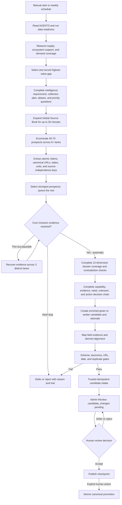
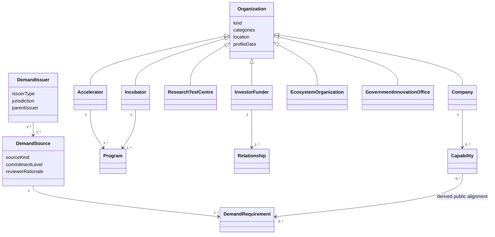
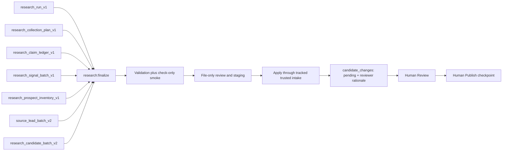
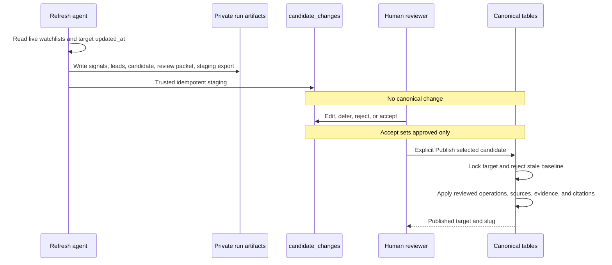
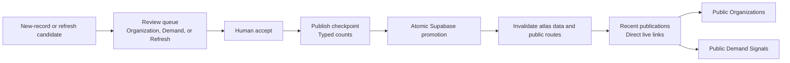

# Autonomous Ecosystem Research Pipeline

Status: canonical research orchestration contract
Owner: Andrew Davies
Last reviewed: 2026-09-04
Public brand: True North Map
Canonical domain: `https://truenorthmap.ca`

## Outcome

True North Map has a production Codex-native research and signal-refresh system that runs manually under the current operating posture. It starts with a decision-led OSINT collection plan, searches both outward from entities and inward from Mission Areas and published Public Needs, measures saturation through a twelve-dimension dossier vector plus marginal decision value, records atomic claims and conflicts in a private ledger, ranks durable sources, builds a broad prospect inventory, monitors material changes across multiple source families, recovers durable evidence, creates typed new-record or refresh leads, produces green or amber private candidates, and sends successful candidates directly into the existing private Admin Review workflow.

The system never treats review intake as publication. Live corpus counts come from the canonical production database rather than this operating document. Any expansion requires a human to review and accept an organization or public-demand candidate in Review and use the explicit Publish checkpoint. `research_runs` is hidden audit metadata, not another queue or approval step. A completed run must place every validated candidate directly into `candidate_changes` with a generated reviewer rationale; file-only artifacts are not a successful terminal state.

One automatic safeguard protects deployment order. Preparation and live intake read the canonical production `/api/system/research-contract` endpoint and confirm end-to-end Review and Publish support for each candidate kind and schema. This internal check is deliberately independent of the browser application's `NEXT_PUBLIC_SITE_URL`, which normally points to localhost during development. Operators do not enter or compare version strings. If the deployed endpoint is unavailable or support is missing, the run stops safely before a database write rather than creating an unreadable or unpublishable queue item.

Base pipeline `1.7.0` introduced reviewer usefulness as an executable, same-run intake condition. Source-backed claims target one atomic leaf field; lifecycle timestamps record elapsed work; refresh runs include their dispositioned signal batch; and each candidate carries one 90-160 word rationale in the fixed order `Coverage value`, `Evidence`, `Mission/Public Need read`, `Unknowns`, and `Reviewer action`. The complete run, plan, prospect, signal, lead, ledger and candidate inputs must agree on one exact target-key outcome per named dossier target. The review packet and private staging export are then derived from those validated inputs, and import verifies the complete staged run and candidate envelopes before intake. Prospect fit, signal change, lead refresh, operation explanation, claim predicate, analyst note, recovery-attempt, and rationale text must use structured record-specific anchors. Generic name substitution, missing deltas, mutation-shaped predicates, invented source-count matches, duplicate targets, unresolved recovery attempts, free-text disposition tokens, and staging drift are hard failures for new 1.7 runs. Candidate warnings remain record-specific while the common non-endorsement boundary appears once at packet level. Historical 1.5 and 1.6 artifacts remain valid under their recorded versions. Repository-wide validation prints a concise summary by default and exposes historical warning detail only with `--verbose true`.

The 1.7.1 corpus-enrichment base keeps the 1.7.0 lineage and staging guarantees while adding exact named-target preparation, a fail-closed active-queue preflight, target-specific collection queries, a genuinely read-only `research:smoke --check-only`, optional signal linkage when no dated development qualifies, and a valid all-disposition outcome with no candidate padding. Dossier readiness has no fixed article or source count. Each target must be searched through at least three complementary lanes, all twelve coverage dimensions must be dispositioned, consequential claims use durable independent corroboration when the plan requires it, and the ledger must record low or zero marginal yield before a candidate or `no_material_change` outcome is ready. High or medium yield remains `research_required`. Every selected source supports a proposed public leaf, a specific warning, an adequate-unchanged conclusion, or a documented coverage decision; syndication and unused padding never increase readiness. The business-development narrative recovers the concrete offering or mandate, likely buyer/user/funder/test/partner audience, public proof, access path, Canadian delivery footprint, relationships, current trigger, constraints and best first conversation using entity-kind-appropriate fields. Background and maintenance evidence remain valuable without being mislabeled as a signal. First activation is an explicit reviewed version operation. Qualified refresh signals use structured event/effective dates, ordinary refresh-batch candidates require one, and a non-null activity as-of date must match its linked signal or claim temporal evidence rather than review time.

Pipeline 1.7.3 defines the production-scale operating model. It retains the complete 1.7.2 corpus, evidence, coverage, marginal-yield, signal, baseline, Review and Publish gates and adds an explicitly cited or null executive relevance summary. `corpus_refresh` selects up to 50 eligible published null-version records outside active Review, balances roles deterministically, and continues successive non-overlapping segments until the eligible corpus is exhausted. Unrelated pending candidates no longer serialize research; exact target overlap remains a hard stop. Preparation supplies one collecting ledger subject with all twelve `not_assessed` dimensions per target, while completion rejects any unassessed scaffold. It also makes the normalized underlying-owner/origin/event-family key, reciprocal conflict linkage, role-specific collection questions, mode-aware source-family breadth, and event-specific signal delta executable so operators do not repair those contracts manually at the end of each run.

The canonical operator skill and its downstream candidate, evidence, and stewardship instructions remain local under ignored `.agents/skills/`. The tracked TypeScript contract, validation command, tests, and governance are the deployable interoperability surface. The current organization output is `organization_bundle_v3` for a new normalized dossier and `organization_refresh_bundle_v2` for cited enrichment of an existing record; the importer must still see those exact versions in the deployed research-contract endpoint before it may stage either one. This prevents private operator instructions or credentials from entering the public repository while still making incompatible candidate output fail closed.

### Canonical-repair production contract

Pipeline 1.8.0 and Review contract v4 add a manual, separately typed canonical-repair branch for 1-25 exact published organizations. The runner always verifies that the additive migration, compatible application and live contract endpoint advertise the new bundle before creating or staging a repair run; an incomplete or rolled-back deployment fails closed.

Canonical repair uses at least two independent identity/lifecycle source lanes and one private service-role-only immutable snapshot of the exact organization, aliases, capabilities and protected dependencies. A proposed successor carries a separate exact published identity and baseline that publication rechecks live. Every target ends as one `organization_canonical_repair_bundle_v1` or typed `research_required` / `no_material_change` disposition. The branch creates no Signal batch. It permits only `set_organization_identity`, `set_profile_field`, `add_alias`, `archive_alias`, `archive_capability`, and `archive_organization`; it never hard-deletes, reparents, transfers or changes a stable slug. Archival requires positive lifecycle or scope evidence, not silence or a dead website.

The publisher rechecks all snapshot classes under lock, applies exact soft-archive cascades, preserves evidence and audit history, and may create one immutable old-slug redirect from an archived superseded organization to an already published successor. Protected references or drift fail closed. Canonical repairs cannot use batch acceptance or publication: each candidate stops in private Admin Review for an individual human decision and, if accepted, a separate individual Publish action.

## Coordinator flow

## Agent and skill handoff

```mermaid
flowchart LR
  CO["$tnm-autonomous-research\nCollection plan, claim ledger, coordinator"] --> SR["$tnm-signal-refresh\nWatchlists, atomic signals, entity matching"]
  SR --> SD["$tnm-source-discovery\nProspects, recovery, typed leads"]
  SD --> CB["$tnm-candidate-builder\nGreen or amber bundles"]
  CB --> EM["$tnm-evidence-mapper\nField citations and derived matches"]
  EM --> LG["$tnm-candidate-logo\nPrivate official-site logo disposition"]
  LG --> RS["$tnm-review-steward\nClaim lineage, coverage, validation, intake"]
  RS --> HR["Admin Review"]
  HR -. "explicitly accepted" .-> PUB["Controlled publication"]
```

## Organization and demand model

Organizations and public demand are independent typed records. This prevents a NATO policy page from being mistaken for an organization or a company press release from being treated as government demand.

Supported public-demand issuers include NATO, the Government of Canada, DND, CAF, RCN, RCAF, Canadian Army, PSPC, DRDC, and IDEaS. The migration stores the hierarchy separately from individual demand sources, allowing co-issuers, sponsors, and beneficiaries to be represented without duplicating the source.

## Evidence contracts by organization kind

| Kind | Required review evidence |
| --- | --- |
| Company | At least one concrete cited capability |
| Accelerator | At least one cited program, cohort, or challenge |
| Incubator | At least one cited program, cohort, or incubation offering |
| Investor or funder | Sourced mandate and a public portfolio or funding relationship |
| Research or test centre | Sourced technical mandate |
| Ecosystem organization | Sourced mandate plus a program or relationship |
| Government innovation office | Sourced mandate plus a program or relationship |

## Bounded operation

- One coordinator per run.
- Operational checkpoints range from 90 minutes for ordinary discovery to 480 minutes for a 50-record corpus segment. Time is not a readiness shortcut: if consequential questions still have plausible unresolved evidence routes at the checkpoint, close the target as `research_required` with the exact remaining lanes rather than padding or claiming readiness.
- Broad discovery: 40-75 unique prospects across at least six lanes; target 10 private candidates and require at least eight unless specific exhaustion evidence is recorded.
- Deep dossier: 1-5 named organizations across at least three complementary lanes.
- Named dossier enrichment: 1-50 exact published targets. Corpus refresh: automatically selected non-overlapping production segments of up to 50, continued until every eligible record is dispositioned. Readiness is question- and evidence-led rather than article-count-led; no fixed source quota authorizes padding or premature completion.
- The 50-lead/candidate envelope is a private artifact and publication-transaction safety boundary, not a discovery-yield or relevance limit.
- Canada-first geography, all active Mission Areas eligible.
- Canonical durable HTTPS sources first.
- English/French aliases and Canadian public-source queries where relevant.
- Official sitemap, technical-document, registry, patent/IP, procurement, proactive-disclosure, customer/partner/program, ecosystem, and reputable secondary lanes are available; authenticated social and newsletter surfaces remain discovery-only.
- Every candidate-linked dossier assesses identity/ownership, Canadian presence, offering/mandate, technical specifications, maturity/deployment, customers/contracts/programs, procurement/demand, partnerships/financing, public contacts, current activity, source diversity, and contradictions.
- Discovery searches entity-outward through products, variants, subsystems, interfaces, suppliers, partners, primes, customers, programs and proof events, and problem-inward from Mission Areas and published Public Needs through outcomes, constraints, metrics, standards, procurement terms, and English/French synonyms.
- Every selected candidate exposes a compact decision chain using the current artifact fields: specific capability or need, coverage value, evidence composition, current trigger when one exists, conservative Mission/Public Need read, consequential unknowns, and one bounded reviewer action.
- A Public Need hypothesis in an organization candidate is a private Derived Read only. It does not create a capability-demand match; after publication, the reviewer may use the existing private matching workspace.
- Hard-stop unresolved duplicates, unresolvable identity or Canadian presence, no concrete offering or mandate, no durable evidence, defunct status, taxonomy drift, access failures, or rate limits.
- Keep missing legal names, direct contacts, exact addresses, and incomplete relationships as amber reviewer warnings when the core inclusion case is supported.
- Resume an interrupted manifest instead of creating a second run for the same work.

## Validation and artifacts

The executable contract is `app/src/lib/research/pipeline-schema.ts`. The orchestrator is `app/scripts/autonomous-research.ts`. Portable JSON contracts live under `research/ingestion/schema/`. The machine-readable `.agents/skills/tnm-research-workflow-registry.json` is the authority for mode envelopes, artifact roots and the ordered finalizer; its generated Markdown reference is checked for drift. `research:finalize --plan` previews the exact guarded sequence, ordinary `research:finalize` performs validation plus non-writing smoke, `--file-only` adds local review/staging output, and `--apply` alone invokes tracked private intake and exact production reconciliation. Logo preparation is globally bounded, serializes each website host, skips existing dispositions and retains downloader retry/failure telemetry. `research:eval` runs synthetic production-shaped identity, provenance and sufficiency regressions. Historical `research:smoke --file-only` still means no database import but can regenerate local review and staging artifacts; it is not a read-only command.

Earlier test cycles proved the typed organization and demand paths but also exposed low discovery yield. The July 21 throughput upgrade added explicit prospect, lane, recovery, backlog, green/amber, and under-target controls. The July 30 OSINT upgrade added collection planning, deterministic URL/alias/procurement normalization, source-independence checks, claim conflicts and supersession, and dossier coverage. The August 5 decision-usefulness upgrade kept the same executable schemas and Review/Publish boundary while requiring capability specificity, complementary evidence, problem-led discovery, explicit unknowns, and an actionable reviewer handoff rather than merely one schema-valid record. The August 10 pipeline 1.7 repair converts that expectation into a hard same-run specificity gate and requires trusted import to reproduce the validated candidate payload exactly. The current 1.7 refinement adds exact named-target preparation, fail-closed queue checks, quota-free dossier searching, selective signal linkage and non-writing validation without adding an experimental schema layer. The companion Admin Review repair presents source identity beside each mapped excerpt, one collapsed generated research brief, one editable reviewer-decision rationale pre-populated with the record-specific evidence-bounded suggestion, and readable scalar, object, array, relationship, and clear-to-null changes without changing review or publication authority. The reviewer must inspect or edit the suggestion and explicitly submit the decision; Publish remains separate.

## Existing-record enrichment integration

The weekday refresh is integrated into the same pipeline and review queue as new organization and demand discovery. It does not run an alternate database writer.

Refresh candidates use `organization_refresh_bundle_v2` for the normalized organization dossier, historical `organization_refresh_bundle_v1` only for compatibility, or `demand_refresh_bundle_v1`. Their `target_entity_id`, `before_record`, and `targetMatch.baselineUpdatedAt` bind the proposal to a specific live record and point in time. `operations` is the sole publication change set. Organization v2 supports allowlisted organization and kind-specific profile fields, child additions, and stable capability or program-participation updates. It never automates deletion.

The `tnm-refresh-2026-07-23` run demonstrates this boundary. It staged a high-confidence Kraken Robotics refresh proposing two new capability children, SeaPower Subsea Batteries and Kraken Synthetic Aperture Sonar. A human later accepted and published the candidate through the standard checkpoint, and the public Kraken profile now contains all three reviewed technologies. Before publication, the JSON seen during review was only the private before-state, two operations, official sources, five evidence items, provenance, and rationale. The later canonical result confirms that acceptance and publication were distinct transitions.

## Publication visibility contract

Successful publication is a database transaction, not a deployment event. Public organization and demand indexes render dynamically from the invalidatable atlas snapshot so an older full-route render cannot hide newly published records. The publication checkpoint shows separate organization and demand counts before promotion and provides direct public links under `Recent publications` after promotion. A reviewer should never need to redeploy the application to make a successfully published candidate visible.

## Schedule

Broad ecosystem research is manual and Andrew-invoked. The former broad-research automation has been retired, and the weekday multi-source refresh automation remains paused. The operator workflow uses the coordinator plus six internal project-local research stages; Daily Signals, North Signal and Visibility are separate operator workflows. Every TNM skill is registry-checked, and all operator systems except explicitly scheduled North Signal require direct invocation. Every run begins with `research_collection_plan_v1`, maintains `research_claim_ledger_v1`, and requires claim-to-field and dossier-coverage validation before intake. A manual ordinary refresh batch invokes `$tnm-signal-refresh` before discovery, candidate building, evidence mapping, optional candidate-logo preparation for organization candidates, and review stewardship; searches at least four source families with a seven-day overlap; and may produce up to 50 review candidates or complete with zero only when every signal is dispositioned. Named dossier enrichment uses its exact-target contract. A full-corpus request uses `corpus-refresh` and continues automatically selected production segments until every eligible published null-version organization has a candidate or typed disposition. All organization-dossier modes retain the three-lane, twelve-dimension and marginal-yield contract without an article or source-count quota. Runs stop after private Admin Review intake and never accept or publish.

Qualified leads continue automatically from Source Discovery to Candidate Builder. The schedule never pauses for lead approval. Deferred and rejected leads remain audit artifacts, while human editing and inclusion decisions occur only on staged candidates in Admin Review.

Manual execution remains available through `pnpm research:prepare`, `pnpm research:validate`, `pnpm research:eval`, `pnpm research:finalize`, and `pnpm research:reconcile`. Scheduling grants only the private candidate-intake write performed by the trusted function. It does not grant authority to accept, publish, or mutate canonical ecosystem records.
