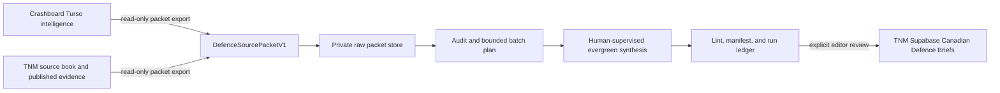

# True North Map Defence Wiki Foundation

Status: deferred private-system expansion plan
Owner: Andrew Davies
Last reviewed: 2026-08-08

## Status

The foundation and first reviewed-publication slice were implemented on 2026-07-21. Further expansion is deferred and is not a dependency of the current public product. This document replaces the retired in-app help-wiki plan that described legacy product routes and a Start Here funnel.

## Purpose

The True North Map Defence Wiki is a private, Canada-first evergreen synthesis layer. It receives bounded, versioned source packets from Crashboard and True North Map, compiles durable knowledge under human supervision, and remains separate from the public application runtime.

Crashboard remains the raw intelligence and trend engine. True North Map Supabase project `facoactpdckkhciamflk` remains the sole public runtime and publication source. The private wiki never writes to core organization, capability, demand, evidence, citation, or match records.

## Canonical Root

`/Users/andrewdavies/Library/Mobile Documents/iCloud~md~obsidian/Documents/Andrew's Vault/True North Map Defence Wiki`

The root is flat and contains:

- `raw/`: immutable `DefenceSourcePacketV1` packets.
- `wiki/`: evergreen and operational markdown pages.
- `outputs/`: source inventories and compiler reports.
- `ingest-manifest.json`: incremental compiler ledger.
- `AGENTS.md`: private evidence and compilation contract.

Do not add nested taxonomy folders, publisher folders, dashboards, or a Start Here page.

## Source Flow

## Selection Policy

- Scan the complete eligible corpus and admit only defence-relevant source segments.
- Recover defence items from Business, AI, Cybersecurity, Defence, and other newsletters when the article-level segment is relevant.
- Reject coarse mixed-newsletter fallbacks instead of copying a complete message.
- Treat newsletters, social material, and source-book rows as discovery or research leads until a durable source is verified.
- Keep source-backed facts, time-sensitive developments, and Derived Reads distinct.
- Use global material only when it clarifies Canadian demand, partners, competitors, benchmarks, supply chains, or industrial gaps.

## Current Interfaces

From the True North Map repository:

- `pnpm wiki:sources:inventory -- --root <root>`
- `pnpm wiki:sources:export -- --root <root> --dry-run`
- `pnpm wiki:packets:validate -- --root <root>`
- `pnpm wiki:audit -- --root <root>`
- `pnpm wiki:compile:plan -- --root <root>`
- `pnpm wiki:lint -- --root <root>`
- `pnpm wiki:query -- --root <root> --query "..."`
- `pnpm wiki:learning-report -- --root <root>`

From Crashboard:

- `npm run defence-wiki:inventory -- --root <root>`
- `npm run defence-wiki:export -- --root <root> --dry-run`

All source reads are read-only. Inventory and export commands report selected, rejected, changed, unchanged, missing, and failed records. Exports never delete a packet silently.

## Delivery Gates

1. **Inventory:** live source counts and a reviewed accepted/rejected sample.
2. **Foundation:** private root, contracts, adapters, packet validation, audit, and lint.
3. **Compilation:** a small, source-bounded representative set. Broad compilation remains deferred.
4. **Publication:** approved. `/admin/briefs` writes reviewed synthesis into dedicated Supabase tables; `/briefs` exposes published rows only.
5. **Trend:** stable topic mappings and source-balanced historical snapshots.

The current milestone includes the reviewed publication workflow and a growing set of public briefs. It does not authorize broad autonomous compilation, direct raw-packet publication, automated publishing, or trend publication. Private markdown and source packets remain outside the public runtime. Public articles must use approved sources, a clear thesis and narrative structure, visible authorship and review dates, and visibly separated evidence-bounded interpretation.
