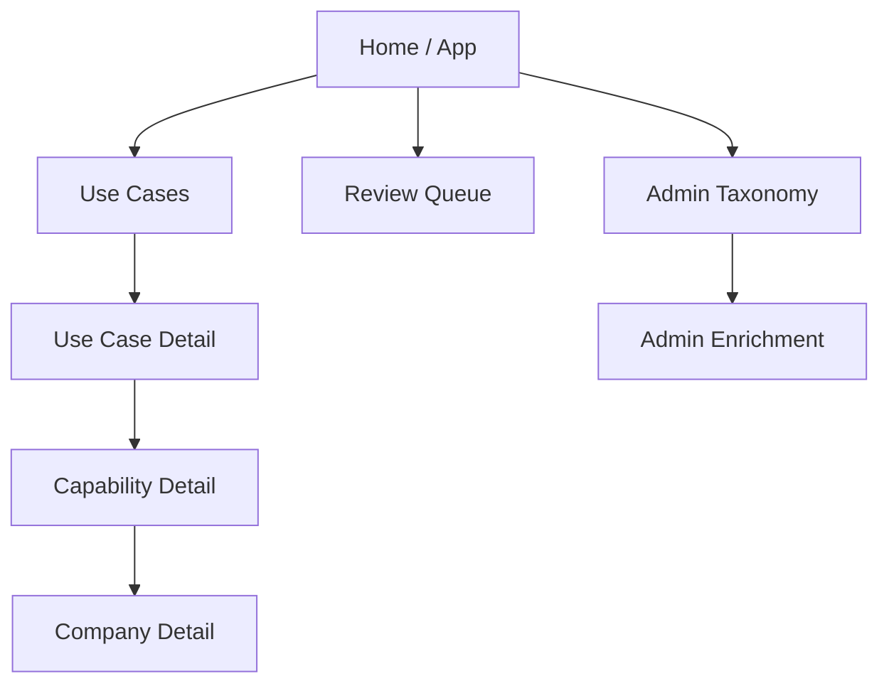
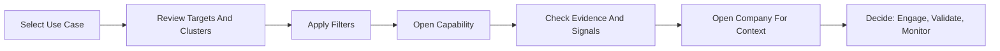
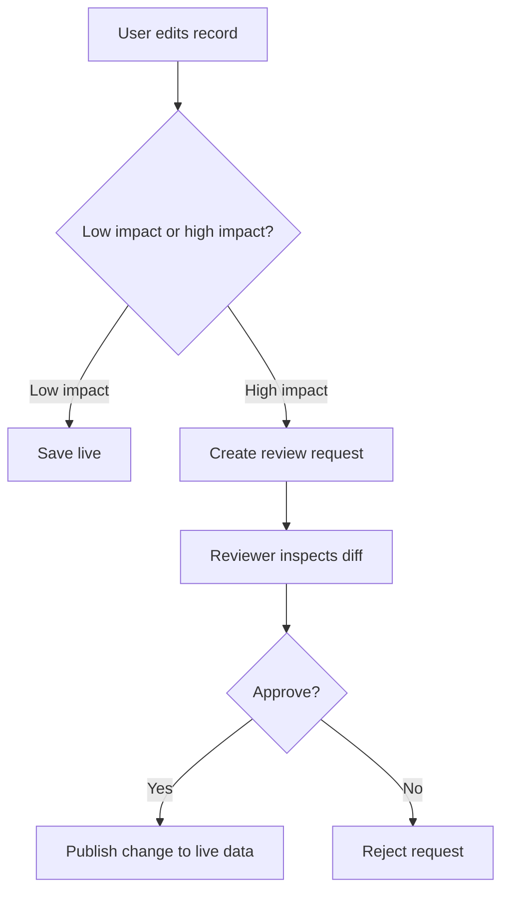
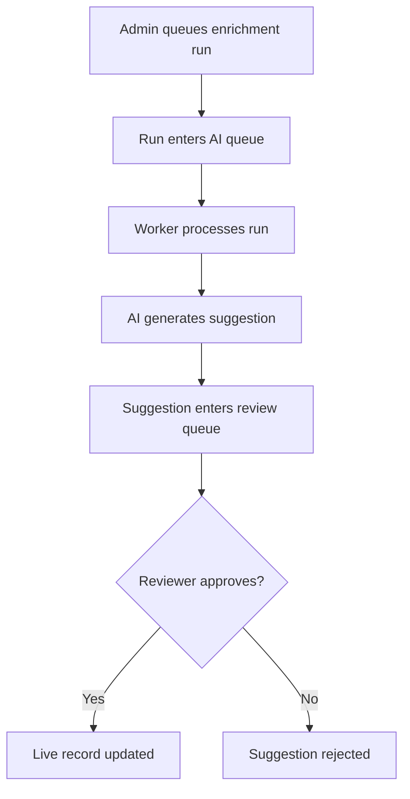

# Internal Wiki And User Enablement Plan

## Purpose

This document defines the first internal wiki / "How to Use" layer for the Ecosystem Intelligence MVP.

The goal is to make the product usable by non-builders without requiring live support from the project team.

The wiki should help users:

- understand what the platform is for
- learn the meaning of platform terms
- navigate the app with confidence
- follow the intended discovery workflow
- understand what is source-backed vs inferred
- know when to edit, request refresh, or use the review queue

## Primary Audience

### Primary readers

- business development team members
- ecosystem engagement staff
- internal staff preparing recommendations or opportunity scans

### Secondary readers

- reviewers and admins
- senior leaders who want a fast orientation
- new team members onboarding into the workflow

## Wiki Success Criteria

The wiki is successful if a first-time user can:

1. understand the purpose of the product in under 3 minutes
2. define the core objects: Use Case, Capability, Company, Cluster, Pathway
3. complete the main workflow without coaching
4. tell the difference between evidence-backed content and derived reads
5. understand what to do when data looks wrong or stale

## Recommended Information Architecture

The first version of the wiki should have 8 pages.

### 1. Start Here

Purpose:

- explain what the platform is
- explain who it is for
- explain the core workflow in plain language

Contents:

- one-paragraph product summary
- "What you can do here"
- "What this product is not"
- 3-step quick start
- link cards to all other help pages

### 2. Core Concepts And Definitions

Purpose:

- create a shared vocabulary
- reduce confusion between company-centric and capability-centric thinking

Contents:

- Use Case
- Capability
- Company
- Cluster
- Domain
- Pathway: Build / Validate / Scale
- Relevance
- Defence relevance
- Top Engagement Target
- Provenance / citation
- Derived read
- Review queue
- Refresh request
- AI suggestion

### 3. 10-Minute First Walkthrough

Purpose:

- give a new user one concrete path through the app

Contents:

1. open the app home page
2. choose a Use Case
3. read Top Engagement Targets
4. scan the cluster and maturity sections
5. apply filters
6. open a capability
7. review evidence and suggested action
8. open the company profile for context

### 4. Use Case-Led Discovery Guide

Purpose:

- teach the main working model of the product

Contents:

- why users start with Use Cases
- how to read Recommended Actions
- how to interpret Top Engagement Targets
- how to use filters
- how to use clusters and maturity distribution together
- how to treat derived summaries carefully

### 5. Capability And Company Pages

Purpose:

- explain the two main drill-down pages

Contents:

- what belongs on a capability page
- what belongs on a company page
- how to use provenance panels
- when to use company context vs capability context
- how breadcrumbs and back-links support workflow continuity

### 6. Editing, Review, And Trust Model

Purpose:

- explain how data quality is maintained

Contents:

- live edits vs review-triggering changes
- who can edit
- who can review
- what happens after approval
- what a refresh request means
- how AI suggestions are handled
- what "derived read" means
- how users should challenge questionable content

### 7. Admin And Enrichment Guide

Purpose:

- document the admin-only loop

Contents:

- queueing enrichment runs
- processing queued runs
- reviewing AI suggestions
- expected safeguards
- known limitations in MVP

### 8. FAQ And Troubleshooting

Purpose:

- reduce support burden

Contents:

- Why do I see a suggestion but not a live change?
- Why does a record have no citations yet?
- What should I do if a capability is misclassified?
- What if a company belongs to multiple Use Cases?
- What does "Build / Validate / Scale" actually mean?
- What if a record feels stale?

## Page Templates

Every wiki page should use the same lightweight pattern.

### Template structure

1. What this page is for
2. Key terms
3. How to use it
4. What to watch for
5. Related pages

### Writing rules

- use short paragraphs
- define terms the first time they appear
- prefer "do this" instructions over abstract explanations
- call out confidence and trust boundaries clearly
- keep examples concrete and product-specific

## Glossary Plan

The glossary should exist as a standalone page and be reused inside other pages.

### Tier 1 terms

- Use Case
- Capability
- Company
- Domain
- Cluster
- Pathway
- Top Engagement Target

### Tier 2 terms

- relevance band
- defence relevance
- suggested action
- recent signal
- evidence
- provenance
- citation

### Tier 3 governance terms

- live edit
- review-triggering change
- reviewer
- refresh request
- AI suggestion
- derived read
- audit event

## Diagram Plan

The wiki should include simple diagrams that show system behavior and user workflows.

Use Mermaid in the first version so diagrams are editable in-repo before polished visuals are created.

### Diagram 1: App Navigation Map



Purpose:

- show the overall structure of the app
- help new users understand where to start

### Diagram 2: Primary User Workflow



Purpose:

- teach the intended discovery path
- reinforce capability-first behavior

### Diagram 3: Edit And Review Flow



Purpose:

- explain governance
- reduce confusion about why some changes appear immediately and others do not

### Diagram 4: AI Enrichment Flow



Purpose:

- communicate the safety model
- show that AI does not publish directly

## Visual Walkthrough Plan

The wiki should include a screenshot-led walkthrough after the text-only draft is stable.

### Recommended screenshot set

1. app home page
2. Use Cases index
3. Use Case detail hero area
4. Top Engagement Targets section
5. capability filters expanded
6. capability detail page
7. provenance panel on capability page
8. company detail page
9. review queue example
10. admin enrichment page

### Annotation style

- add numbered callouts
- keep labels short
- highlight only one learning objective per image
- use arrows sparingly
- annotate trust cues such as badges, citations, and review states

### Walkthrough sequence

1. Where to start
2. How to narrow the landscape
3. How to inspect a capability
4. How to check evidence
5. How to understand company context
6. How edits and review work
7. How admin enrichment works

## Content Drafting Order

The wiki should be built in this order.

### Phase 1: Core onboarding

- Start Here
- Core Concepts And Definitions
- 10-Minute First Walkthrough

### Phase 2: Core operational use

- Use Case-Led Discovery Guide
- Capability And Company Pages
- Editing, Review, And Trust Model

### Phase 3: Admin and support

- Admin And Enrichment Guide
- FAQ And Troubleshooting
- screenshot walkthroughs

## Suggested Deliverables

### Deliverable set for MVP documentation

- 1 landing help page
- 1 glossary page
- 5 task-oriented help pages
- 4 mermaid diagrams
- 10 annotated screenshots
- 1 FAQ page

## Recommended File Strategy

If this stays repo-native, create a docs area like this:

```text
docs/
  index.md
  start-here.md
  concepts-and-definitions.md
  first-walkthrough.md
  use-case-discovery.md
  capability-and-company-pages.md
  editing-review-and-trust.md
  admin-enrichment.md
  faq.md
  diagrams/
  screenshots/
```

If the wiki will live in Notion, Confluence, or Google Docs, use this document as the source structure and mirror the same page order.

## Ownership And Workflow

### Proposed owners

- product / strategy owner: approve tone and user goals
- builder / product author: draft accurate feature explanations
- reviewer / operator: validate instructions against real workflow

### Review checklist

- is the page accurate to the current app?
- are terms defined simply?
- are actions described in the correct order?
- are trust boundaries explicit?
- are screenshots current?

## Risks To Avoid

- writing documentation like a product spec instead of a user guide
- over-explaining internal design details that users do not need
- hiding trust caveats around AI-derived content
- letting screenshots drift out of date
- documenting future behavior as if it already exists

## Immediate Next Steps

1. Confirm where the wiki will live: repo docs, Notion, or another internal system.
2. Draft the first 3 pages before creating polished visuals.
3. Capture screenshots only after wording is stable.
4. Add the 4 Mermaid diagrams early so the structure is understandable even before screenshots exist.
5. Run a short walkthrough with one internal user and revise wording based on confusion points.

## Recommended First Build Sprint

For the next documentation sprint, the highest-value slice is:

1. `Start Here`
2. `Core Concepts And Definitions`
3. `10-Minute First Walkthrough`
4. `Editing, Review, And Trust Model`
5. `Diagram 1` through `Diagram 4`

That gives the MVP a usable onboarding layer quickly, even before the full screenshot walkthrough is complete.

## 2026-04-29 In-App Help Update

The in-app help should now lead with the same vocabulary as the product surfaces:

- `Start Here`: choose the path based on the user's question.
- `Mission Areas / Use Cases`: start here for a mission problem or engagement decision.
- `Technical Domains`: start here when the technology landscape is known first.
- `Companies`: start here when the organization is known first.
- `Working Lists`: saved engagement memory for targets, status, owner, next step, due date, and rationale.

The core concepts page should define Use Case, Domain, Cluster, Capability, Company, Evidence, Derived Read, and Working List before sending users into longer walkthroughs.

Screenshot and wiki walkthroughs should avoid CRM language and keep the primary workflow framed as mission problem -> target comparison -> evidence/confidence -> gaps/tradeoffs -> Working List.
