# True North Map Project Status

Status: active broader-sharing product and review-first data operation

Last verified: 2026-07-31

Canonical production: Supabase project `facoactpdckkhciamflk`

Public brand: [True North Map](https://truenorthmap.ca)

## Current position

True North Map is an evidence-backed Canadian defence and dual-use ecosystem map with public organization, technology, demand-signal, Defence Brief, evidence, and private Working List surfaces. Production Supabase is the only source of truth for live records, taxonomy, review state, and publication state. Exact corpus and queue counts must be read from production rather than copied into status documents.

The current product and operating system include:

- The homepage and primary collection routes now render their value proposition independently of database reads, then stream live records through bounded loading states. An exact cached summary reports current organizations, technologies, and approved public sources; a compact discovery projection powers the national map, Organizations, Regions, and regional directories while omitting dossier evidence, citations, media, financing, and other profile-only fields. Public Needs uses a dedicated source-gated index over published demand sources, requirements, and approved matches. Rich evidence loads only on record pages or export. This preserves complete national discovery as the corpus grows without making first paint depend on the complete evidence graph.
- Public atlas responses use a five-minute CDN cache with ten-minute stale-while-revalidate support, and the Vercel server region is pinned to `sfo1` to reduce round-trip distance to the canonical Supabase `us-west-2` project. The compact demand filter includes only published Demand Signals whose source has recorded human verification.
- Phase 2 broader-release hardening reduces the initial rich-card payload without reducing national map coverage, adds bounded transient-read retry and a safe warm-instance snapshot, clears invalid refresh-token state, publishes a non-sensitive health endpoint, enforces provider-specific security headers, and schedules the privacy policy's 30-day event and 90-day raw-search retention rules. A low-rate canonical crawl, first-week administrator scorecard, campaign attribution, access matrix, rollback runbook and current launch kit now make release validation repeatable.
- Pre-launch security remediation updates the production runtime dependencies, bounds citation and evidence reads to the requested public records, and removes private demand-match reviewer rationale from the public data contract and Ask True North catalogue. `pnpm security:validate` is now a release gate; the durable backlog and verification record live in `Security And Reliability Remediation Log.md`.
- Phase 1B established the charcoal, warm-white and signal-yellow system. The approved production identity uses a directional N and separated yellow north corner while retaining the same palette, typography, messaging, and product behaviour.
- The primary navigation is Map, Organizations, Public Needs, Defence Briefs, How It Works, and About. `/demand` remains canonical; Public Needs names the collection while Demand Signal remains the precise label for one source-gated released need.

- A public map, organization and capability profiles, public-demand records, reviewed capability-demand matches, exports, and Ask True North over the published corpus.
- Published organization profiles can display an approved official logo with recorded source provenance. Missing or uncertain marks retain the neutral organization icon, and administrators can replace or remove a logo from the canonical organization editor.
- A public organization directory and region-browsing surface at `/organizations`, `/regions`, and `/regions/[slug]`. These routes use live published counts, URL-based type and region browsing, pagination, regional context, and explicit coverage caveats without changing record-level evidence or dossier content.
- Seven approved regional map illustrations are integrated in the public presentation layer for Canada, Atlantic Canada, Quebec, Ontario, the Prairies, British Columbia and the North. The responsive WebP assets preserve each highlighted region without cropping, use descriptive map-specific alt text, and retain the existing abstract fallback; they are illustrative and do not change geography, evidence, record counts, metadata or publication state.
- Canadian Defence Briefs as a reviewed editorial synthesis surface with administrator-only drafting and publication.
- A private Admin workflow for intake, candidate review and editing, explicit publication, canonical organization maintenance, demand maintenance, demand matching, evidence, and audit history.
- Seven project-local research skills are the current research and ingestion skills of record. North Signal and private visibility are separate local operator systems by design and do not gain research, review, database, or publication authority.
- A Monday 06:00 America/Halifax broad discovery run and a weekday 08:00 multi-source refresh run. Both stop at private review intake.
- Production email separation across Zoho, MailerLite, Resend, and the Supabase consent ledger, with authenticated sending domains and signed lifecycle synchronization.
- Phase 1 public-product hardening adds page-aware sharing for the map, organizations, technology, regions, public needs, and Defence Briefs; page-specific LinkedIn and X metadata; the consent-backed North Signal capture journey; and granular analytics choices. Google Analytics and Microsoft Clarity are independently optional, private routes are excluded, free-form inputs are masked, and the privacy page explains each provider and choice.

## Phase 1 public-product hardening boundary

- Supabase remains the authoritative subscriber-consent ledger and MailerLite remains the delivery surface. No second mailing database or campaign composer is introduced.
- North Signal is the named weekly briefing. Contextual forms appear after useful public content, the desktop prompt waits for high-intent engagement, and mobile uses a compact banner and bottom sheet. The journey respects a 30-day dismissal, remains available from the header and footer, records one-action affirmative consent before MailerLite synchronization, and reports a privacy-bounded funnel in the administrator workspace. The signup experience previews the four-part editorial product rather than offering generic updates.
- The North Signal editorial skill reads published production changes, scans a 24-feed Canada-first Inoreader portfolio, treats selected Gmail newsletters as discovery only, resolves external items to original durable sources, validates one private weekly issue packet, and stops for Andrew's editorial review. It never creates or sends a MailerLite campaign automatically.
- The first private North Signal test issue was prepared on July 30 from published production changes and durable source resolution. A MailerLite design and test campaign exist only for editorial review; no subscriber group was selected and the test delivery was restricted to Andrew's Gmail address. This test does not change the skill's stop-before-send default.
- Social-share controls preserve the current filtered map URL when sharing the map and use canonical URLs on record pages. Share actions are recorded as bounded product-learning events without storing social account data.
- Vercel aggregate performance monitoring remains separate from optional Google product analytics and optional Microsoft experience diagnostics.
- The uncapped national marker and discovery snapshot is deduplicated within each request instead of being written to one Next.js data-cache item. This avoids the platform 2 MB item limit as the corpus grows; smaller record-detail reads retain five-minute caching.
- Clarity code is dormant unless `NEXT_PUBLIC_MICROSOFT_CLARITY_ID` is configured. When configured, it loads only after a separate visitor choice and never runs on account, administration, connection, sign-in, submission, or Working List routes.

## Research and enrichment lifecycle

Research uses one review workflow for both new records and changes to published records. `research_runs` is audit metadata, not another approval queue.

```mermaid
flowchart LR
  I["Intelligence requirement and collection plan"] --> S["Official, technical, registry/IP, government, Source Book, Gmail, LinkedIn, and ecosystem sources"]
  S --> X["Extract atomic claims and deduplicate signals"]
  X --> D["Dossier coverage, conflicts, and saturation"]
  D --> M["Match live organizations, capabilities, and demand"]
  M --> N["New-record candidate"]
  M --> R["Refresh candidate with baseline and explicit operations"]
  N --> Q["candidate_changes: private review"]
  R --> Q
  Q --> A["Human edit and accept"]
  A --> P["Explicit Publish checkpoint"]
  P --> C["Atomic canonical database change"]
  C --> L["Public routes revalidated"]
```

The refresh path is additive in v1. A refresh candidate may propose:

- `set_field` for an approved field on an existing organization or demand source.
- `add_child` for a capability, program, relationship, or demand requirement.
- `update_child` for an existing capability or demand requirement while preserving its stable ID and slug.

Automated deletion is not permitted. Every operation carries a reviewer explanation and field-level evidence IDs. Discovery-only newsletter or social material may explain how a lead was found, but it cannot support a public field unless resolved to durable evidence.

Every new OSINT-enabled run writes a private `research_collection_plan_v1` and `research_claim_ledger_v1`. The ledger is run lineage, not another database or review queue. It stores atomic claims, canonical URLs, locators, temporal scope, source independence, contradictions, supersession, candidate field targets, and a twelve-dimension dossier coverage vector. Smoke validation requires every source-backed candidate field to map to a durable ledger claim before the existing trusted intake can create a pending review row.

## Current worktree and lineage reconciliation

The July 30 worktree is “dirty” because `main` contains intentional changes and new files that have not yet been committed, not because production data is corrupt. The pre-existing changes span North Signal capture and email operations, private visibility tooling, candidate-logo research support, governance updates, and immutable research run lineage. The claim-led OSINT upgrade is being added around those changes without reverting or absorbing them.

Files under `research/ingestion/runs/`, `reviews-v2/`, `staging/`, and candidate/lead directories are point-in-time provenance. They remain unchanged after staging and therefore do not mirror later review decisions. A read-only production audit on July 30 found no pending `candidate_changes`; recent July 29 research candidates had already reached published or rejected terminal states. This is expected historical drift, not stale canonical data. Production Supabase remains the only current queue and corpus authority.

## Database write boundary

| Lifecycle stage | Database effect | Canonical public effect |
| --- | --- | --- |
| Research artifacts | JSON and Markdown under `research/ingestion/` | None |
| Trusted staging | Upserts one `research_runs` audit row and one or more private `candidate_changes` rows | None |
| Human edit or accept | Updates the private candidate, adds `review_decisions`, and records an audit event; accepted candidates move from pending Review to the Publish selection | None |
| Human Publish | Locks the target, rejects a stale baseline, applies only reviewed operations, upserts sources, appends evidence and citations, records the audit, and marks the candidate published | Immediate canonical change and route revalidation |

`target_entity_id` links a refresh candidate to the existing canonical record. `before_record` is the captured review baseline. `proposed_record.operations` is the exact change set. These fields are review and publication instructions; merely seeing them in JSON does not mean they have been merged into the public record.

## Kraken Robotics refresh: published example

The multi-source refresh run `tnm-refresh-2026-07-23` found durable official evidence for two additional Kraken Robotics technologies alongside KATFISH: `SeaPower Subsea Batteries` and `Kraken Synthetic Aperture Sonar`. The reviewed candidate was subsequently published through the standard human Publish checkpoint. The public Kraken profile now shows all three reviewed technologies.

This remains the reference example for an additive organization refresh: the candidate targets the existing canonical organization, carries a captured baseline and explicit `add_child` operations, receives human acceptance, and makes canonical source-backed changes only at publication. Research staging still verifies the deployed `/api/system/research-contract` before candidate intake, and candidate kinds without complete Review and Publish support fail closed.

## Recent live research outcome

The targeted Sentinel AMS dossier run also completed the ordinary new-record path. Candidate `516e63e1-8e4e-40a1-8e7b-c9ebd19fb433` was human-reviewed and published on 2026-07-23 as `sentinel-advanced-military-solutions`, canonical organization `25a799a3-2cc1-47ae-b839-cf13895f7c40`, with five published capability records. Together with the published Kraken refresh, this confirms that staging, acceptance, and publication remain distinct transitions for both new and refresh candidates.

## Current operational priorities

- Work approved refresh candidates through the separate Publish checkpoint only after reviewing their explicit operations and evidence.
- Verify each published refresh on the affected organization, capability, demand, index, and sitemap routes; no redeployment should be required for data visibility.
- Keep the weekday refresh source portfolio balanced across official government or procurement sources, company sources, due Source Book entries, and discovery feeds.
- Keep discovery feeds subordinate to durable evidence and preserve unresolved signals in the deferred backlog.
- Read queue and corpus state from production before declaring a run or release complete.
- Preserve active research and visibility work as a separate integration stream from application and launch documentation. Do not copy ignored provider data, credentials, raw queries, local logo binaries, or scratch artifacts into tracked project files.
- Apply the cross-system regression contract to every material change and update the overview, status, relevant skill contract, brand packet, or launch package when the operating picture changes.

## Source-of-truth documents

- `AGENTS.md` — project operating contract and change log.
- `context/governance/PRD.md` — current product requirements.
- `context/governance/Autonomous Ecosystem Research Pipeline.md` — research orchestration and scheduling.
- `context/governance/Research Agent Schema And Source Contract.md` — evidence and candidate contracts.
- `context/governance/Admin Workflow And Data Contract.md` — private review and publication boundary.
- `context/governance/Skills And Automation Map.md` — canonical skill, operating-mode, and automation map.
- `context/governance/Cross-System Change And Regression Contract.md` — impact analysis and regression requirements.
- `context/governance/Security And Reliability Remediation Log.md` — active security, privacy, resilience, dependency, and assurance register.
- `content/brand/True North Map Brand System.md` — current brand packet, directional-N local review candidate, and usage rules.
- `app/src/lib/research/pipeline-schema.ts` — executable research contract when prose and code differ.
