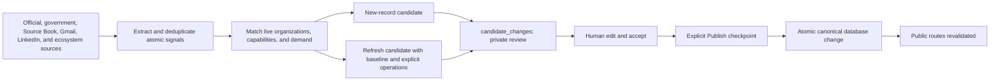

# True North Map Project Status

Status: active broader-sharing product and review-first data operation

Last verified: 2026-07-23

Canonical production: Supabase project `facoactpdckkhciamflk`

Public brand: [True North Map](https://truenorthmap.ca)

## Current position

True North Map is an evidence-backed Canadian defence and dual-use ecosystem map with public organization, technology, demand-signal, Defence Brief, evidence, and private Working List surfaces. Production Supabase is the only source of truth for live records, taxonomy, review state, and publication state. Exact corpus and queue counts must be read from production rather than copied into status documents.

The current product and operating system include:

- A public map, organization and capability profiles, public-demand records, reviewed capability-demand matches, exports, and Ask True North over the published corpus.
- Canadian Defence Briefs as a reviewed editorial synthesis surface with administrator-only drafting and publication.
- A private Admin workflow for intake, candidate review and editing, explicit publication, canonical organization maintenance, demand maintenance, demand matching, evidence, and audit history.
- Six project-local research skills of record: autonomous coordination, signal refresh, source discovery, candidate building, evidence mapping, and review stewardship.
- A Monday 06:00 America/Halifax broad discovery run and a weekday 08:00 multi-source refresh run. Both stop at private review intake.
- Production email separation across Zoho, MailerLite, Resend, and the Supabase consent ledger, with authenticated sending domains and signed lifecycle synchronization.

## Research and enrichment lifecycle

Research uses one review workflow for both new records and changes to published records. `research_runs` is audit metadata, not another approval queue.

The refresh path is additive in v1. A refresh candidate may propose:

- `set_field` for an approved field on an existing organization or demand source.
- `add_child` for a capability, program, relationship, or demand requirement.
- `update_child` for an existing capability or demand requirement while preserving its stable ID and slug.

Automated deletion is not permitted. Every operation carries a reviewer explanation and field-level evidence IDs. Discovery-only newsletter or social material may explain how a lead was found, but it cannot support a public field unless resolved to durable evidence.

## Database write boundary

| Lifecycle stage | Database effect | Canonical public effect |
| --- | --- | --- |
| Research artifacts | JSON and Markdown under `research/ingestion/` | None |
| Trusted staging | Upserts one `research_runs` audit row and one or more private `candidate_changes` rows | None |
| Human edit or accept | Updates the private candidate, adds `review_decisions`, and records an audit event; accepted candidates move from pending Review to the Publish selection | None |
| Human Publish | Locks the target, rejects a stale baseline, applies only reviewed operations, upserts sources, appends evidence and citations, records the audit, and marks the candidate published | Immediate canonical change and route revalidation |

`target_entity_id` links a refresh candidate to the existing canonical record. `before_record` is the captured review baseline. `proposed_record.operations` is the exact change set. These fields are review and publication instructions; merely seeing them in JSON does not mean they have been merged into the public record.

## Kraken Robotics refresh: live verified example

The multi-source acceptance run `tnm-refresh-2026-07-23` found that the published Kraken Robotics profile represented only KATFISH while official product evidence supported two additional distinct technologies.

The staged candidate proposed two `add_child` operations under the existing Kraken organization ID:

1. `SeaPower Subsea Batteries`, mapped to the autonomous-systems technical domain.
2. `Kraken Synthetic Aperture Sonar`, mapped to the sensing-and-ISR technical domain.

The sources stored in the candidate are Kraken's official SeaPower product page, SeaPower sales announcement, Kraken SAS product page, and newsroom. LinkedIn was retained only as discovery provenance. Five field-evidence items support the two proposed capability operations.

Live production state verified on 2026-07-23:

- Research run ID: `ab3570e2-4887-43e9-b561-9c931f5700d1`, completed.
- Candidate ID: `60d7eb52-8d62-406e-b2f2-a926db00f335`.
- Candidate kind: `organization_refresh_bundle` using `organization_refresh_bundle_v1`.
- Target: Kraken Robotics organization `10000000-0000-4000-8000-000000000001`.
- Review state: `approved` after a human accept decision.
- Publication state: `published_at` is null; the candidate has not passed the Publish checkpoint.
- Canonical Kraken state: unchanged from the captured baseline, with only `KATFISH Towed Synthetic Aperture Sonar` published.

Therefore, the database currently associates the refresh proposal with Kraken through the private candidate's `target_entity_id`, `before_record`, evidence, sources, and operations. It has not yet created SeaPower or Kraken SAS capability rows, canonical source rows, evidence snippets, or field citations. Because the candidate was accepted, it has left the pending `/admin/review` list and should now be selected and published at `/admin/publish`; only that action performs the canonical writes.

The current local application source includes a structured refresh card with target links and before/after operation panels, includes refreshes at the Publication checkpoint, and keeps approved work visible from the Admin overview. The approved Kraken candidate is intentionally still unpublished while this repair is reviewed locally. Production must receive this application build before the Kraken Publish action is used.

Research staging now checks the deployed `/api/system/research-contract` before it writes candidates. Candidate kinds without complete Review and Publish support fail closed, and accepted candidates receive an explicit link to the Publication checkpoint. The two local signal-refresh migration filenames now exactly match the versions already applied to production: `20260723105823` and `20260723111826`.

## Recent live research outcome

The targeted Sentinel AMS dossier run also completed the ordinary new-record path. Candidate `516e63e1-8e4e-40a1-8e7b-c9ebd19fb433` was human-reviewed and published on 2026-07-23 as `sentinel-advanced-military-solutions`, canonical organization `25a799a3-2cc1-47ae-b839-cf13895f7c40`, with five published capability records. This contrasts with Kraken's current `approved` state and confirms that staging, acceptance, and publication remain distinct transitions for both new and refresh candidates.

## Current operational priorities

- Work approved refresh candidates through the separate Publish checkpoint only after reviewing their explicit operations and evidence.
- Verify each published refresh on the affected organization, capability, demand, index, and sitemap routes; no redeployment should be required for data visibility.
- Keep the weekday refresh source portfolio balanced across official government or procurement sources, company sources, due Source Book entries, and discovery feeds.
- Keep discovery feeds subordinate to durable evidence and preserve unresolved signals in the deferred backlog.
- Read queue and corpus state from production before declaring a run or release complete.

## Source-of-truth documents

- `AGENTS.md` — project operating contract and change log.
- `context/governance/PRD.md` — current product requirements.
- `context/governance/Autonomous Ecosystem Research Pipeline.md` — research orchestration and scheduling.
- `context/governance/Research Agent Schema And Source Contract.md` — evidence and candidate contracts.
- `context/governance/Admin Workflow And Data Contract.md` — private review and publication boundary.
- `app/src/lib/research/pipeline-schema.ts` — executable research contract when prose and code differ.
