# True North Map Project Status

Status: production soft beta and review-first data operation

Owner: Andrew Davies

Last reviewed: 2026-09-01

Canonical production: Supabase project `facoactpdckkhciamflk`

Public brand: [True North Map](https://truenorthmap.ca)

## Current position

True North Map is a Canadian defence capability-discovery platform with public organization, technology, Public Need, Defence Brief, Canadian Defence Signals, source, assessment, and private Working List surfaces. It helps people find Canadian organizations and technologies, understand possible fit, and decide who is worth speaking with next. Production Supabase is the only source of truth for live records, taxonomy, review state, and publication state. Exact corpus and queue counts must be read from production rather than copied into status documents.

The tracked public application now carries the approved guided-entry release: `/` is the task-led public landing page and `/map` is the canonical atlas and Ask True North workspace. The compact discovery architecture, directional-N identity, regional illustrations, North Signal capture journey, deterministic quota-free guided example, and safe map return paths remain intact. Ask True North uses `gpt-5.6-luna` by default inside the existing structured-output and deterministic-fallback boundary. The product remains in soft beta while Andrew validates decision journeys, content cadence, contribution quality, and broader-release messaging with real users.

The CMMC readiness editorial entry remains a question-led homepage continuation
to the existing Defence Signals edition
`/signals/access-architecture-and-production-are-becoming-readiness-gates`.
The local graph experiment was withdrawn before commit or deployment. `/map`
remains the existing Map/List atlas with deterministic lookup and separately
labelled Ask True North; no Connections mode, guide URL, taxonomy record,
canonical relationship, or separate discovery product remains.

Vercel currently has no active custom firewall configuration. Two deliberately conservative log-only production rules are staged as a draft: one observes unusually rapid requests to the Organizations index and the other observes organization/capability profile-family bursts. They do not block or challenge traffic until separately reviewed and changed, and the draft still requires Andrew's explicit Vercel Publish action before observation begins.

The public-hero and first-viewport consistency release applies the existing
Brand System and `PublicPageShell` contract to North Signal, Signals, Mission
Areas, Public Needs, Organizations and How It Works without changing routes,
public data, consent, telemetry event names, research, review or publication
authority. It follows the ordinary direct-main application release path and
does not couple presentation deployment to any concurrent research run,
candidate review or publication checkpoint.

## September 1 deterministic internal-link graph release

The public application now contains a deterministic internal-link presentation
graph for organizations, capabilities, Mission Areas, Public Needs, Signals,
Briefs and region clusters. Shared native-link and continuation components cap
each page at three organization, three mission/ecosystem and two editorial
destinations, retain relationship provenance, keep similarity labelled as
shared areas of work, and reuse the existing anonymous `result_select` event
without sending anchor text, evidence text, names or personal data. Inline
editorial links use persistent underlines and the established focus treatment.

The read-only `pnpm links:inventory` command now records the eligible published
database graph separately from rendered-site assurance. The existing guarded
launch audit retains rendered anchor label, role, module, route family, degree
and click-depth evidence when Andrew explicitly authorizes that production
audit. Cluster cards use `cluster=<slug>` map state without adding relationships
to the compact marker payload; unknown or mismatched membership fails closed.

Private research review now loads published aliases and canonical program
definitions into its immutable coverage snapshot and adds a deterministic
Linkability review and enforcement gate. Smoke/check-only validation, review
packet generation, staging export and trusted staging import all fail closed on
an explicit unpublished slug, slug/name mismatch, self-reference or canonical
program conflict. A unique exact no-slug canonical-name or published-alias match
remains advisory until a researcher or reviewer explicitly supplies the slug
and the candidate is revalidated. Ambiguous and unresolved names receive no
public target; exact program roles and cohort labels remain distinct; and
organization participation never implies capability-program participation. The
candidate schema, pipeline version, database schema and human Review/Publish
checkpoints are unchanged.

This release changes presentation, bounded anonymous analytics and private
research validation only. It includes no migration, canonical-data write,
research candidate intake, review decision, publication, provider write,
campaign or outreach action. Production acceptance still requires the exact
pushed commit, a READY Vercel deployment, bounded affected-route validation,
cold dossier validation, healthy operational counts and post-ready log review.

## August 29 admin responsiveness and submissions repair

The August 29 production release removes the rich national atlas rebuild
from the five cold-slow administration routes. Production profiling measured
roughly 13–17-second cold loads on Overview, Organizations, Demand Matches,
Defence Briefs and Coverage, while routes without `getAtlasSnapshot()` generally
resolved in 0.6–3.2 seconds. Overview and Demand Matches now use count-only
queries; Organizations uses bounded database search and 50-row server pages;
Coverage uses a staff-gated aggregate that returns only regional, domain,
Mission Area and Public Need count arrays, and renders 50 dossier dispositions
at a time; Defence Briefs lists drafts first and mounts
only the selected editor. Shared request authentication is memoized, all private
navigation disables speculative prefetch, the public footer and newsletter
proof fetch are omitted from admin work, and a shared admin loading state is
available across the route family. Admin Insights retains complete 30-day event
coverage behind a frozen timestamp-and-ID boundary, reads its stable 1,000-row
pages in bounded four-query waves, and no longer loads public-submission
payloads. Organization search retains technical-tag and technical-domain
matching. Brief selector options use anonymous public RLS, while a prepared
trigger independently rejects related-record links outside the published
organization/capability or verified Public Need boundary.

`/admin/submissions` is the explicit private queue for claims, corrections and
new-organization suggestions. It provides active/status/type filters, 20-row
pagination, structured source and target context, decision history and
rationale-gated actions. The prepared migration makes each transition atomic:
it locks the expected active status, records `review_decisions`, updates only the
submission, and writes `submission_reviewed` audit lineage with
`publication_changed = false`. **Approve for candidate preparation** does not
create or publish a canonical record; the governed research candidate, Admin
Review and separate Publish checkpoints remain required. Approved rows remain
available as a preparation queue and link into source intake for that next
governed step.

The submission migration also repairs the shared member-workflow quota trigger:
new submissions and connection requests now extract their table-specific owner
fields safely, while the existing daily and duplicate-organization limits
remain in force. Executable migration tests cover all four reviewer actions,
the stale-status guard, non-staff denial, zero candidate/public mutation,
submission and connection-request insertion, duplicate quota enforcement, and
anonymous/member/admin Defence Brief link visibility.

The production database contains three active public submissions, not four. All
three are retained July 19 release-test fixtures. They were not deleted,
rejected, approved or otherwise changed by this release. The earlier
migration-ledger discrepancy is resolved in source control: the two
byte-identical North Signal files use the production versions
`20260827100251` and `20260827100553`. No migration-history repair, schema
replay, pull or duplicate execution is part of the release. The linked ledger
matches through August 27 before the ordered application of the three reviewed
August 29 admin migrations. Production acceptance requires the exact pushed
application SHA, a READY Vercel deployment, post-apply ledger and object checks,
authenticated admin-route smoke, a healthy `/api/health`, and bounded public
route validation. The release changes no candidate review decision, canonical
atlas record, research artifact, newsletter provider, campaign or publication
state.

## August 29 publication child-baseline repair

A failed Dream Photonics Publish attempt was traced to the approved research
packet, not its selected checkbox or the admin-performance release. The selected
candidate reached the production RPC three times and each transaction rolled
back with SQLSTATE `22023`: the staged capability `before` snapshot named
`advanced-manufacturing-and-integration`, while the unchanged canonical
capability has always been linked to `sensing-and-isr`. No operation was
published and the approved candidate remains unchanged.

The production repair maps child-baseline and shared-program conflicts to explicit
administrator guidance, confirms that the selection was received, and offers a
single-candidate return-to-research action. Its fail-closed intake trigger
reconstructs every organization-refresh v2 child snapshot—including sorted
capability domains and reviewed Mission matches—before it may enter Admin
Review. It also checks program participations, relationships and funding events,
and rejects a new participation that describes an existing canonical program
differently. Child checks remain in the publisher, and the intake trigger runs
again at the transactional published transition so all five shared-program
fields also fail closed when they change after staging. The autonomous-research
and candidate-builder contracts now require the same complete child projection and exact shared-program
reuse, and a tracked contract test guards that operator rule. The approved Dream
candidate is not rewritten or bypassed: it is returned through the governed
Review action and replaced by a fresh validated pending candidate for another
human review before a separate Publish action. The repair changes no canonical
record and grants no research acceptance or publication authority. Production
acceptance remains tied to the exact pushed SHA, applied migration, READY Vercel
deployment, healthy service checks and an exact pending-candidate reconciliation.

## August 27-28 deterministic record lookup release

The application separates familiar record lookup from Ask True North
on `/map`. The primary input searches only the current published discovery
projection and returns deterministic grouped suggestions for organizations,
capabilities, Technology Areas, Mission Areas, and Public Needs. Direct records
open their canonical dossiers; taxonomy suggestions and submitted queries reuse
the existing shareable map/filter state. The lookup does not call OpenAI,
consume an Ask quota, retain a raw Ask question, expose a public relevance score,
or inherit a prior Ask search identifier.

Ask True North is a compact secondary disclosure labelled **AI-assisted**. It
invites the visitor to describe a challenge and see which Canadian capabilities
may help; the expanded panel asks **Not sure who or what to search for?** and
explains that Ask True North helps explore who may help—and why. The repeated
**Reviewed public records only** entry line is removed while the sensitive-data
caution remains. Existing homepage need-entry links still open and focus that
field. The live map, lenses, result rail, accessible table, mobile sheet, export,
share, Working List and URL-state contracts are unchanged. This release adds no
database migration, provider change, canonical data write, research or
publication authority. Production acceptance requires the exact pushed SHA, a
READY Vercel deployment, bounded `/map` validation and a healthy `/api/health`.

## August 27 homepage social-sharing card

The homepage advertises a dedicated, versioned 1,200-by-630-pixel Open Graph and
X image rather than the shared query-driven dossier card. The image uses the
Directional N, True North Map identity, **Canadian defence capability
discovery** category and the large promise **Make Canadian capability visible.**
It is intentionally legible in LinkedIn's observed 168-by-88-pixel thumbnail and
does not duplicate the longer homepage title or add miniature trust/footer copy.
The root metadata keeps the approved headline and positioning and now declares
the absolute image URL, dimensions, PNG type and descriptive alt text. Root
structured data points to the same asset. Organization, capability, Mission,
Public Need and Signals card contracts are unchanged. This release changes no
page UI, Supabase record, provider configuration, research, publication,
campaign, outreach message or social post.

## August 26-27 North Signal unification release

The release implements the one-newsletter hierarchy:
**Defence Signals** is the publication-driven public editorial stream and
**North Signal** is the single free email newsletter. Weekly is the default
delivery; **Also email me when a new Defence Signal is published** is a separate
unchecked optional preference. Public navigation, route headings, metadata,
social cards, footer, privacy copy, RSS and source-controlled email copy remove
daily-publication promises while retaining internal Daily Signals workflow and
scheduler names.

The public release adds signup immediately after the featured `/signals`
edition and after each edition Bottom Line, visible RSS access,
server-rendered homepage editions, reciprocal reviewed record links, topic
anchors, complete archive/sitemap paging and bounded contextual organization or
capability signup. Inline offers suppress a second automatic prompt. Offer
impressions require 50-percent visibility for one continuous second; deliberate
modal/banner reveal is the only open stage.

Two versioned Supabase migrations provide the safe deployment sequence. The
base migration creates service-role-only current preferences, append-only
history, aggregate delivery runs/metric snapshots and provider-event receipts;
atomically records consent with `newsletter_success`; and retains compatibility
defaults for the old application. Existing active subscribers backfill weekly
only and the current edition becomes a skipped alert baseline. After the exact
compatible application is READY, the second idempotent migration reconciles any
subscriber created in the bounded deployment window and fails if an active
subscriber still lacks weekly state. Read-only production reconciliation found
6 global records: 4 active, 2 unsubscribed, so the preview is 4 weekly, 0 alerts
and no change to the 2 withdrawals.

Provider event receipts are written before mutation; retries cannot undo newer
consent, stale events are ignored, and ordinary, administrator or API group
addition cannot create consent. The application permits one fail-closed
exception only when a valid signed group-add webhook contains an explicit event
time within five minutes of receipt and MailerLite's activity log independently
corroborates that exact delivery group and Preference Center action. Clearing
the final stream requires a provider-global unsubscribe. Admin Insights
pages the full event window, reports distinct non-QA 7/14/28-day funnels,
preference/sync state and aggregate campaign state, and keeps GSC, consented
GA4, first-party behavior, consent and MailerLite delivery denominators
separate. Command Centre receives sanitized aggregates only.

Authenticated provider reconciliation completed on August 27. The workspace is
on Comfort at USD $129.60 annually, so RSS and Preference Center required no
purchase or incremental cost. `Ecosystem Intelligence` remains the master
lifecycle group; **North Signal Weekly** and **Defence Signal Alerts** are the
delivery groups; the four active master members were backfilled weekly only.
The Preference Center, welcome automation, reusable weekly template and signed
group lifecycle webhook are active. One controlled campaign to Andrew proved
the secure Preference Center path, weekly group addition and a successful 202
webhook; the temporary weekly/alert memberships were then removed without a
global unsubscribe. The branded **Defence Signal Alerts — RSS** campaign is
active at the provider-supported `08:00 America/Halifax` whole-hour cadence with
new posts only and zero alert-group members after cleanup. Production application
acceptance remains conditional on the exact released SHA, ordered two-stage
migration reconciliation, READY deployment, bounded launch validation and live
health/state verification; no research, review, publication or social authority
changes with this release.

## August 23 guided atlas identity and lens release

The map workspace now makes individual organizations and their reviewed
technologies easier to distinguish without changing atlas order, ranking,
filters, URLs or publication state. The paginated 18-record result projection
receives approved public logos through one bounded cached media lookup; when no
logo is published, rail, sheet, preview, accessible table and collection cards
use one deterministic two-letter monogram. Selected results retain their
ordinary position and add Signal Wash plus a Signal Yellow rule, while expanded
records expose the existing Working List handoff.

The previous compact starting selectors are consolidated into four guided browse
lenses: Mission Area, Public Need, Technology Area and Organization type. Each
lens shows live distinct-organization counts from the already-loaded compact
discovery snapshot and applies the existing `mission`, `demand`, `domain` or
`type` URL parameter through the ordinary atlas loader. Desktop uses an
accessible popover; mobile uses a focus-managed sheet with 44-pixel controls,
12-pixel minimum labels and focus restoration. The complete Filters panel,
quota-free guided example, suggested questions, bounds, Map/List control,
mobile results-sheet states, export, sharing, authentication returns and
Working Lists remain intact. Secondary mobile utilities follow the map so the
clean 390-pixel entry exposes meaningful live canvas without compressing the
search or lenses.

Presentation wording now uses **Strong public evidence** rather than **Strong
assessment** where the label describes source support. Mission and Public Need
detail pages state their shared relationship context once before the collection
instead of repeating it on every card. The landing contribution and independence
blocks use existing Editorial Blue and Paper tonal surfaces. No schema,
migration, core API endpoint, analytics event name, provider, research, review,
publication or canonical relationship changed.

## August 21 relationship-presentation pilot release candidate

A bounded presentation release candidate improves how existing reviewed
capability relationships are explained and ordered on one Mission Area and two
Public Need detail pages. Production acceptance remains conditional on the exact
pushed SHA, its Vercel production deployment reaching READY, bounded validation
of the three treatment and three matched-control routes, and a healthy
`/api/health` response. Treatment is allowlisted in application code for
`arctic-domain-awareness`, `persistent-uncrewed-underwater-surveillance` and
`major-event-and-critical-infrastructure-cyber-defence`; `underwater-isr`,
`future-submarine-operational-capability` and
`canadian-submarine-sustainment-and-industrial-capacity` remain unchanged
controls. The Search Console exposure baseline is provisional because current
56-day detail-route impressions are sparse.

The versioned view-layer comparator uses only existing published capability,
relationship, citation and freshness fields. It prefers specific, source-backed
direct or enabling contributions and penalizes material gaps and generic
overlap, with deterministic tie-breaking. Normalized formatting aliases count
once, and a material-gap penalty applies only when a record has no direct or
enabling phrase match. It exposes no score, ranking,
endorsement, eligibility or procurement implication, and changes no canonical
relationship or global map order. Treatment pages add an answer-first synthesis,
only the reviewed connections that meet the bounded feature threshold, the
remaining published set without duplicate cards, reciprocal related-record paths
and current Signals only when an exact published record link exists. The Mission
feature and narrative render on page one only. Reciprocal Mission links on Public
Needs use a two-query read bounded to the demand's already-loaded capability IDs,
not the national discovery snapshot. Treatment-only reciprocal Mission cards
require at least two connected capabilities before the four-card limit, so a
one-off connection cannot displace a broader reviewed lens. Controls retain their existing visual
rendering, link destinations, heading hierarchy and ordering while treatment and
matched-control result links emit equivalent bounded comparison metadata. Default
Mission social titles retain the legacy plain Mission name.

Twenty-six existing relationships were shadow-reviewed without changing data.
The final feature threshold surfaces five direct system contributions for
persistent underwater surveillance and three for major-event cyber defence; it
does not pad cyber with the broader fourth and fifth records. Broader treatment
rows preserve the source-backed capability description and public evidence but
replace the canonical alignment sentence with a bounded warning that direct or
enabling functional overlap is not established. The underwater page
renders all 18 published relationships once and fell from roughly 8,047 to 7,055
desktop pixels. Arctic page one renders 18 unique organization cards and fell
from roughly 9,475 to 8,423 pixels; page two contains no repeated synthesis,
featured block or related Signals block. Node 24.14.0 focused checks, TypeScript,
ESLint and the complete 71-file/483-test suite pass. Local browser review at 390,
768, 1,024 and 1,440 pixels confirms one H1, no horizontal overflow, native
44-pixel evidence disclosures on featured Public Need records, treatment-only
presentation, unchanged controls and a clean console. Packed four-field
comparison metadata remains intact when UTM and QA attribution are present;
unavailable demand capability confidence and freshness remain neutral rather
than inferred. Intro visibility follows the clamped directory page. No schema,
migration, provider, research, review, publication or canonical relationship
change accompanies this presentation release.

## August 20 guided map entry release

The approved conservative Guided Map Entry iteration is part of the current
application release. Homepage need-entry actions use the existing
`#ask-true-north` target and preserve the focused field behavior. The map search
block presents Ask True North as the entry identity, explains that plain-language
needs are interpreted against reviewed
public records, and retains the classified, confidential, proprietary and
personal-information caution.

The previous outbound Mission Area and Public Need starting links are replaced
by compact, labelled native selectors that use the existing atlas load path.
Selections remain on `/map` and synchronize the result count, map, desktop
rail, accessible table, applied-filter chips, export and current share URL. URL
state survives refresh and browser Back. The complete Filters panel remains
available for Region, Organization type, Technology area, Mission Area and
Public Need, with explicit grammatical all-option labels. The quota-free guided
example, suggested-question behavior, Ask quota boundary, Working Lists,
authentication returns, caching and public-data contracts are unchanged.

Landing Signals now use the bounded `signals` entry value rather than the North
Signal acquisition value. Direct North Signal actions read **Get North Signal**
and informational route links read **About North Signal** without changing
consent or delivery behavior. Node 24.14.0 focused checks, TypeScript, lint and
the complete 69-file, 459-test suite pass. Browser review at 390, 768, 1,024 and
1,440 pixels found one H1, no horizontal overflow, a visibly focused need field,
44-pixel guided controls and the map entering the first tablet/desktop viewport.
Mission Area and Public Need selection, export state, refresh and Back were
verified locally. Production acceptance remains tied to the exact pushed commit,
GitHub checks, Vercel readiness, bounded affected-route validation and live
health checks rather than a copied deployment identifier in this durable status.
No migration, public API, provider, research, review or publication change is
part of this release.

## August 19 outcome-led messaging release

The production release reconciles the public message hierarchy
around **Canadian defence capability discovery**: **Make Canadian capability
visible**, **Canada is building more than most people can see**, and **See who
can help. Understand why they matter. Start the right conversation.** Public
copy leads with the useful outcome and possible next step; facts, assessments,
sources, limits, and human review remain intact as the trust layer.

The release also removes permanent `Public Beta` and retired-category
branding from social art, makes dynamic organization/capability cards more
record-specific, updates North Signal's five-minute offer, and extends private
Admin Insights using the existing event ledger and UTM/session attribution. It
adds no migration, provider, endpoint, personal-data field, publication path,
or external-send authority. QA/staff/test/internal exclusions remain
scorecard-only; raw governed events are preserved.

`Marketing And Outreach Operations.md` is the manual distribution contract for
Andrew's founder voice, approved post types, factual-check outreach, two-post
weekly ceiling, UTM values, measurement, prohibited claims, and explicit
external-action approval. The campaign line **Bring one real question. See what
Canada can do.** remains off permanent product pages.

Andrew approved production go-live on August 19 after the local visual review.
The release follows the direct-main deployment path; its exact deployed commit,
GitHub checks, Vercel readiness and bounded launch result remain machine-verified
release evidence rather than copied into this durable status. All 457 tests,
lint, governance/repository hygiene, dependency audit, scale validation and the
production-mode build pass on Node 24.14.0. Browser review covers the eight
affected route families at 390, 768, 1,024 and 1,440 pixels with one visible H1,
no horizontal overflow and the primary next action present in the first
viewport. Root, organization and capability social cards were also rendered at
1,200 by 630 pixels. No migration, provider change, campaign, publication,
social post, partner action or outreach is part of this application release.

## August 13 reliability, dossier, UX and growth release

The coordinated August 13 implementation is now the production contract.
Production advertises `tnm-research-pipeline/1.7.3`; current queue, corpus,
activation, subscriber and publication totals continue to be read live rather
than frozen in this document.

- Dossier reliability: production removes the nested citation aggregate from
  `organization_dossiers`, keeps an empty compatibility member, hydrates only
  the admitted public citation graph, and adds an exact-deployment cold gate
  across at least ten activated high-citation, sparse, recent and coverage-fill
  dossiers. The gate checks anonymous view/API/route health, streamed RSC and
  metadata completion, a non-zero approved citation trail, forbidden-lineage
  absence and bounded response latency.
- Public privacy: an application allowlist projects only approved public
  `profile_data`. The applied irreversible cleanup migration removed
  `reviewed_candidate_id`, `reviewed_by`, `research_schema_version` and
  `ingestion_batch_id` from public organization JSON and prevents recurrence;
  private run, candidate, decision and audit tables retain canonical lineage.
- Launch assurance: the bounded release gate now recognizes RSC error digests,
  unresolved loading shells and dynamic-metadata failures. The explicitly
  triggered full audit adds normalized internal-link traversal and a separate
  capped durable-source probe. Only confirmed broken marked sources block;
  bot-restricted and transport-unknown results remain named non-blocking
  classifications. Serialization, pacing, locking, progress, health circuits
  and request ceilings remain mandatory.
- Public presentation: shared shell, navigation, footer, Signals language,
  trust wording and responsive accessibility are reconciled without changing
  routes or public-data authority. All organization slugs use one dossier
  presentation family and capability pages use its evidence/decision sequence.
  The approved trust signature is **Public sources cited · Facts and assessments
  kept separate · Human review**; `Public Beta` is a product-stage description, never a
  permanent wordmark or social-card label.
- Research and publication: production advances to
  `tnm-research-pipeline/1.7.3` and carries an optional cited
  `executive_relevance_summary` through candidate validation, Admin Review and
  the separate new/refresh publication functions. It is an 80-to-1,200-character
  human-reviewed assessment, not a fact, ranking, endorsement or procurement
  claim. The compatible schema, application, Review and both Publish paths are
  deployed together. Research may stage 1.7.3 candidates only through the
  existing deployed-contract preflight and private Admin Review boundary.
- North Signal measurement: production adds a bounded CTA-click event and a
  private scorecard filter for explicit QA/staff/test/internal traffic while
  preserving the complete 30-day raw event ledger and the existing consent
  boundary. The source-controlled welcome and weekly email contracts and their
  live MailerLite surfaces now form one restrained branded family. The welcome
  is active for future dedicated-group entrants only; its production Gmail
  delivery, authentication, lawful footer and lifecycle controls were verified.
  Signed flat and batched MailerLite lifecycle payloads normalize through the
  deployed webhook. The reusable weekly template is previewed but remains
  unsent. Release-QA consent records are unsubscribed and excluded from active
  audience reporting. No weekly campaign, contact import or automatic research
  publication occurred.

Four versioned migrations were applied in the controlled two-stage sequence:

1. `20260813081430_add_executive_relevance_summary.sql`
2. `20260813081500_add_newsletter_cta_click_event.sql`
3. `20260813081542_remove_dossier_view_citation_aggregate.sql`
4. `20260813083552_sanitize_public_organization_profile_data.sql`

Checkpoint one applied the executive-summary and CTA-event additions. The
compatible 1.7.3 application was then deployed and verified before checkpoint
two removed the nested citation aggregate and sanitized public profile JSON.
The cleanup intersected zero pending or approved refresh candidates, preserved
organization `updated_at` baselines, removed all four forbidden public lineage
keys and installed the recurrence guard. Canonical workflow lineage remains in
private run, candidate, decision and audit tables. The migration ledger is
aligned with the repository. No research acceptance/publication, provider
campaign send, contact import or outreach occurred as part of this release.

The current product and operating system include:

- A simplified Codex control plane with one concise root contract, one governance index, and one complete system registry. Four workflows are operator-facing; the six internal research stages require explicit invocation. The main checkout is the integration and credentialed-operator workspace, while temporary worktrees are local-only tools for explicitly concurrent writers and do not create Vercel previews without approval.
- The guided landing and primary collection routes render their value proposition independently of database reads, then stream live records through bounded loading states. An exact cached summary reports current organizations, technologies, and approved public sources; a compact discovery projection powers `/map`, Organizations, Regions, and regional directories while omitting dossier evidence, citations, media, financing, and other profile-only fields. Public Needs uses a dedicated source-gated index over published demand sources, requirements, and approved matches. Rich evidence loads only on record pages or export. This preserves complete national discovery as the corpus grows without making the landing first paint depend on the complete evidence graph.
- Production carries the ordered dossier schema, application contract `tnm-review-publication-v3`, pipeline 1.7.3 and the bounded citation read path. The shared loader resolves published identity/version first and presents every public organization through one evidence-bounded dossier family; content depth still reflects only reviewed published evidence. Activation remains per record and no global version update is permitted. Exact activated/null-version counts are read live.
- Andrew has reviewed and separately published prior pilot and corpus waves through the human checkpoints. The August 13 release preflight found zero pending and zero approved research candidates. Corpus rollout continues through automatic, non-overlapping role-balanced production segments from the current eligible set, with every assigned target ending in a reviewable candidate or typed researched disposition; no application release changes that authority.
- The deployed August 11 queue release advances Admin Review from a page-shaped list to an explicit persistent queue. Exact totals span every pending candidate rather than only the 20 rendered cards, research runs remain visible as distinct batches, and an eligible completed run can be accepted atomically with its pre-populated record-specific rationales. This does not collapse the human boundary: acceptance changes candidates only to `approved`, while `/admin/publish` remains a distinct run-grouped, all-or-nothing public-write checkpoint.
- Public atlas responses use bounded cache layers, and the Vercel server region is pinned to `sfo1` to reduce round-trip distance to the canonical Supabase `us-west-2` project. After the seven-profile publication exposed a shared-tag rewarm stampede, deployed repair `ebda002` keeps national discovery pages on a stable five-minute window, refreshes the Organizations shell every minute, invalidates exact changed dossier slugs, and disables speculative organization-profile prefetch across listing surfaces. Exact profiles become fresh immediately after publication; the compact directory and map may lag by the bounded discovery window rather than placing a full-corpus rebuild on the next visitor. The compact demand filter includes only published Demand Signals whose source has recorded human verification.
- Phase 2 broader-release hardening reduces the initial rich-card payload without reducing national map coverage, adds bounded transient-read retry and a safe warm-instance snapshot, clears invalid refresh-token state, publishes a non-sensitive health endpoint, enforces provider-specific security headers, and schedules the privacy policy's 30-day event and 90-day raw-search retention rules. Routine release assurance now checks the exact deployment, five core routes, operational endpoints and only explicitly affected canonical paths; dynamic-family representatives are opt-in for shared rendering changes. The serialized full-site audit is explicit-only behind `$tnm-site-assurance` and production acknowledgement, while visibility refreshes reuse a compatible technical crawl for up to 14 days. A first-week administrator scorecard, campaign attribution, access matrix and rollback runbook make release validation repeatable. No standing launch packet is tracked; screenshots and campaign collateral are created only on explicit request and checked against production at that time.
- Pre-launch security remediation updates the production runtime dependencies, bounds citation and evidence reads to the requested public records, and removes private demand-match reviewer rationale from the public data contract and Ask True North catalogue. `pnpm security:validate` is now a release gate; the durable backlog and verification record live in `Security And Reliability Remediation Log.md`.
- Phase 1B established the charcoal, warm-white and signal-yellow system. The approved production identity uses a directional N and separated yellow north corner while retaining the same palette, typography, messaging, and product behaviour.
- Global-refinement Phase 1 establishes one public language and orientation
  foundation. Source-backed fact, Our assessment, Evidence strength, Last
  reviewed, and Evidence limits remain the public evidence terms. Claim-adjacent
  limits use **Not established in the reviewed public record:**; `unknowns` and
  Coverage gap remain internal field/state names. Public collections use a
  compact accessible disclosure instead of repeating the full evidence legend.
  Editorial organization dossiers keep sources, review context and material
  limitations beside the specific relationship or claim they qualify, without
  adding standalone evidence-status or unknowns chrome. Public routes use shared
  breadcrumbs, and the footer keeps the concise independence line. Complete
  explanations remain on How It Works and Methodology.
- Global-refinement Phase 2 aligns Map, Organizations, Regions, Mission Areas,
  and Public Needs around the decision a visitor is trying to make. Useful
  records now precede supporting methodology; collection cards have one
  keyboard-safe canonical destination; counts state their published scope;
  and each route offers one contextual continuation without changing filters,
  pagination, complete map coverage, URL state, or public-data contracts.
- Global-refinement Phase 3 aligns organization, capability, Mission Area,
  regional, Public Need, and private Working List handoffs. Detail pages lead
  with the record, keep supporting sources, review context and material
  limitations at the point they qualify a decision, preserve explicit
  procurement and endorsement limits, and end with
  one practical continuation into the map, related records, a correction, or a
  Working List. Legacy regional and mission filters now enter the canonical
  `/map` workspace without changing the filters themselves.
- Global-refinement Phase 4 aligns Canadian Defence Signals and Defence Briefs
  as complementary editorial journeys. Signals archive cards lead with one
  decision-useful bottom line, editions point readers to deeper Defence Brief
  context, and Briefs use the established wide editorial hierarchy, tonal
  surfaces, and existing Mission Area and record continuations. Published
  article bodies, source lineage, imagery, automation, editorial skills, and
  publication authority are unchanged.
- Global-refinement Phase 5 aligns the guided entrance and supporting trust
  journeys. About leads with the canonical founder story; How It Works moves
  from a visitor question through published capability, evidence, comparison,
  and a Working List; Methodology remains the detailed review reference and
  sends readers into a published record; and contribution pages state clearly
  that every change is reviewed before publication. Landing caching,
  authentication hydration, private-route access, consent, MailerLite, and all
  data and publication contracts remain unchanged.
- Global-refinement Phase 6 aligns shared loading, empty, error, and not-found
  states with the public copy system; gives supporting routes canonical Home
  breadcrumbs and current social metadata; and keeps one H1, responsive
  geometry, accessible recovery actions, canonical URLs, sitemap behaviour,
  and public/private indexing boundaries intact. No schema, API, authentication,
  analytics, provider, research, review, or publication change was introduced.
- The Signals archive and edition template now establish the next shared public
  surface standard: wide consistent editorial frames, rounded tonal cards with
  no decorative outlines, Editorial Blue for reading structure, bounded colour
  roles for tags, and thin neutral borders only where pills or links need edge
  definition. Cards remain stationary on hover while the actionable link gains
  emphasis. Organizations and Mission Areas now apply the same hierarchy and
  tonal system without changing their records or public-data contracts.
- The public-hero release makes the shared collection hierarchy
  explicit in `PublicPageShell`: breadcrumb, eyebrow, Barlow decision heading,
  one concise sentence, bounded actions and a fine rule before the first useful
  content. North Signal rejoins that shell, places live issue proof and its
  Paper signup early, and reduces the global dialog to a compact artwork-free
  capture surface. Signals reduces latest-edition mass; Public Needs and Mission
  Areas expose one clear map action; Organizations compresses scoped counts and
  loading before filters; How It Works presents the existing five steps as one
  restrained sequence with step one as the starting action. These remain
  presentational changes only; production acceptance is established through
  the exact deployment, bounded launch, route and runtime-log gates.
- The primary navigation is Map, Organizations, Missions, Public Needs, Signals, How It Works, and About, with North Signal as the standing signup action. Existing Defence Brief routes remain indexed and canonical as an evergreen archive but are no longer promoted in primary navigation, the homepage, signup surfaces or new outreach. `/demand` remains canonical; Public Needs names the collection while Demand Signal remains the precise label for one source-gated released need.

- A public map, organization and capability profiles, public-demand records, reviewed capability-demand matches, exports, and Ask True North over the published corpus.
- Published organization profiles can display an approved official logo with recorded source provenance. The editorial dossier falls back first to deterministic initials and then to the neutral organization icon; directory cards retain the neutral icon when no approved mark exists. Administrators can replace or remove a logo from the canonical organization editor.
- A public organization directory and region-browsing surface at `/organizations`, `/regions`, and `/regions/[slug]`. These routes use live published counts, URL-based type and region browsing, pagination, regional context, and explicit coverage caveats without changing record-level evidence or dossier content.
- The Organizations collection now moves directly from its compact task-led
  introduction and live summary into the full paginated directory. Visible
  cards show an approved official logo or neutral placeholder, use separated
  taxonomy pills, and omit the redundant evidence-strength badge. Organization
  dossiers retain contextual source, assessment, freshness, and gap information
  inside rounded borderless tonal sections rather than repeating a full-page
  reading legend.
- A public Mission Area / Use Case directory at `/missions` and source-aware detail routes at `/missions/[slug]`. Mission pages use only published taxonomy and reviewed relationships, distinguish assessment from released Public Needs, and link visitors into organizations, technologies, Briefs, and Working Lists without creating a second corpus.
- The Missions collection now uses the same compact collection-header rhythm as
  Organizations and Signals, brings the operational-outcome choices forward,
  and states the discovery-lens boundary once in the introduction instead of
  repeating an evidence legend and separate warning band. Mission detail routes
  and their evidence behaviour are unchanged.
- Seven approved regional map illustrations are integrated in the public presentation layer for Canada, Atlantic Canada, Quebec, Ontario, the Prairies, British Columbia and the North. The responsive WebP assets preserve each highlighted region without cropping, use descriptive map-specific alt text, and retain the existing abstract fallback; they are illustrative and do not change geography, evidence, record counts, metadata or publication state.
- Canadian Defence Briefs as a reviewed editorial synthesis surface with administrator-only drafting and publication.
- Canadian Defence Signals is an isolated publication-driven editorial surface with an internal 06:30 Atlantic operating check and the same Andrew-invoked skill; that schedule is not a public daily promise. Descriptive immutable URLs, source links, visible uncertainty, correction timestamps, RLS, admin archive/correction tools, run health, and private social examples are live. Production application code now supports the exact-eight v2 packet, typed no-publish input and guarded historical-v1 repair path. The scheduler remains paused because its prompt still names v1; it must not resume until the prompt advances to v2 and the isolated no-publish apply path is deliberately verified in the same automation closure. V2 requires exactly eight distinct developments, eight distinct primary durable source pages, an honestly computed source-family count, one visually verified article-specific image from a cited durable source, at least one current-edition LinkedIn example, and at least one current-edition X example. Fewer than eight or another edition-level gate failure uses the separate typed no-publish input, which creates only one private idempotent run-health row and no public, media or email-alert records. Historical v1 editions remain repairable only after a credentialed exact run/slug/date lookup, and v1 cannot create a new edition after rollout. Automatic authority remains limited to dedicated `signal_*` tables and `brief-images/signals/`; padding is prohibited.
- The public Signals archive and reusable `/signals/[slug]` template present
  each edition as an executive briefing: a split masthead, generated briefing
  snapshot and contents, anchored section navigation, consistent article cards,
  direct LinkedIn and X sharing, source actions, continuation links, related
  editions, North Signal signup, and a quiet end-of-article editorial note.
  Article content remains generated by the existing Daily Signals contract; no
  article-specific layout or copy is hardcoded.
- A private Admin workflow for intake, candidate review and editing, explicit publication, canonical organization maintenance, demand maintenance, demand matching, evidence, and audit history.
- Seven project-local research skills are the current research and ingestion skills of record. North Signal, Daily Signals, and private visibility are separate local operator systems. Daily Signals alone has narrowly scoped authority to its isolated tables after deterministic validation; it gains no core research, review, or publication authority.
- The deployed `tnm-review-publication-v3` interoperability contract supports `organization_bundle_v3` for new normalized dossiers plus `organization_refresh_bundle_v2` for cited additive or in-place enrichment under pipeline 1.7.3. The production corpus campaign uses `corpus_refresh`, automatic non-overlapping selection, 50-record operational segments, role-specific planning, normalized source-independence/conflict lineage, event-specific signal deltas and a cited nullable executive decision snapshot. Preparation automatically requires an equal or newer compatible production pipeline before creating the run, and import rechecks the actual candidate schemas immediately before private intake. This is an automatic schema-safety check rather than an evidence threshold or operator-managed version ritual. Both candidate shapes remain guarded by private Admin Review, a separate selectable-subset Publish checkpoint, stale-baseline protection, and exact per-leaf evidence.
- Broad ecosystem research is manual and review-first. The former broad-research automation has been retired; the multi-source refresh automation remains paused. Manual runs may stage validated candidates only into private Admin Review and never accept or publish them.
- The private visibility workflow remains available for Andrew to invoke, while its Monday 08:00 America/Halifax automation is currently paused. When run, it validates its local contract, preflights configuration/authentication, queries every configured read-only provider with paginated responses and a complete public-sitemap audit, and synchronizes only the allowlisted owner dashboard summary. Optional APIs without local configuration remain explicitly unavailable/unknown and do not fail the run; a configured provider failure still does. It does not check credits, cap DataForSEO tasks, reuse same-day panels, or change billing. Incomplete configured-provider evidence is a failed monitoring run, not a successful zero-data report.
- Search Console bulk export is active for the verified `https://truenorthmap.ca/` property in the owner-controlled Google Cloud project, writing to the Montréal `searchconsole_truenorthmap` dataset. The export service and private collector have least-privilege BigQuery roles. Google allows up to 48 hours for first-table creation, so that dated warm-up state is reported as pending and does not fail strict refreshes; once the window expires, a failed configured BigQuery query is blocking.
- Chrome UX Report API access is now enabled for the private visibility collector through a dedicated API-restricted key kept only in ignored local configuration. The collector and owner-only dashboard preserve CrUX History when an origin is eligible; True North Map currently has no eligible CrUX origin/page row, so the provider remains explicitly unavailable/unknown and PageSpeed remains the dated performance source.
- Production email separation across Zoho, MailerLite, Resend, and the Supabase consent ledger, with authenticated sending domains and signed lifecycle synchronization.
- Phase 1 public-product hardening adds page-aware sharing for the map, organizations, technology, regions, public needs, and Defence Briefs; page-specific LinkedIn and X metadata; the consent-backed North Signal capture journey; and granular analytics choices. Google Analytics and Microsoft Clarity are independently optional, private routes are excluded, free-form inputs are masked, and the privacy page explains each provider and choice.

The approved release completes the July 31 implementation sequence through launch collateral and scale hardening. Discovery-table reads page deterministically so the full published corpus remains available beyond the Data API's per-response row limit; collection counts derive from the same compact snapshot shown to visitors; the Leaflet fallback uses linear-time grid grouping; and `pnpm scale:validate` exercises 5,000 markers. Direct health and launch probes compare public catalogue availability and count consistency without exposing counts or internal details.

The guided landing tells one decision story: describe a need, inspect a real published product specimen, review the interpretation, compare possible fits, weigh evidence and gaps, and build a Working List for the conversation ahead. The hero retains the approved bounded maritime split, highlighted opening phrase and caption cutout. Its three live coverage measures now sit in a restrained responsive image overlay rather than a separate page-width band, and the redundant freshness sentence is removed. The lightweight Kraken Robotics and KATFISH specimen precedes the worked example and uses a lazy fixed provider-resilient map with Kraken selected and every interaction disabled. Dossier geography is now a lazy OpenStreetMap-backed map rather than a MapTiler Static API image, and the interactive atlas preflights MapTiler before falling back to OpenStreetMap so an invalid provider key cannot produce broken artwork.

`/map` is now a compact map-first workspace rather than a marketing page followed by a tool. The live map begins inside the first viewport, with a fixed 380-pixel internally scrolling results rail on desktop and the accessible evidence table immediately below. Mobile uses an explicit Map/List control and collapsed, preview, and expanded synchronized result-sheet states. Bounds deep links frame the requested geography; selected markers, rail records, mobile previews and table rows remain synchronized; refresh, sharing, profile navigation, browser Back, sign-in returns and Working List handoffs preserve ordinary URL state. Responsive separators, pills, icons, whitespace and social actions follow the August 2 brand contract.

The shared public header now applies the approved Inter interface face
directly, so `/`, `/map`, and public detail routes cannot diverge through
route-level font inheritance. Barlow remains reserved for the logo, hero,
editorial headings, and selected brand display moments. The brand folder contains one canonical brand
system document plus approved artwork and exports; the superseded COVE-era
brand audit has been removed.

Organization and capability dossiers render dynamically because they accept safe, shareable map-return context. Their bounded slug loaders remain cached for five minutes, so this avoids query-dependent static-cache failures without loading the national snapshot or weakening the public-data boundary.

## Phase 1 public-product hardening boundary

- Supabase remains the authoritative subscriber-consent ledger and MailerLite remains the delivery surface. No second mailing database or campaign composer is introduced.
- North Signal is the single email newsletter; weekly is its default delivery and optional Defence Signal alerts require separate consent. `/north-signal` is the campaign hub and `/signals` is the public sample library. Contextual forms appear only after useful content and suppress a competing automatic prompt on the same route. The acquisition surface sells one bounded exchange—five minutes for a clearer view of the week—using one shared offer, live latest-edition proof, one signup action and one secondary preview link. The approved grayscale fighter/map artwork remains landing-page atmosphere only and never appears in the interrupt modal or mobile sheet. `/map` permits explicit header/footer opening without automatic interruption. The journey respects a 30-day dismissal and keeps local consent, provider sync and delivery as separate outcomes.
- The North Signal editorial skill reads published Signals and their original durable sources, scans the validated 28-feed Canada-first register, treats selected Gmail newsletters and search as discovery only, produces `north_signal_issue_v2`, validates its six required sections and product links, records per-run feed health, and stops for Andrew's editorial review. It never creates or sends a MailerLite campaign automatically. The August 10 read-only health probe resolved 27 feeds as available, one NRC feed as stale, and none as failed or unresolved; one failed probe never removes a feed.
- The existing North Signal acquisition application, bounded event-name migration and RSS route are deployed. At the August 10 verification, a production signup proved landing attribution, Supabase consent, MailerLite synchronization, authenticated Gmail delivery, lawful footer, unsubscribe headers, SPF, DKIM and DMARC; disposable fixtures were removed afterward. The August 27 provider reconciliation supersedes the August 13 welcome/template snapshot and establishes the live master/weekly/alert group, Preference Center, lifecycle webhook and RSS-campaign configuration described above.
- The first private North Signal test issue was prepared on July 30 from published production changes and durable source resolution. The editorial skill still stops before campaign creation or sending. Live reusable template ID `16906930`, the welcome workflow and the Defence Signal alert presentation were reconciled and previewed on August 27. Each weekly issue still requires Andrew's content reconciliation, Gmail and non-Gmail inbox tests, sender/reply-to/image/link/footer verification, approved-group selection and explicit full-send authorization.
- Social-share controls preserve the current filtered map URL when sharing the map and use canonical URLs on record pages. Share actions are recorded as bounded product-learning events without storing social account data.
- Vercel aggregate performance monitoring remains separate from optional Google product analytics and optional Microsoft experience diagnostics.
- The uncapped national marker and discovery snapshot is assembled from deterministic 1,000-row table pages. Each page is a separate five-minute Next.js cache item under the dedicated discovery tag, so the complete map remains available without creating a single cache entry that can exceed the platform limit. Ordinary publication keeps those pages stable; the owner-only maintenance endpoint can invalidate them explicitly. Request memoization still prevents duplicate assembly work, and record-detail reads use exact-slug plus controlled global cache tags.
- Public-read recovery retains one bounded retry and now adds a short randomized delay to avoid synchronized retry bursts.
- Middleware is limited to the root compatibility bridge and routes that require authentication refresh or protection. Public collection and dossier traffic no longer crosses the middleware boundary unnecessarily.
- Node 24 is the application and CI contract. GitHub Actions runs `pnpm release:validate` on `main`, CodeQL scans JavaScript and TypeScript, the release gate audits the complete dependency graph, and Dependabot vulnerability alerts, secret scanning, and push protection remain enabled. Automated dependency-update branches are disabled to preserve the approved main-only release workflow.
- Repository migration filenames now match the live Supabase migration versions exactly. This was a ledger and test-fixture reconciliation only; no production migration was executed or altered.
- Superseded launch exports, lookbooks, dated audits, and historical reports were removed from the active tracked surface. Runtime brand and video assets remain in `app/public/`; canonical brand source material remains in `content/brand/`; requested collateral is generated locally by default rather than retained as standing project context.
- Clarity code is dormant unless `NEXT_PUBLIC_MICROSOFT_CLARITY_ID` is configured. When configured, it loads only after a separate visitor choice and never runs on account, administration, connection, sign-in, submission, or Working List routes.

## Research and enrichment lifecycle

Research uses one review workflow for both new records and changes to published records. `research_runs` is audit metadata, not another approval queue.

```mermaid
flowchart LR
  I["Intelligence requirement and collection plan"] --> S["Official, technical, registry/IP, government, Source Book, Gmail, LinkedIn, and ecosystem sources"]
  S --> X["Extract atomic claims and deduplicate signals"]
  X --> D["Dossier coverage, conflicts, and saturation"]
  D --> M["Match live organizations, capabilities, and demand"]
  M --> N["New-record candidate"]
  M --> R["Refresh candidate with baseline and explicit operations"]
  N --> Q["candidate_changes: private review"]
  R --> Q
  Q --> A["Human edit and accept"]
  A --> P["Explicit Publish checkpoint"]
  P --> C["Atomic canonical database change"]
  C --> L["Public routes revalidated"]
```

The current normalized organization refresh path is non-destructive v2. Historical v1 remains parseable for compatibility. A v2 refresh candidate may propose:

- `set_field` for an approved field on an existing organization.
- `set_profile_field` for a kind-specific allowlisted profile field.
- `add_child` for a supported capability, program participation, relationship, or funding event.
- `update_child` for a supported capability, program participation, relationship, or funding event while preserving its stable ID and parent.

Automated deletion is not permitted. Every operation carries a reviewer explanation and field-level evidence IDs. Publication locks the organization before any child, compares the complete live child snapshot with the reviewed `before` payload, and routes each evidence leaf from an immutable operation target so array order cannot misattach a citation. Direct owner corrections advance the parent review baseline. Discovery-only newsletter or social material may explain how a lead was found, but it cannot support a public field unless resolved to durable evidence.

The trusted staging worker has the minimum execute privilege required by the
refresh-baseline trigger's private immutable parser. Anonymous and ordinary
authenticated roles remain denied. On 2026-08-02 this repaired the previously
rolled-back North Vector Dynamics refresh intake; the validated candidate later
passed human review and publication. The repair changed intake permission only,
not publication authority.

Every new OSINT-enabled run writes a private `research_collection_plan_v1` and `research_claim_ledger_v1`. The ledger is run lineage, not another database or review queue. It stores atomic claims, canonical URLs, locators, temporal scope, source independence, contradictions, supersession, candidate field targets, and a twelve-dimension dossier coverage vector. The coordinator searches entity-outward and problem-inward, classifies consequential unknowns, and requires each rationale to expose coverage value, evidence, the conservative Mission/Public Need read, unknowns, and one bounded reviewer action. Pipeline 1.7.3 retains the complete 1.7.2 same-run specificity, corpus segmentation, target-overlap, role-specific planning, normalized underlying-owner/origin/event-family provenance, reciprocal conflicts and event-specific signal-delta gates, and adds an explicitly supported or null cited executive decision snapshot. Dossier work still requires at least three recorded complementary lanes per target, qualitative signal qualification, low/zero marginal-yield readiness, explicit first-template activation, structured signal/activity dates and a read-only check mode without imposing an article quota. Ordinary refresh batches require target-matched qualified signals; dossiers may proceed with none when no dated decision change exists. Historical artifacts remain immutable under their recorded versions. The deployment-compatibility preflight still checks the canonical production contract rather than inheriting a local browser URL.

## Current tracked lineage posture

The August 5 reconciliation retained completed published research lineage, reusable visibility tooling and no raw provider material. The August 10 dossier pilot adds one complete, validated 1.7 lineage set for eight named organizations. Those candidates were later reviewed, accepted and separately published; the tracked files remain point-in-time lineage and do not themselves authorize or substitute for those human decisions. Raw source-working material and the deterministic local builder remain ignored. Releases continue to use explicit path staging and never a blanket stage command.

Files under `research/ingestion/runs/`, `reviews-v2/`, `staging/`, and candidate/lead directories are point-in-time provenance. After the final corrective restage they remain unchanged and therefore do not mirror later review decisions. Exact live queue totals must still be read from production. Production Supabase remains the only current queue and corpus authority. The deployed application now carries pipeline 1.7 and the Admin Review repair at governance-closure commit `a3c52f8`; that deployment does not accept, publish, activate, or make the tracked lineage a runtime queue.

## Database write boundary

| Lifecycle stage | Database effect | Canonical public effect |
| --- | --- | --- |
| Research artifacts | JSON and Markdown under `research/ingestion/` | None |
| Trusted staging | Upserts one `research_runs` audit row and one or more private `candidate_changes` rows | None |
| Human edit or accept | Updates the private candidate, adds `review_decisions`, and records an audit event; accepted candidates move from pending Review to the Publish selection | None |
| Human Publish | Locks the target, rejects a stale baseline, applies only reviewed operations, upserts sources, appends evidence and citations, records the audit, and marks the candidate published | Immediate canonical change and route revalidation |

`target_entity_id` links a refresh candidate to the existing canonical record. `before_record` is the captured review baseline. `proposed_record.operations` is the exact change set. These fields are review and publication instructions; merely seeing them in JSON does not mean they have been merged into the public record.

## Kraken Robotics refresh: published example

The multi-source refresh run `tnm-refresh-2026-07-23` found durable official evidence for two additional Kraken Robotics technologies alongside KATFISH: `SeaPower Subsea Batteries` and `Kraken Synthetic Aperture Sonar`. The reviewed candidate was subsequently published through the standard human Publish checkpoint. Later reviewed additions may increase the profile further, so current profile totals must be read live.

This remains the reference example for an additive organization refresh: the candidate targets the existing canonical organization, carries a captured baseline and explicit `add_child` operations, receives human acceptance, and makes canonical source-backed changes only at publication. Research staging still verifies the deployed `/api/system/research-contract` before candidate intake, and candidate kinds without complete Review and Publish support fail closed.

## Recent live research outcome

The targeted Sentinel AMS dossier run also completed the ordinary new-record path. Candidate `516e63e1-8e4e-40a1-8e7b-c9ebd19fb433` was human-reviewed and published on 2026-07-23 as `sentinel-advanced-military-solutions`, canonical organization `25a799a3-2cc1-47ae-b839-cf13895f7c40`, with five published capability records. Together with the published Kraken refresh, this confirms that staging, acceptance, and publication remain distinct transitions for both new and refresh candidates.

## Current operational priorities

1. Complete the authenticated Codex Security assessment. The current release is deployed and has passed the complete Node 24 release gate, GitHub Release Validation, CodeQL, production smoke, catalogue-consistency probes, and a paced 794-page canonical crawl with no findings or recovered warnings.
2. Read the live Admin Review and Publish queues before starting the next role-balanced corpus segment. Continue automatically selected non-overlapping production segments until every eligible target receives a candidate or typed disposition; only records Andrew explicitly reviews and separately publishes become activated. Respond to real connection, contact, contribution and feedback items through their ordinary workflows.
3. Review current field LCP, INP, CLS, function errors, direct health, atlas summary, rich-page size, and catalogue-consistency results during the broader-release window. Keep `REL-2026-003` open until the anonymous cache-header and signed-in-header matrix is verified in production; `REL-2026-004` is now closed by the production crawl.
4. Keep the 06:30 Atlantic Canadian Defence Signals automation paused through v2 release sequencing. After the compatible application and writer are deployed and verified, update the automation prompt to v2, reactivate it, and monitor exact-eight or valid no-publish outcomes, source-link integrity, public-route health, and current-edition LinkedIn and X examples in `/admin/signals`. Defence Brief and weekly North Signal remain human-reviewed editorial products.
5. Create screenshots, reports, decks, campaign copy, or other collateral only when explicitly requested. Generate them locally by default, recheck production proof points and outbound URLs, and track only durable source material that has an ongoing product purpose.
6. Continue the open security and resilience register without weakening authorization: stale-publication SQLSTATE, multi-tab auth noise, nonce-based CSP, and field-performance monitoring remain deliberate follow-up work.
7. Keep discovery feeds subordinate to durable evidence, preserve unresolved signals in the deferred backlog, and read queue and corpus state from production before declaring a run or release complete.
8. Preserve active research and visibility work as a separate integration stream. Do not copy ignored provider data, credentials, raw queries, local logo binaries, or scratch artifacts into tracked public-site files.
9. Apply the cross-system regression contract to every material change and update the overview, status, relevant skill contract, brand system, route contract, and development log when the operating picture changes.

## Source-of-truth documents

- `AGENTS.md` — concise task-start operating map and safety boundaries.
- `context/governance/INDEX.md` — single governance entrance and document-status map.
- `context/governance/PRD.md` — current product requirements.
- `context/governance/Autonomous Ecosystem Research Pipeline.md` — research orchestration and scheduling.
- `context/governance/Research Agent Schema And Source Contract.md` — evidence and candidate contracts.
- `context/governance/Admin Workflow And Data Contract.md` — private review and publication boundary.
- `context/governance/Skills And Automation Map.md` — canonical system registry for workflows, stages, schedules, contracts, providers, authority, and owners.
- `context/governance/Cross-System Change And Regression Contract.md` — impact analysis and regression requirements.
- `context/governance/Security And Reliability Remediation Log.md` — active security, privacy, resilience, dependency, and assurance register.
- `context/governance/Development Log.md` — chronological implementation and operating history.
- `content/brand/True North Map Brand System.md` — current deployed brand packet, directional-N identity, and usage rules.
- `app/src/lib/research/pipeline-schema.ts` — executable research contract when prose and code differ.
