# True North Map Project Status

Status: production soft beta and review-first data operation

Last verified: 2026-08-06

Canonical production: Supabase project `facoactpdckkhciamflk`

Public brand: [True North Map](https://truenorthmap.ca)

## Current position

True North Map is an evidence-backed Canadian defence and dual-use ecosystem map with public organization, technology, demand-signal, Defence Brief, Canadian Defence Signals, evidence, and private Working List surfaces. Production Supabase is the only source of truth for live records, taxonomy, review state, and publication state. Exact corpus and queue counts must be read from production rather than copied into status documents.

The tracked public application now carries the approved guided-entry release: `/` is the task-led public landing page and `/map` is the canonical atlas and Ask True North workspace. The compact discovery architecture, directional-N identity, regional illustrations, North Signal capture journey, deterministic quota-free guided example, and safe map return paths remain intact. Ask True North uses `gpt-5.6-luna` by default inside the existing structured-output and deterministic-fallback boundary. The product remains in soft beta while Andrew validates decision journeys, content cadence, contribution quality, and broader-release messaging with real users.

The current product and operating system include:

- The guided landing and primary collection routes render their value proposition independently of database reads, then stream live records through bounded loading states. An exact cached summary reports current organizations, technologies, and approved public sources; a compact discovery projection powers `/map`, Organizations, Regions, and regional directories while omitting dossier evidence, citations, media, financing, and other profile-only fields. Public Needs uses a dedicated source-gated index over published demand sources, requirements, and approved matches. Rich evidence loads only on record pages or export. This preserves complete national discovery as the corpus grows without making the landing first paint depend on the complete evidence graph.
- Public atlas responses use a five-minute CDN cache with ten-minute stale-while-revalidate support, and the Vercel server region is pinned to `sfo1` to reduce round-trip distance to the canonical Supabase `us-west-2` project. The compact demand filter includes only published Demand Signals whose source has recorded human verification.
- Phase 2 broader-release hardening reduces the initial rich-card payload without reducing national map coverage, adds bounded transient-read retry and a safe warm-instance snapshot, clears invalid refresh-token state, publishes a non-sensitive health endpoint, enforces provider-specific security headers, and schedules the privacy policy's 30-day event and 90-day raw-search retention rules. A low-rate canonical crawl, first-week administrator scorecard, campaign attribution, access matrix and rollback runbook make release validation repeatable. No standing launch packet is tracked; screenshots and campaign collateral are created only on explicit request and checked against production at that time.
- Pre-launch security remediation updates the production runtime dependencies, bounds citation and evidence reads to the requested public records, and removes private demand-match reviewer rationale from the public data contract and Ask True North catalogue. `pnpm security:validate` is now a release gate; the durable backlog and verification record live in `Security And Reliability Remediation Log.md`.
- Phase 1B established the charcoal, warm-white and signal-yellow system. The approved production identity uses a directional N and separated yellow north corner while retaining the same palette, typography, messaging, and product behaviour.
- Global-refinement Phase 1 establishes one public language and orientation
  foundation. Source-backed fact, Our assessment, Evidence strength, Last
  reviewed, and What remains unknown are the reader-facing evidence terms;
  Coverage gap remains the internal semantic state. Public collections and
  dossiers use a compact accessible disclosure instead of repeating the full
  evidence legend, public routes use shared breadcrumbs, and the footer keeps
  the concise independence line. Complete explanations remain on How It Works
  and Methodology.
- Global-refinement Phase 2 aligns Map, Organizations, Regions, Mission Areas,
  and Public Needs around the decision a visitor is trying to make. Useful
  records now precede supporting methodology; collection cards have one
  keyboard-safe canonical destination; counts state their published scope;
  and each route offers one contextual continuation without changing filters,
  pagination, complete map coverage, URL state, or public-data contracts.
- Global-refinement Phase 3 aligns organization, capability, Mission Area,
  regional, Public Need, and private Working List handoffs. Detail pages lead
  with the record, label supporting evidence and unknowns where they affect a
  decision, preserve explicit procurement and endorsement limits, and end with
  one practical continuation into the map, related records, a correction, or a
  Working List. Legacy regional and mission filters now enter the canonical
  `/map` workspace without changing the filters themselves.
- Global-refinement Phase 4 aligns Canadian Defence Signals and Defence Briefs
  as complementary editorial journeys. Signals archive cards lead with one
  decision-useful bottom line, editions point readers to deeper Defence Brief
  context, and Briefs use the established wide editorial hierarchy, tonal
  surfaces, and existing Mission Area and record continuations. Published
  article bodies, source lineage, imagery, automation, editorial skills, and
  publication authority are unchanged.
- Global-refinement Phase 5 aligns the guided entrance and supporting trust
  journeys. About leads with the canonical founder story; How It Works moves
  from a visitor question through published capability, evidence, comparison,
  and a Working List; Methodology remains the detailed review reference and
  sends readers into a published record; and contribution pages state clearly
  that every change is reviewed before publication. Landing caching,
  authentication hydration, private-route access, consent, MailerLite, and all
  data and publication contracts remain unchanged.
- Global-refinement Phase 6 aligns shared loading, empty, error, and not-found
  states with the public copy system; gives supporting routes canonical Home
  breadcrumbs and current social metadata; and keeps one H1, responsive
  geometry, accessible recovery actions, canonical URLs, sitemap behaviour,
  and public/private indexing boundaries intact. No schema, API, authentication,
  analytics, provider, research, review, or publication change was introduced.
- The Signals archive and edition template now establish the next shared public
  surface standard: wide consistent editorial frames, rounded tonal cards with
  no decorative outlines, Editorial Blue for reading structure, bounded colour
  roles for tags, and thin neutral borders only where pills or links need edge
  definition. Cards remain stationary on hover while the actionable link gains
  emphasis. Organizations and Mission Areas now apply the same hierarchy and
  tonal system without changing their records or public-data contracts.
- The primary navigation is Map, Organizations, Missions, Public Needs, Signals, Defence Briefs, How It Works, and About. `/demand` remains canonical; Public Needs names the collection while Demand Signal remains the precise label for one source-gated released need.

- A public map, organization and capability profiles, public-demand records, reviewed capability-demand matches, exports, and Ask True North over the published corpus.
- Published organization profiles can display an approved official logo with recorded source provenance. Missing or uncertain marks retain the neutral organization icon, and administrators can replace or remove a logo from the canonical organization editor.
- A public organization directory and region-browsing surface at `/organizations`, `/regions`, and `/regions/[slug]`. These routes use live published counts, URL-based type and region browsing, pagination, regional context, and explicit coverage caveats without changing record-level evidence or dossier content.
- The Organizations collection now moves directly from its compact task-led
  introduction and live summary into the full paginated directory. Visible
  cards show an approved official logo or neutral placeholder, use separated
  taxonomy pills, and omit the redundant evidence-strength badge. Organization
  dossiers retain contextual source, assessment, freshness, and gap information
  inside rounded borderless tonal sections rather than repeating a full-page
  reading legend.
- A public Mission Area / Use Case directory at `/missions` and source-aware detail routes at `/missions/[slug]`. Mission pages use only published taxonomy and reviewed relationships, distinguish assessment from released Public Needs, and link visitors into organizations, technologies, Briefs, and Working Lists without creating a second corpus.
- The Missions collection now uses the same compact collection-header rhythm as
  Organizations and Signals, brings the operational-outcome choices forward,
  and states the discovery-lens boundary once in the introduction instead of
  repeating an evidence legend and separate warning band. Mission detail routes
  and their evidence behaviour are unchanged.
- Seven approved regional map illustrations are integrated in the public presentation layer for Canada, Atlantic Canada, Quebec, Ontario, the Prairies, British Columbia and the North. The responsive WebP assets preserve each highlighted region without cropping, use descriptive map-specific alt text, and retain the existing abstract fallback; they are illustrative and do not change geography, evidence, record counts, metadata or publication state.
- Canadian Defence Briefs as a reviewed editorial synthesis surface with administrator-only drafting and publication.
- Canadian Defence Signals as an isolated daily automated editorial surface running at 06:30 Atlantic and available through the same Andrew-invoked skill. Descriptive immutable URLs, source links, visible uncertainty, correction timestamps, RLS, admin archive/correction tools, run health, and private social examples are live. Every edition requires six to eight distinct signals, one visually verified article-specific image from a cited durable source, at least one current-edition LinkedIn example, and at least one current-edition X example. The publisher stores a normalized 1600 x 900 WebP under `brief-images/signals/`, verifies both social platforms before publication, and repairs missing rows on an idempotent rerun. `/admin/signals` is the owner edition index and run-health view; `/admin/signals/[id]/edit` is the conventional edition editor with source and image provenance, atlas continuations, and view-and-copy-only social examples. Automatic authority is limited to dedicated `signal_*` tables and that storage prefix, and the executive field-guide, evidence, significance, image, and social-example gates must pass before publication; a no-publish day is valid.
- The public Signals archive and reusable `/signals/[slug]` template present
  each edition as an executive briefing: a split masthead, generated briefing
  snapshot and contents, anchored section navigation, consistent article cards,
  direct LinkedIn and X sharing, source actions, continuation links, related
  editions, North Signal signup, and a quiet end-of-article editorial note.
  Article content remains generated by the existing Daily Signals contract; no
  article-specific layout or copy is hardcoded.
- A private Admin workflow for intake, candidate review and editing, explicit publication, canonical organization maintenance, demand maintenance, demand matching, evidence, and audit history.
- Seven project-local research skills are the current research and ingestion skills of record. North Signal, Daily Signals, and private visibility are separate local operator systems. Daily Signals alone has narrowly scoped authority to its isolated tables after deterministic validation; it gains no core research, review, or publication authority.
- Broad ecosystem research is manual and review-first. The former broad-research automation has been retired; the multi-source refresh automation remains paused. Manual runs may stage validated candidates only into private Admin Review and never accept or publish them.
- A Monday 08:00 America/Halifax private visibility run validates its local contract, preflights configuration/authentication, runs every configured read-only provider with paginated responses and a complete public-sitemap audit, and synchronizes only the allowlisted owner dashboard summary. Optional APIs without local configuration remain explicitly unavailable/unknown and do not fail the run; a configured provider failure still does. It does not check credits, cap DataForSEO tasks, reuse same-day panels, or change billing. Incomplete configured-provider evidence is a failed monitoring run, not a successful zero-data report.
- Search Console bulk export is active for the verified `https://truenorthmap.ca/` property in the owner-controlled Google Cloud project, writing to the Montréal `searchconsole_truenorthmap` dataset. The export service and private collector have least-privilege BigQuery roles. Google allows up to 48 hours for first-table creation, so that dated warm-up state is reported as pending and does not fail strict refreshes; once the window expires, a failed configured BigQuery query is blocking.
- Chrome UX Report API access is now enabled for the private visibility collector through a dedicated API-restricted key kept only in ignored local configuration. The collector and owner-only dashboard preserve CrUX History when an origin is eligible; True North Map currently has no eligible CrUX origin/page row, so the provider remains explicitly unavailable/unknown and PageSpeed remains the dated performance source.
- Production email separation across Zoho, MailerLite, Resend, and the Supabase consent ledger, with authenticated sending domains and signed lifecycle synchronization.
- Phase 1 public-product hardening adds page-aware sharing for the map, organizations, technology, regions, public needs, and Defence Briefs; page-specific LinkedIn and X metadata; the consent-backed North Signal capture journey; and granular analytics choices. Google Analytics and Microsoft Clarity are independently optional, private routes are excluded, free-form inputs are masked, and the privacy page explains each provider and choice.

The approved release completes the July 31 implementation sequence through launch collateral and scale hardening. Discovery-table reads page deterministically so the full published corpus remains available beyond the Data API's per-response row limit; collection counts derive from the same compact snapshot shown to visitors; the Leaflet fallback uses linear-time grid grouping; and `pnpm scale:validate` exercises 5,000 markers. Direct health and launch probes compare public catalogue availability and count consistency without exposing counts or internal details.

The guided landing tells one decision story: describe a need, inspect a real published product specimen, review the interpretation, compare possible fits, weigh evidence and gaps, and build a Working List for the conversation ahead. The hero retains the approved bounded maritime split, highlighted opening phrase and caption cutout. Its three live coverage measures now sit in a restrained responsive image overlay rather than a separate page-width band, and the redundant freshness sentence is removed. The lightweight Kraken Robotics and KATFISH specimen precedes the worked example and uses a lazy fixed MapTiler view with Kraken selected and every interaction disabled.

`/map` is now a compact map-first workspace rather than a marketing page followed by a tool. The live map begins inside the first viewport, with a fixed 380-pixel internally scrolling results rail on desktop and the accessible evidence table immediately below. Mobile uses an explicit Map/List control and collapsed, preview, and expanded synchronized result-sheet states. Bounds deep links frame the requested geography; selected markers, rail records, mobile previews and table rows remain synchronized; refresh, sharing, profile navigation, browser Back, sign-in returns and Working List handoffs preserve ordinary URL state. Responsive separators, pills, icons, whitespace and social actions follow the August 2 brand contract.

The shared public header now applies the approved Inter interface face
directly, so `/`, `/map`, and public detail routes cannot diverge through
route-level font inheritance. Barlow remains reserved for the logo, hero,
editorial headings, and selected brand display moments. The brand folder contains one canonical brand
system document plus approved artwork and exports; the superseded COVE-era
brand audit has been removed.

Organization and capability dossiers render dynamically because they accept safe, shareable map-return context. Their bounded slug loaders remain cached for five minutes, so this avoids query-dependent static-cache failures without loading the national snapshot or weakening the public-data boundary.

## Phase 1 public-product hardening boundary

- Supabase remains the authoritative subscriber-consent ledger and MailerLite remains the delivery surface. No second mailing database or campaign composer is introduced.
- North Signal is the named weekly briefing. Contextual forms appear after useful public content, the desktop prompt waits for high-intent engagement, and mobile uses a compact banner and bottom sheet. The journey respects a 30-day dismissal, remains available from the header and footer, records one-action affirmative consent before MailerLite synchronization, and reports a privacy-bounded funnel in the administrator workspace. The signup experience previews the four-part editorial product rather than offering generic updates.
- The North Signal editorial skill reads published production changes, scans a 24-feed Canada-first Inoreader portfolio, treats selected Gmail newsletters as discovery only, resolves external items to original durable sources, validates one private weekly issue packet, and stops for Andrew's editorial review. It never creates or sends a MailerLite campaign automatically.
- The first private North Signal test issue was prepared on July 30 from published production changes and durable source resolution. The reusable weekly MailerLite template remains a manual, administrator-sent campaign surface, and the editorial skill still stops before campaign creation or sending. Separately, the single-message North Signal welcome workflow is now active for future members of the dedicated `Ecosystem Intelligence` group. Its branded July 31 live-trigger Gmail test passed sender, copy, link, unsubscribe, SPF, DKIM, and DMARC checks. The temporary test membership was removed afterward, leaving the three consent-backed production subscribers and every legacy audience untouched.
- Social-share controls preserve the current filtered map URL when sharing the map and use canonical URLs on record pages. Share actions are recorded as bounded product-learning events without storing social account data.
- Vercel aggregate performance monitoring remains separate from optional Google product analytics and optional Microsoft experience diagnostics.
- The uncapped national marker and discovery snapshot is assembled from deterministic 1,000-row table pages. Each page is a separate five-minute, tag-invalidated Next.js cache item, so the complete map remains available without creating a single cache entry that can exceed the platform limit. Request memoization still prevents duplicate assembly work, and smaller record-detail reads retain five-minute caching.
- Public-read recovery retains one bounded retry and now adds a short randomized delay to avoid synchronized retry bursts.
- Middleware is limited to the root compatibility bridge and routes that require authentication refresh or protection. Public collection and dossier traffic no longer crosses the middleware boundary unnecessarily.
- Node 24 is the application and CI contract. GitHub Actions runs `pnpm release:validate` on `main`, CodeQL scans JavaScript and TypeScript, the release gate audits the complete dependency graph, and Dependabot vulnerability alerts, secret scanning, and push protection remain enabled. Automated dependency-update branches are disabled to preserve the approved main-only release workflow.
- Repository migration filenames now match the live Supabase migration versions exactly. This was a ledger and test-fixture reconciliation only; no production migration was executed or altered.
- Superseded launch exports, lookbooks, dated audits, and historical reports were removed from the active tracked surface. Runtime brand and video assets remain in `app/public/`; canonical brand source material remains in `content/brand/`; requested collateral is generated locally by default rather than retained as standing project context.
- Clarity code is dormant unless `NEXT_PUBLIC_MICROSOFT_CLARITY_ID` is configured. When configured, it loads only after a separate visitor choice and never runs on account, administration, connection, sign-in, submission, or Working List routes.

## Research and enrichment lifecycle

Research uses one review workflow for both new records and changes to published records. `research_runs` is audit metadata, not another approval queue.

```mermaid
flowchart LR
  I["Intelligence requirement and collection plan"] --> S["Official, technical, registry/IP, government, Source Book, Gmail, LinkedIn, and ecosystem sources"]
  S --> X["Extract atomic claims and deduplicate signals"]
  X --> D["Dossier coverage, conflicts, and saturation"]
  D --> M["Match live organizations, capabilities, and demand"]
  M --> N["New-record candidate"]
  M --> R["Refresh candidate with baseline and explicit operations"]
  N --> Q["candidate_changes: private review"]
  R --> Q
  Q --> A["Human edit and accept"]
  A --> P["Explicit Publish checkpoint"]
  P --> C["Atomic canonical database change"]
  C --> L["Public routes revalidated"]
```

The refresh path is additive in v1. A refresh candidate may propose:

- `set_field` for an approved field on an existing organization or demand source.
- `add_child` for a capability, program, relationship, or demand requirement.
- `update_child` for an existing capability or demand requirement while preserving its stable ID and slug.

Automated deletion is not permitted. Every operation carries a reviewer explanation and field-level evidence IDs. Discovery-only newsletter or social material may explain how a lead was found, but it cannot support a public field unless resolved to durable evidence.

The trusted staging worker has the minimum execute privilege required by the
refresh-baseline trigger's private immutable parser. Anonymous and ordinary
authenticated roles remain denied. On 2026-08-02 this repaired the previously
rolled-back North Vector Dynamics refresh intake; the validated candidate later
passed human review and publication. The repair changed intake permission only,
not publication authority.

Every new OSINT-enabled run writes a private `research_collection_plan_v1` and `research_claim_ledger_v1`. The ledger is run lineage, not another database or review queue. It stores atomic claims, canonical URLs, locators, temporal scope, source independence, contradictions, supersession, candidate field targets, and a twelve-dimension dossier coverage vector. The coordinator now searches entity-outward and problem-inward, decomposes independently reviewable capabilities, pairs capability evidence with official Mission Area or Public Need premises, classifies consequential unknowns, and requires each rationale to expose coverage value, evidence, the conservative Mission/Public Need read, unknowns, and one bounded reviewer action. Pipeline `1.5.0` enforces one atomic leaf-field target per claim, real lifecycle timestamps, a dispositioned signal artifact for refresh runs, one concise five-part reviewer rationale, and record-specific warnings. This uses the existing schema and review fields; exact Public Need hypotheses remain private Derived Reads until a published capability enters the existing demand-matching workflow. Smoke validation still requires every source-backed candidate field to map to a durable ledger claim before trusted intake can create a pending review row. Its deployment-compatibility preflight always checks the canonical production contract rather than inheriting a local browser URL, so a stopped localhost server cannot create a false staging failure.

## Current worktree and lineage reconciliation

The August 5 reconciliation traced every visible uncommitted path to a completed Daily Signals, visibility, research-lineage, or governance task. The two complete research runs are retained as immutable, validated lineage because their staged candidates have already moved through human review into production; they are not pending database writes. Reusable visibility tooling is retained, while raw provider material remains ignored. Superseded collateral is removed from the active tracked tree. Releases continue to use explicit path staging and never a blanket stage command.

Files under `research/ingestion/runs/`, `reviews-v2/`, `staging/`, and candidate/lead directories are point-in-time provenance. They remain unchanged after staging and therefore do not mirror later review decisions. The July 31 live audit found active candidate, contribution, connection, contact, and feedback work. Exact totals are intentionally not copied here because they may change at any time. Production Supabase remains the only current queue and corpus authority.

## Database write boundary

| Lifecycle stage | Database effect | Canonical public effect |
| --- | --- | --- |
| Research artifacts | JSON and Markdown under `research/ingestion/` | None |
| Trusted staging | Upserts one `research_runs` audit row and one or more private `candidate_changes` rows | None |
| Human edit or accept | Updates the private candidate, adds `review_decisions`, and records an audit event; accepted candidates move from pending Review to the Publish selection | None |
| Human Publish | Locks the target, rejects a stale baseline, applies only reviewed operations, upserts sources, appends evidence and citations, records the audit, and marks the candidate published | Immediate canonical change and route revalidation |

`target_entity_id` links a refresh candidate to the existing canonical record. `before_record` is the captured review baseline. `proposed_record.operations` is the exact change set. These fields are review and publication instructions; merely seeing them in JSON does not mean they have been merged into the public record.

## Kraken Robotics refresh: published example

The multi-source refresh run `tnm-refresh-2026-07-23` found durable official evidence for two additional Kraken Robotics technologies alongside KATFISH: `SeaPower Subsea Batteries` and `Kraken Synthetic Aperture Sonar`. The reviewed candidate was subsequently published through the standard human Publish checkpoint. Later reviewed additions may increase the profile further, so current profile totals must be read live.

This remains the reference example for an additive organization refresh: the candidate targets the existing canonical organization, carries a captured baseline and explicit `add_child` operations, receives human acceptance, and makes canonical source-backed changes only at publication. Research staging still verifies the deployed `/api/system/research-contract` before candidate intake, and candidate kinds without complete Review and Publish support fail closed.

## Recent live research outcome

The targeted Sentinel AMS dossier run also completed the ordinary new-record path. Candidate `516e63e1-8e4e-40a1-8e7b-c9ebd19fb433` was human-reviewed and published on 2026-07-23 as `sentinel-advanced-military-solutions`, canonical organization `25a799a3-2cc1-47ae-b839-cf13895f7c40`, with five published capability records. Together with the published Kraken refresh, this confirms that staging, acceptance, and publication remain distinct transitions for both new and refresh candidates.

## Current operational priorities

1. Complete the authenticated Codex Security assessment. The current release is deployed and has passed the complete Node 24 release gate, GitHub Release Validation, CodeQL, production smoke, catalogue-consistency probes, and a paced 794-page canonical crawl with no findings or recovered warnings.
2. Triage the live review and participation queues before broader promotion. Work approved research through the separate Publish checkpoint only after reviewing operations and evidence; respond to real connection, contact, contribution, and feedback items through their ordinary workflows.
3. Review current field LCP, INP, CLS, function errors, direct health, atlas summary, rich-page size, and catalogue-consistency results during the broader-release window. Keep `REL-2026-003` open until the anonymous cache-header and signed-in-header matrix is verified in production; `REL-2026-004` is now closed by the production crawl.
4. Monitor the active 06:30 Atlantic Canadian Defence Signals run, including valid no-publish outcomes, the six-signal minimum, source-link integrity, public-route health, and verified current-edition LinkedIn and X examples in `/admin/signals`. Defence Brief and weekly North Signal remain human-reviewed editorial products.
5. Create screenshots, reports, decks, campaign copy, or other collateral only when explicitly requested. Generate them locally by default, recheck production proof points and outbound URLs, and track only durable source material that has an ongoing product purpose.
6. Continue the open security and resilience register without weakening authorization: stale-publication SQLSTATE, multi-tab auth noise, nonce-based CSP, and field-performance monitoring remain deliberate follow-up work.
7. Keep discovery feeds subordinate to durable evidence, preserve unresolved signals in the deferred backlog, and read queue and corpus state from production before declaring a run or release complete.
8. Preserve active research and visibility work as a separate integration stream. Do not copy ignored provider data, credentials, raw queries, local logo binaries, or scratch artifacts into tracked public-site files.
9. Apply the cross-system regression contract to every material change and update the overview, status, relevant skill contract, brand system, route contract, and development log when the operating picture changes.

## Source-of-truth documents

- `AGENTS.md` — project operating contract and change log.
- `context/governance/PRD.md` — current product requirements.
- `context/governance/Autonomous Ecosystem Research Pipeline.md` — research orchestration and scheduling.
- `context/governance/Research Agent Schema And Source Contract.md` — evidence and candidate contracts.
- `context/governance/Admin Workflow And Data Contract.md` — private review and publication boundary.
- `context/governance/Skills And Automation Map.md` — canonical skill, operating-mode, and automation map.
- `context/governance/Cross-System Change And Regression Contract.md` — impact analysis and regression requirements.
- `context/governance/Security And Reliability Remediation Log.md` — active security, privacy, resilience, dependency, and assurance register.
- `content/brand/True North Map Brand System.md` — current deployed brand packet, directional-N identity, and usage rules.
- `app/src/lib/research/pipeline-schema.ts` — executable research contract when prose and code differ.
