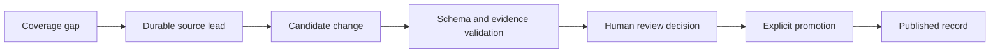

# Research Agent Schema and Source Contract

Date: 2026-07-15  
Status: active public-atlas contract

## Purpose

This contract governs autonomous and manual research for True North Map, the Canadian Ecosystem Intelligence Public Atlas.

Research agents may discover sources, measure gaps, and draft review candidates. They must not write directly to canonical published tables or public storage.

The promotion path is:



## Source visibility

Every source must be labelled:

- `public`: canonical URL can support a public claim after review
- `permissioned`: the project can use it under a recorded permission basis, but public display depends on that permission
- `internal`: informs research or requirements only and cannot appear as a public citation

Rules:

- Colleague emails are internal unless the sender explicitly authorizes publication.
- Uploaded PDFs remain in the `atlas-private-intake` bucket until review.
- Public claims require a canonical HTTPS source or an approved first-party submission.
- Named contacts require official publication or explicit approved submission.
- Social posts and video transcripts are discovery inputs unless they resolve to a durable source.
- Long copied passages are not evidence snippets. Use concise paraphrases or compliant short excerpts.

## Source order

1. Official company product, documentation, newsroom, investor, or press-release page.
2. Government, NATO, defence program, policy, procurement, or official challenge page.
3. Reputable industry publication with a direct company or program reference.
4. Social media and video only as a path to durable sources.
5. Secondary summaries only when they lead to better evidence.

Reject or defer:

- non-canonical or non-HTTPS URLs
- browser citation tokens or report-local markers
- unsupported marketing claims
- copied contact data
- inferred metrics, maturity, financing, or employee counts
- media without a recorded source and rights posture
- unresolved duplicate organizations or capabilities

## Canonical tables

Agents may propose changes for these records, but promotion remains human-controlled:

| Group | Tables |
| --- | --- |
| Identity | `organizations` (one canonical row per organization, including common profile fields and type-specific `profile_data`) |
| Geography | `locations`, `organization_locations` |
| Capability | `capabilities`, `technical_domains`, `capability_domains` |
| Mission landscape | `mission_areas`, `capability_mission_matches`, `ecosystem_clusters`, `capability_clusters` |
| Public demand | `demand_sources`, `demand_requirements`, `capability_demand_matches` |
| Participation | `programs`, `program_participations`, `funding_events`, `organization_relationships` |
| Media | `media_assets` |
| Evidence | `sources`, `evidence_snippets`, `field_citations` |

`organization_dossiers` is a read-only, security-invoker view that assembles
each organization and its reviewed child records into one dossier payload. It
is for screens, PDFs, exports, and unified editing; agents still propose changes
through `candidate_changes` and never write through the view.

## Required organization candidate fields

- stable candidate identifier
- canonical name and proposed slug
- description
- website when publicly available
- one or more organization categories
- primary location or an explicit unresolved-location note
- source confidence
- at least one canonical source
- field citation for the public description
- duplicate-check result
- research rationale

Unknown fields stay null. Do not insert `YTD`, `TBD`, `unknown`, `N/A`, or an invented range.

## Required capability candidate fields

- parent organization candidate or canonical ID
- name and proposed slug
- concise source-backed summary
- controlled capability type when supported
- core features backed by evidence
- defence applications backed by evidence or clearly labelled as a derived candidate
- technical tags and existing domain IDs
- maturity or TRL only when a source supports the value
- source confidence
- at least one capability citation
- duplicate-check result

Commercial organizations require at least one reviewed capability before publication.

## Mission and demand mappings

Mission and demand mappings are independent records, not fields embedded in prose.

Every mapping candidate needs:

- canonical capability ID
- existing mission-area or demand-requirement ID
- concise alignment summary
- rationale
- `match_type`: `public_source_alignment` or `derived`
- confidence
- field-level evidence
- review status

Demand mappings must include this public caveat:

> Public-source alignment only. This is not procurement eligibility, NATO endorsement, or a classified requirement.

An agent must never promote a policy theme into a mission area without enough organization and capability coverage to make the landscape useful.

## Evidence records

### Source

Required:

- title
- canonical URL for public sources
- publisher
- source type
- visibility
- accessed date
- public-approval state

### Evidence snippet

Required:

- source ID
- concise excerpt or paraphrase
- source locator when useful
- visibility
- public-approval state

### Field citation

Required:

- entity type
- entity ID
- exact field name
- evidence snippet ID

Company descriptions, capability summaries, mission/demand alignment summaries, program participation, financing, and public relationships need field citations before promotion.

## Candidate-change envelope

Database-backed candidates use `candidate_changes`:

- `research_run_id`
- `candidate_kind`
- `target_entity_type`
- `target_entity_id`
- `proposed_record`
- `before_record`
- `field_evidence`
- `duplicate_check`
- `confidence`
- `status`

File-backed research batches must preserve the same information and validate against the applicable schema under `research/ingestion/schema/`.

## Weekly autonomous loop

1. Run readiness and coverage checks.
2. Measure coverage by region x organization type x capability x demand requirement.
3. Choose the highest-value gap and record the selection in `research_runs.selected_gap`.
4. Expand the Global Source Book with durable public sources.
5. Create source leads before structured candidates unless an approved lead already exists.
6. Draft organizations, capabilities, relationships, and citations.
7. Validate schema, canonical URLs, duplicates, media rights, evidence completeness, and taxonomy IDs.
8. Put candidates in the review queue.
9. Stop. Do not publish.
10. After explicit human promotion, recalculate coverage and freshness.

Rate limits, weak sources, extraction failures, unresolved duplicates, and missing coordinates produce review notes. They never produce partially published records.

### Implemented coordinator contract

The weekly loop is implemented by `app/scripts/autonomous-research.ts` and the repository skills in `.agents/skills/`. Each run is bounded by a `research_run_v1` manifest and produces typed `source_lead_batch_v2` and `research_candidate_batch_v2` artifacts before a reviewer packet and direct private `candidate_changes` intake. Every typed candidate requires a generated reviewer rationale that explains the inclusion case, evidence strength, and reviewer verification focus. The `research_runs` row is audit metadata only and is not a separate review step.

The executable schema distinguishes organization, demand-signal, and program-relationship bundles. It also enforces conditional organization evidence so accelerators, incubators, investors, research centres, and ecosystem bodies are not forced into company-capability records.

The database migrations add organization aliases, hierarchical demand issuers, source-to-issuer roles, commitment metadata, durable reviewer rationales, richer run/candidate audit fields, idempotent trusted review intake, and typed human publication support for organization and public-demand candidates. Autonomous authority ends after private candidate intake; approval and all canonical-table writes remain human controlled.

## Public contributions

Profile claims, corrections, and suggested organizations create rows in `submissions` owned by the authenticated submitter.

- The submitter can read only their own submission.
- Editors and reviewers can access submissions through controlled `app_metadata.role`.
- Submission payloads are private.
- A submission must become a reviewed candidate before canonical promotion.
- Direct self-service publication is prohibited.

## Media contract

Every asset candidate records:

- organization or capability owner
- asset type
- storage path or source URL
- source visibility
- permission basis
- attribution
- licence
- approval status
- publication status

Only approved media may enter `atlas-public-media`. Raw or uncertain media remains private.

## Validation

Before a reviewed batch is eligible for promotion, run:

```bash
pnpm data:readiness
pnpm leads:validate
pnpm seed:validate
pnpm ingest:validate
pnpm test
pnpm lint
pnpm build
```

The public migration test additionally verifies:

- clean migration and seed execution
- six validated seed organizations and capabilities
- five NATO demand requirements
- zero unreviewed demand matches
- no scaffold names, example domains, or placeholder `YTD` values
- public canonical evidence for every published organization
- RLS on every exposed table
- anonymous denial from editorial candidate tables

## Promotion boundary

An accepted candidate is not a published record. Promotion must be a distinct reviewer-authorized operation that:

1. passes validation
2. records reviewer identity
3. writes canonical tables in one controlled transaction
4. records an audit event
5. preserves the before/after candidate and evidence
6. recalculates coverage and freshness

Agents do not own this step.
