# Research Agent Schema and Source Contract

Status: canonical research schema and source contract
Owner: Andrew Davies
Last reviewed: 2026-09-06

## Codex research efficiency contract (September 6)

Research uses the calling Codex task's selected model and effort. Follow the [shared efficiency contract](Autonomous%20Ecosystem%20Research%20Pipeline.md#codex-research-efficiency-contract-september-6) for the supported workbench, local focus scope, single finalizer gate, resumable receipt and measurement. No public schema, research API executor, model default, or Review/Publish authority change is introduced. The optional public assistant requires an explicit server model setting.

Workbench assembly computes the inspected canonical-source count and includes newly inventoried prospects while preserving any larger discovery-event count. It proposes a completed manifest to the shared validation gate and writes it only when that gate passes. A locally passed manifest establishes artifact validity; the finalizer receipt and exact pending-row reconciliation separately establish private intake.

## Purpose

This contract governs autonomous and manual research for True North Map, the Canadian Ecosystem Intelligence Public Atlas.

Research agents may discover sources, measure gaps, and draft review candidates. They must not write directly to canonical published tables or public storage.

Production advertises its current research pipeline through `/api/system/research-contract`; pipeline 1.8.0 retains the 1.7.3 requirements for ordinary organization work and adds governed canonical repair. Corpus refresh uses normalized outputs: `organization_bundle_v3` for new organizations and `organization_refresh_bundle_v2` for existing records. The tracked prepare command automatically requires an equal or newer compatible production pipeline before it creates a run, and import rechecks each actual candidate kind and schema before private intake. Local files alone never make those shapes stageable, but operators do not compare or synchronize patch strings manually. Historical runs remain valid under their recorded contracts.

`tnm-review-publication-v4` / `tnm-research-pipeline/1.8.0` governs canonical organization repair. The database migration, compatible Review and single-record Publish surfaces, and deployed `/api/system/research-contract` must all be live and verified before any `organization_canonical_repair_bundle_v1` run may be prepared or imported.

The promotion path is:

```mermaid
flowchart LR
  A["Saturation gap"] --> I["Intelligence requirement and collection plan"]
  I --> P["Broad prospect inventory"]
  P --> B["Durable source lead"]
  B --> L["Atomic claim ledger and dossier coverage"]
  L --> C["Green or amber candidate change"]
  C --> D["Schema and evidence validation"]
  D --> E["Human review decision"]
  E --> F["Explicit promotion"]
  F --> G["Published record"]
```



## Source visibility

Every source must be labelled:

- `public`: canonical URL can support a public claim after review
- `permissioned`: the project can use it under a recorded permission basis, but public display depends on that permission
- `internal`: informs research or requirements only and cannot appear as a public citation

Rules:

- Colleague emails are internal unless the sender explicitly authorizes publication.
- Uploaded PDFs remain in the `atlas-private-intake` bucket until review.
- Public claims require a canonical HTTPS source or an approved first-party submission.
- Named contacts require official publication or explicit approved submission.
- Social posts and video transcripts are discovery inputs unless they resolve to a durable source.
- Long copied passages are not evidence snippets. Use concise paraphrases or compliant short excerpts.

## Source order

1. Official company product, documentation, newsroom, investor, or press-release page.
2. Government, NATO, defence program, policy, procurement, or official challenge page.
3. Reputable industry publication with a direct company or program reference.
4. Social media and video only as a path to durable sources.
5. Secondary summaries only when they lead to better evidence.

Use specialized Canadian OSINT lanes when relevant: corporate registries for identity and status; patent/IP sources for published technical claims and assignee trails; CanadaBuys and proactive disclosure for procurement lifecycle; official customer, prime, program, exercise, trial, or funding pages for independent corroboration; official sitemaps, documents, PDFs, datasheets, manuals, and bilingual search for technical depth. Lobbying records, patents, job postings, newsletters, and social posts retain their specific limitations and never prove contract award, product maturity, or customer interest by implication.

## Investigation and claim-specific support

The installed Research coordinator uses broad discovery, selective follow-up and substantial decision-useful synthesis. Search the authorized newsletter/feed portfolio alongside independent web investigation; source access failures are recorded at the affected question or target, with alternate public routes and unrelated investigation continuing. Essential production snapshots, identity, duplicate, taxonomy, privacy and staging compatibility remain hard boundaries. Research still ends at private Admin Review; acceptance and Publish are separate human actions.

A competent direct record, attributed announcement or identifiable public original report can establish its own bounded claim. Independent corroboration is required when the intended stronger assertion, consequential dispute or identity/lifecycle risk calls for it, not automatically for every company specification or reported plan. Collection questions use the existing `one_anchor` or `anchor_plus_independent_corroboration` values; `discovery_only` is a source posture, not a question threshold. Source-backed statements, TNM inference and private unresolved hypotheses remain distinct. Threshold changes require a substantive change in the claim or evidence question and cannot be used to evade validation.

Financial and industrial research preserves amounts, currencies, reporting periods, counterparties and stages: announced capital, commitments, disbursements, equity/debt, grants/contributions, backlog/revenue, planned/operating capacity and nonbinding/definitive transactions. Inspect relevant filings, annexes, application terms, buyer or counterpart records, earlier announcements and contradictory evidence when they can materially change the understanding. An incomplete transaction may still be consequential. Use existing allowlisted fields for supported public context and private lineage for findings without a compatible public field. Date-only evidence remains date-only where supported; access time is never a substitute event date.

Use one combined substantive and integrity review, returning thin work to investigation and repeating review only for concrete findings. Generated time allowances are progress checkpoints unless Andrew sets a time limit. Complete the required coverage and actual marginal-yield assessment; no extra ritual pair of searches is required after material questions are resolved. Existing executable discovery/lane minima, packet capacities, public field bounds and source/lineage gates are unchanged by this instruction revision and must not be represented as removed. Private working checkpoints and public-source caches remain ignored under `research/ingestion/local/`; finalized candidate artifacts still require complete in-memory validation before their canonical write.

Official-logo preparation now tries observed official HTML pages after the canonical website, with optional private `--source-pages` routing that does not add unused field evidence. `--retry-missing` revisits only `not_found` dispositions; successful marks and packet entries survive repair. Per-batch locking, atomic JSON writes, rate-limit stops and bounded optional page attempts protect local work. Every new organization still has a private logo disposition, including valid non-blocking `not_found`; research never uploads or publishes a canonical mark.

## Collection plan, claims, and coverage

Every new run prepared by the current coordinator uses:

- `research_collection_plan_v1` for the intelligence requirement, named subjects and aliases, priority questions, target fields, English/French search posture, source lanes, evidence thresholds, stop conditions, and prohibited actions;
- `research_claim_ledger_v1` for atomic subject-predicate-value claims, units and dates, original and canonical URLs, source independence, corroboration, contradictions, supersession, dispositions, and candidate targets;
- a twelve-dimension dossier coverage vector for identity/ownership, Canadian presence, offering/mandate, technical specifications, maturity/deployment, customers/contracts/programs, procurement/demand, partnerships/financing, public contacts, current activity, source diversity, and contradictions.

The current coordinator also enforces a decision-usefulness standard without changing these schema versions. Search proceeds in both directions: entity-outward through capabilities, variants, subsystems, interfaces, primes, partners, programs, contracts and proof events; and problem-inward from Mission Areas and published Public Needs through outcomes, constraints, metrics, standards, procurement language, and English/French terminology to candidate capabilities and enabling organizations. Every selected candidate must make the specific capability or need, coverage value, evidence composition, current trigger when present, conservative Mission/Public Need read, consequential unknowns, and one bounded reviewer action legible in the existing typed fields, warnings, and rationale.

Organization and program linkability is a deterministic private review aid, not
a new candidate kind or publication path. An explicit related-organization slug
is accepted only when it resolves to a published organization and the supplied
name matches that organization's canonical name or one published alias. A
unique exact canonical-name or published-alias match without an explicit slug
remains an advisory reviewer suggestion until a researcher or reviewer supplies
the slug and revalidates the candidate; the coordinator does not mutate the
candidate automatically. Fuzzy, substring, ambiguous and unresolved names
remain discovery or private review items with no public target. The generated
reviewer packet lists exact targets, exact alias suggestions, unresolved names
and suggested reciprocal paths but does not mutate the candidate. The same
fail-closed checks run during smoke/check-only validation, review packet
generation, staging export and trusted staging import immediately before
intake.

Existing program slugs reuse the current canonical name, type, operator, URL
and summary exactly. Research preserves the source's participation wording and
keeps program family, annual cohort label, operator, accelerator, cohort
company, participant, funder and other or ambiguous roles distinct. An operator
is not a cohort company by implication. Organization participation never
creates capability participation; a capability-to-program claim needs a durable
leaf source explicitly naming both objects and a supported reviewed publication
path. These checks use the existing schema and Review/Publish gates, so the
research pipeline version does not change.

For runs recorded as `tnm-research-pipeline/1.7.0` or later, that usefulness standard is a complete same-run cross-artifact gate rather than a prose convention. The collection plan, prospect inventory, signal batch, source leads, claim ledger, candidate batch, run manifest, and derived staging export must agree on the exact target set and dispositions. Pipeline 1.7.2 preparation scaffolds one ledger subject and all twelve `not_assessed` coverage dimensions per dossier target; completion fails until every scaffold becomes an evidence-linked final assessment. Fit summaries, change summaries, refresh summaries, operation explanations, claim predicates, analyst notes, recovery attempts, and each labelled rationale segment must use record-specific structured anchors. A target is complete only when it has exactly one candidate or one typed `readinessDisposition` of `research_required` or `no_material_change`; a token embedded in free text is not a disposition. Every source-backed evidence leaf maps one-to-one to a supported or corroborated candidate-field claim with the same candidate, field path, source and excerpt; every claim and candidate belongs to exactly one real coverage subject; and refresh leads and signals resolve uniquely to the same target, byte-exact baseline and typed outcome. Missing signal deltas, generic name-substitution copy, mutation-shaped predicates, unresolved recovery attempts, misleading source counts, duplicate or cross-subject lineage, cross-target signals, and staging payloads that differ from the validated candidate batch fail before trusted intake.

Historical 1.5 and 1.6 artifacts remain immutable and are evaluated under their recorded pipeline version. The 1.7 gate does not rewrite or retroactively invalidate their lineage.

Syndicated copies of one release are one source family. Discovery-only material cannot become source-backed field evidence. Every source-backed candidate evidence item must match a ledger claim by candidate ID, field path, and source ID. Conflicting values remain visible as reviewer warnings until resolved or explicitly deferred.

Pipeline 1.7 dossier enrichment has no fixed article or source count. Each named target records at least three complementary searched lanes and dispositions for all twelve coverage dimensions, uses durable evidence and genuine independent corroboration where the plan requires it, and explains why further plausible searching would not change the reviewer decision. Every selected candidate source supports an exact public leaf, a specific warning, or a documented coverage conclusion; unused, duplicated, syndicated, feed, search-result, and social-discovery items cannot satisfy readiness. Source independence considers the underlying publisher or record owner, origin and event family; hostnames alone neither prove nor disprove independence.

For a ready candidate or `no_material_change` disposition, `saturation.additionalSearchYield` must be `low` or `zero`; continuing high or medium yield is a `research_required` outcome. An unactivated organization candidate must explicitly propose `editorial_profile_version = organization_editorial_profile_v1`; activation is never inferred by intake or Publish. A qualified refresh signal must carry a structured `eventDate`, `effectiveDate`, or `procurement.closingAt`. Ordinary refresh batches require at least one target-matched qualified signal per candidate, while dossier enrichment may legitimately use no signals. Any non-null `current_activity_as_of` must equal a linked qualified signal date or a published/effective date on the exact mapped supported claim; observation and reviewer timestamps are not eligible substitutes.

Apply every refresh operation to its exact `beforeRecord` in memory before any canonical artifact write. The resulting organization must publish `current_activity` and `current_activity_as_of` together or clear both, including when the legacy record already contains only one half of the pair. An undated investigation, profile statement, or background development belongs in operating context, a reviewed question, or a warning rather than Recent activity. Historical run builders and one-off repair scripts are audit evidence, not constructors for a new run: target-local sources, exact leaf evidence, recovery outcomes, coverage, counters, and final-state operations must pass the live schema and record-specific checks as one complete in-memory object before the first canonical write.

For organization-dossier work, the assigned target count is an operational artifact envelope rather than discovery yield. `corpus_refresh` automatically selects up to 50 eligible null-version organizations outside active Review, and a corpus-wide request continues successive non-overlapping segments until every eligible record is dispositioned; sparse evidence produces a typed `research_required` or `no_material_change` disposition rather than silent omission. Unrelated pending candidates do not block the next segment, while exact target overlap remains fail-closed. Comprehensive business-development depth covers the organization's concrete offering or mandate, buyer/user/funder/test/partner audience, public proof and maturity, access or procurement path, Canadian delivery footprint, relevant funding and relationships, current trigger, material constraints, public contact and best first conversation. Company-style technical depth is not forced onto accelerators, investors, government offices, test centres or ecosystem organizations; role-specific program, eligibility, facility, portfolio, partnership and access evidence replaces inapplicable fields. Durable background and maintenance evidence may improve the dossier without being promoted to a qualified signal.

Pipeline 1.7.2 validates the handoffs that previously required end-of-run repair: each claim carries `owner:<underlying-owner>|origin:<canonical-host>|event:<underlying-event-family>` provenance, independent links use a different underlying key, contradiction links are real and reciprocal, supersession resolves to a real prior claim, role-specific plan questions replace the global company specification prompt, and qualified signal summaries name the actual event and field delta rather than a generic update sentence.

Pipeline 1.7.3 retains every 1.7.2 evidence, coverage, saturation and
cross-artifact gate and adds one explicit decision-snapshot outcome for each
new or refreshed dossier: an 80-to-1,200-character
`executive_relevance_summary` or `null`. A non-null summary is a human-reviewed
True North Map assessment synthesized only from already supported organization
fields and reviewed connections. It must name the decision relevance without
inventing a ranking, endorsement, customer interest, eligibility or procurement
claim, and it requires mapped field evidence. Coverage validation must choose a
supported summary or null; generic filler and omission without assessment fail.

A candidate-linked material signal requires an exact dated durable claim, a concrete decision delta, affected public fields, and a bounded reviewer action. Context-only findings and record maintenance remain valid research inputs but cannot be qualified or linked as material signals.

Reject or defer:

- non-canonical or non-HTTPS URLs
- browser citation tokens or report-local markers
- unsupported marketing claims
- copied contact data
- inferred metrics, maturity, financing, or employee counts
- media without a recorded source and rights posture
- unresolved duplicate organizations or capabilities

## Canonical tables

Agents may propose changes for these records, but promotion remains human-controlled:

| Group | Tables |
| --- | --- |
| Identity | `organizations` (one canonical row per organization, including common profile fields and type-specific `profile_data`) |
| Geography | `locations`, `organization_locations` |
| Capability | `capabilities`, `technical_domains`, `capability_domains` |
| Mission landscape | `mission_areas`, `capability_mission_matches`, `ecosystem_clusters`, `capability_clusters` |
| Public demand | `demand_sources`, `demand_requirements`, `capability_demand_matches` |
| Participation | `programs`, `program_participations`, `funding_events`, `organization_relationships` |
| Media | `media_assets` |
| Evidence | `sources`, `evidence_snippets`, `field_citations` |

`organization_dossiers` is a read-only, security-invoker view that assembles
each organization and its reviewed child records into one dossier payload. It
is for screens, PDFs, exports, and unified editing; agents still propose changes
through `candidate_changes` and never write through the view.

## Required organization candidate fields

- stable candidate identifier
- canonical name and proposed slug
- description
- website when publicly available
- one or more organization categories
- primary location or an explicit unresolved-location note
- source confidence
- at least one canonical source
- field citation for the public description
- duplicate-check result
- research rationale

Unknown fields stay null. Do not insert `YTD`, `TBD`, `unknown`, `N/A`, or an invented range.

`organization_bundle_v3` is the normalized dossier candidate. In addition to the common organization contract it may carry cited founded, ownership, operating and Canadian-footprint fields; time-bounded current activity and its as-of date; a validated public-contact object; capabilities; program participations with lifecycle and identifiers; funding events; public relationships; and up to four reviewed first-conversation questions. Type-specific `profileData` is restricted by organization kind. `editorialProfileVersion` is nullable and may only select `organization_editorial_profile_v1`; null is the normal safe state until the reviewer explicitly approves template activation.

For a pipeline 1.7.3 bundle, the candidate also carries
`executiveRelevanceSummary` as either a supported 80-to-1,200-character
assessment or null. Its public field target is
`executive_relevance_summary`. A non-null value needs at least one exact
`derived` candidate-field evidence item and field citation tied to the public
sources that establish its factual premises or reviewed connection;
discovery-only inputs cannot support it. The derived classification preserves
the distinction between the source-backed premises and True North Map's bounded
decision interpretation. Review labels the value as an assessment and Publish
writes only the accepted preview.

Every public leaf in a v3 bundle requires exact field evidence except controlled identity, confidence, geographic precision and the presentation-version selector. Reviewed questions are assessment prompts, not source facts: they require specific decision context, reject generic research questions, and remain bounded to high or moderate assessment confidence.

## Required capability candidate fields

- parent organization candidate or canonical ID
- name and proposed slug
- concise source-backed summary
- controlled capability type when supported
- core features backed by evidence
- defence applications backed by evidence or clearly labelled as a derived candidate
- technical tags and existing domain IDs
- maturity or TRL only when a source supports the value
- source confidence
- at least one capability citation
- duplicate-check result

Commercial organizations require at least one reviewed capability before publication.

## Mission and demand mappings

Mission and demand mappings are independent records, not fields embedded in prose.

Every mapping candidate needs:

- canonical capability ID
- existing mission-area or demand-requirement ID
- concise alignment summary
- rationale
- `match_type`: `public_source_alignment` or `derived`
- confidence
- field-level evidence
- review status

Mapping requires two independently recorded premises: what the capability demonstrably does and what the Mission Area or published Public Need demonstrably asks for. The reasoning between them remains a Derived Read with its own confidence, constraint or tradeoff, decisive unknown, and verification action. Keyword overlap is not evidence of fit. An organization candidate may carry an exact Public Need hypothesis in its private reviewer rationale, but it does not create a capability-demand match; the existing private demand-matching workspace remains the only path after capability publication.

Demand mappings must include this public caveat:

> Public-source alignment only. This is not procurement eligibility, NATO endorsement, or a classified requirement.

An agent must never promote a policy theme into a mission area without enough organization and capability coverage to make the landscape useful.

## Evidence records

### Source

Required:

- title
- canonical URL for public sources
- publisher
- source type
- visibility
- accessed date
- public-approval state

### Evidence snippet

Required:

- source ID
- concise excerpt or paraphrase
- source locator when useful
- visibility
- public-approval state

### Field citation

Required:

- entity type
- entity ID
- exact field name
- evidence snippet ID

Company descriptions, capability summaries, mission/demand alignment summaries, program participation, financing, and public relationships need field citations before promotion.

## Candidate-change envelope

Database-backed candidates use `candidate_changes`:

- `research_run_id`
- `candidate_kind`
- `target_entity_type`
- `target_entity_id`
- `proposed_record`
- `before_record`
- `field_evidence`
- `duplicate_check`
- `confidence`
- `status`

New research candidates also carry `reviewTier`, `inclusionScore`, `completenessScore`, and `reviewWarnings`. Inclusion and completeness are separate: a strong core inclusion case with incomplete optional enrichment belongs in amber review, not silent exclusion.

File-backed research batches must preserve the same information and validate against the applicable schema under `research/ingestion/schema/`.

### Signal and refresh envelopes

Multi-source refresh runs first create `research_signal_batch_v1`. Each atomic signal records its deterministic fingerprint, source channel and family, discovery origin, canonical URLs, extracted entities and event details, evidence status, live entity matches, intended outcome, recovery attempts, disposition, and deferral rationale.

Existing-record matches use `organization_refresh_bundle_v2` for normalized organization enrichment, `organization_refresh_bundle_v1` for historical compatibility, or `demand_refresh_bundle_v1` for public-demand enrichment. A refresh bundle requires:

- a high-confidence `targetMatch` with entity type, UUID, slug, match methods, and baseline `updated_at`
- a `beforeRecord` snapshot of every touched canonical row
- explicit `set_field`, `add_child`, or `update_child` operations
- before and after values where applicable
- evidence IDs and a reviewer explanation for every operation
- source-channel provenance, corroboration, reviewer rationale, and warnings

Pipeline 1.7.3 permits an allowlisted `set_field` operation for
`executive_relevance_summary`. The validated preview must equal the result of
applying all reviewed operations to the exact `beforeRecord`; non-null output
requires mapped field evidence, while an evidence-insufficient dossier must
explicitly retain or set null.

Additive child values must satisfy the same typed technology, program, relationship, or demand-statement contract used at publication. Every declared parent must equal the matched canonical target. Refreshes fail validation when they mix organization and demand operation families or reference unknown Technical Domain and Mission Area values.

The intended existing target is not treated as a duplicate collision. Accidental matches remain blocking. Organization refresh v2 adds allowlisted `set_profile_field` operations and stable updates for supported capability, program-participation, relationship, and funding children while retaining `set_field`, `add_child`, exact stale-baseline protection, per-leaf evidence and the prohibition on automated deletion. Every updated child carries a complete schema-valid `before` snapshot; publication compares it with the locked live child after the parent baseline passes. Evidence routing resets to the immutable operation target for every leaf, so a Mission Area or program leaf cannot redirect a later capability or participation citation.

### Canonical organization repair contract

Canonical repair is a separate mode for 1-25 exact published organization targets that ordinary non-destructive enrichment cannot safely correct. Each target requires at least two independent identity/lifecycle source lanes and exactly one repair candidate or typed `research_required` hold. It creates no Signals artifact and cannot mix ordinary refresh and repair candidate kinds.

Each candidate is bound to a private, service-role-only `canonical_organization_repair_snapshot_v1` containing the exact organization baseline, aliases, capabilities and protected dependencies. A proposed successor carries its own exact published ID, slug, name and baseline timestamp and is rechecked live at publication. The only operations are `set_organization_identity`, `set_profile_field`, `add_alias`, `archive_alias`, `archive_capability`, and `archive_organization`. Hard deletion, reparenting and transfer are invalid. An organization archive may name one exact already-published successor and create one immutable old-slug redirect; it may not create a redirect chain.

Public evidence must positively establish identity, lifecycle or supersession. Absence, a dead website or a search miss is never archival proof. Intake and publication reject duplicate source IDs or normalized URLs, identity/domain/alias collisions, protected references, stale target/alias/capability/dependency/successor state, and unsupported successors. Canonical candidates are excluded from generic batch acceptance and publication: each receives one human Review decision and, if accepted, a distinct single-record Publish action. A published redirect is repaired forward through a new governed candidate, never rewritten or deleted.

## Autonomous discovery and refresh loops

1. Run readiness and coverage checks.
2. Measure coverage by region x organization type x capability x demand requirement.
3. Choose the highest-value saturation gap and record the selection in `research_runs.selected_gap`.
4. Rank and expand the Global Source Book with durable public sources.
5. Enumerate 40-75 unique prospects across at least six lanes and preserve unused plausible prospects as queued backlog.
6. Create source leads before structured candidates. Qualified leads continue automatically without a separate human approval pause.
7. Recover evidence across at least three lanes before deferring a plausible thin lead.
8. Draft green and amber organizations, demand signals, independently reviewable capabilities, relationships, citations, scores, warnings, and rationales. Each rationale exposes coverage value, evidence, Mission/Public Need read, unknowns, and reviewer action.
9. Validate schema, canonical URLs, duplicates, media rights, evidence completeness, taxonomy IDs, and discovery throughput.
10. Put candidates in the review queue. Stop. Do not publish.
11. After explicit human promotion, recalculate coverage and freshness.

The refresh loop additionally reads published-record and public-demand watchlists, searches at least four source families, extracts atomic signals, resolves durable evidence, and matches signals before candidate building. A signal qualifies only when it changes a capability definition, proof/current state, Mission/Public Need read, consequential unknown, or reviewer action; recency alone is not materiality. It may complete with no candidates only when every inspected signal has a recorded disposition.

Rate limits, weak sources, extraction failures, unresolved duplicates, and missing coordinates produce review notes. They never produce partially published records.

### Implemented coordinator contract

The loops are implemented by `app/scripts/autonomous-research.ts` and the canonical local operator skills in ignored `.agents/skills/`, including `$tnm-signal-refresh`. The public repository tracks the executable data contract and review boundary, not the private skill instructions or credentials. A broad run produces `research_prospect_inventory_v1`, `source_lead_batch_v2`, and `research_candidate_batch_v2` artifacts. A refresh run also produces `research_signal_batch_v1`. Gap discovery retains its 8-10-candidate completion contract unless `underTargetReason` and `exhaustionEvidence` prove that 40 prospects and six lanes were genuinely exhausted. Named dossier enrichment accepts 1-50 exact targets. An unscoped organization-refresh or full-database request uses `corpus_refresh`, whose default 50-record production segment is selected automatically and followed by successive non-overlapping segments until the eligible corpus is exhausted. Every dossier target requires one exact target-key candidate or structured disposition, and every same-run artifact must validate before staging. Every typed candidate requires one record-specific generated research rationale. Admin Review pre-populates the editable reviewer-decision field with that evidence-bounded suggestion; the authenticated reviewer remains responsible for reviewing or rewriting it and submitting the explicit decision. The `research_runs` row is audit metadata only.

The executable schema distinguishes organization, demand-signal, program-relationship, organization-refresh, and demand-refresh bundles. `organization_bundle_v3` and `organization_refresh_bundle_v2` remain the normalized dossier shapes; production evaluates them under pipeline 1.7.3 with the explicit executive-summary outcome and no new bundle kind. V1/v2 organization and v1 refresh shapes remain parseable only for historical compatibility. The schema enforces conditional organization evidence so accelerators, incubators, investors, research centres, and ecosystem bodies are not forced into company-capability records.

The database migrations add organization aliases, hierarchical demand issuers, source-to-issuer roles, commitment metadata, durable reviewer rationales, richer run/candidate audit fields, idempotent trusted review intake, and typed human publication support for new and refresh organization and public-demand candidates. `research_run_id` is the durable Admin queue batch key: pending and approved totals may span multiple runs, and pagination never redefines the queue size. A reviewer may accept every still-pending, fully valid candidate in one completed run through the atomic batch-review function; each candidate retains its own review decision and AI-prepared rationale, and the separate run-grouped Publish checkpoint remains mandatory. Refresh publication adds stale-baseline protection, stable-target updates, append-only evidence, and explicit operation auditing. Lead qualification is autonomous; human authority begins with candidate editing and review in Admin Review. Autonomous authority ends after private candidate intake, and acceptance, publication, and all canonical-table writes remain human controlled.

## Public contributions

Profile claims, corrections, and suggested organizations create rows in `submissions` owned by the authenticated submitter.

- The submitter can read only their own submission.
- Editors and reviewers can access submissions through controlled `app_metadata.role`.
- Submission payloads are private.
- A submission must become a reviewed candidate before canonical promotion.
- Direct self-service publication is prohibited.

## Media contract

Every asset candidate records:

- organization or capability owner
- asset type
- storage path or source URL
- source visibility
- permission basis
- attribution
- licence
- approval status
- publication status

Only approved media may enter `atlas-public-media`. Raw or uncertain media remains private.

## Historical artifact validation

Archive validation uses the originating run's pipeline version. Pre-1.8 lead recovery retains its historical three-lane minimum; 1.8 and newer use the run's mode-specific `minimumSourceLanes`. This compatibility rule does not upgrade historical artifacts or weaken current staging. Cache JSON reads and schema parsing only within a single validation invocation, index completed-run lookup by run ID/schema, and reread files on the next invocation. Historical warnings remain inspectable; never fabricate recovery evidence or delete useful lineage merely to pass a newer contract.

Preparation already reads current production and builds readiness/coverage context. Do not repeat the standalone readiness and coverage aliases ceremonially in the coordinator. Standalone commands remain useful for diagnosis or when inspecting coverage without preparing a run.

## Validation

Before a reviewed batch is eligible for promotion, run:

```bash
pnpm research:validate
pnpm data:readiness
pnpm release:validate
```

For a 1.7 research batch, file validation and smoke both run the same record-specific cross-artifact gate. Trusted import derives the pipeline version from the canonical run, loads the mode-specific artifact set, requires the private-only write policy, reruns the gate, and deep-compares the staged run plus every complete candidate envelope with the validated artifacts before calling the private staging function. A downgraded, direct, stale, or partially altered staging export cannot bypass this check; direct database-connector calls are not an approved operator path.

For pipeline 1.7.3, validation additionally covers null and supported summaries,
rejects missing citation mapping, compares the refresh preview exactly, and
proves that Admin Accept makes no public write. Migration and publication tests
must exercise both new and refresh publishers before the deployed contract may
advertise the version.

The public migration test additionally verifies:

- clean migration and seed execution
- six validated seed organizations and capabilities
- five NATO demand requirements
- zero unreviewed demand matches
- no scaffold names, example domains, or placeholder `YTD` values
- public canonical evidence for every published organization
- RLS on every exposed table
- anonymous denial from editorial candidate tables

## Promotion boundary

An accepted candidate is not a published record. Promotion must be a distinct reviewer-authorized operation that:

1. passes validation
2. records reviewer identity
3. writes canonical tables in one controlled transaction
4. records an audit event
5. preserves the before/after candidate and evidence
6. recalculates coverage and freshness

Agents do not own this step.
