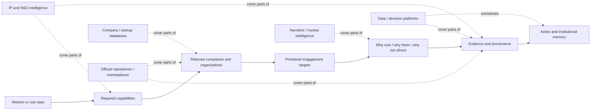
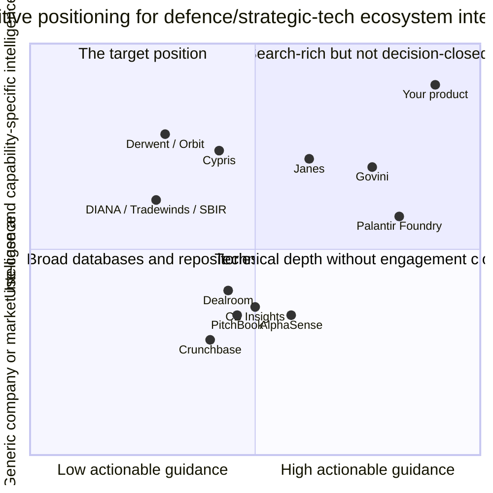

# Market Map for Capability-Centric Business Intelligence in Defence and Strategic Tech

## Executive Summary

The market you are entering is real, but it is fragmented rather than cleanly defined. No single incumbent appears to own the exact workflow you are designing. Instead, the market is split across five adjacent categories: operational data platforms, broad company/startup intelligence databases, IP/R&D intelligence platforms, narrative/market intelligence tools, and official defence repositories and marketplaces. Each category solves part of the user problem, but none consistently solves the full job of **starting from a mission or use case, finding the most relevant capabilities and companies, prioritizing who to engage next, and showing transparent justification plus provenance for that recommendation**. citeturn23view0turn22view0turn14view2turn13view3turn16view0turn21view1turn20view4

The strongest substitutes today are not direct competitors so much as **workarounds**: a BD or engagement manager toggles between PitchBook/Crunchbase/Dealroom for company discovery, Janes/Govini for defence context, AlphaSense or Quid for recent signals and monitoring, patents or technical literature for capability validation, and official repositories such as DIANA, Tradewinds, SAM.gov, SBIR.gov, or DTIC for provenance and procurement context. The result is a manual synthesis burden. Users can get lists, alerts, and records, but they still have to decide: **Who is worth engaging first for this use case, why them, why now, and what evidence will stand up in a meeting?** citeturn25view4turn13view5turn15view0turn22view1turn14view3turn17view3turn21view1turn20view2turn20view1turn20view4

That means the most attractive wedge is not “another database.” It is a **decision-support layer for ecosystem engagement**. The problem worth solving first is not generic market intelligence and not generalized AI enrichment. It is the narrower, higher-value workflow of **mission/use-case–centric partner discovery and prioritization for defence and strategic-tech engagement teams**, especially in contexts where the public ecosystem is fragmented, time is short, and leadership needs a defensible recommendation rather than a raw data dump. citeturn22view0turn23view0turn20view5turn21view1turn15view2turn13view4

The product therefore wins if it is opinionated where others are exhaustive, transparent where others are black-box or search-heavy, and workflow-native for engagement managers rather than analysts, investors, or IP teams. The highest-confidence opportunity is a curated/manual intelligence product with AI-assisted synthesis layered on top later, beginning with a narrow wedge such as allied defence innovation teams, industrial-base engagement offices, or prime-contractor BD teams working specific mission challenges. That wedge is consistent with the problem-identification approach in your bootcamp materials: start from the job, isolate the wedge, and test the riskiest assumptions with explicit hypotheses, metrics, and success lines. fileciteturn0file0 fileciteturn0file1

## Comparative Landscape

The table below compares the twelve strongest “top of stack” services for your proposed product. These are the tools most likely to be used by the same buyer, influence expectations, or occupy adjacent budget.

| Service | Category | Target users | Core features | Data sources | Pricing model | What it does best | Main limitation for your product’s use case | Example customers or use cases | Official sources |
|---|---|---|---|---|---|---|---|---|---|
| **entity["company","Palantir Technologies","software company us"] Foundry** | Operational data/decision platform | Large enterprises, governments, defence organizations | Ontology, data integration, operational apps, actions, streaming, interoperability | Internal enterprise data plus connected external systems | Enterprise / quote-based | Turns integrated data into operational workflows and decisions | Usually requires implementation effort and internal data maturity; not a turnkey external ecosystem/partner-intel product | Use cases: operational decisioning, data integration, secure mission workflows | citeturn3search2turn3search24turn3search3 |
| **entity["company","Govini","defense software company us"] Ark** | Defence acquisition intelligence | Defence acquisition, supply chain, modernization teams | AI-enabled applications across supply chain, S&T, production, sustainment, logistics, modernization | Integrated commercial and government acquisition data | Demo / quote-based | Purpose-built defence acquisition workflows; strong industrial-base and modernization framing | More acquisition-program centric than outward ecosystem-engagement centric; narrower around DoD acquisition workflows | Use cases: supplier ecosystem visibility, technology market analysis, modernization planning, vendor due diligence | citeturn23view0turn2view1turn11search14 |
| **entity["company","Janes","defence intelligence company uk"] Defence Intelligence** | Defence OSINT/data platform | Defence, intelligence community, industry, tech partners | Foundational intelligence, country intelligence, market understanding, API-integrated data | Structured open-source defence intelligence curated by analysts | Demo / subscription | Deep validated defence context and trusted military/market data | Strong on “what exists” and “what is happening,” but not a lightweight use-case-to-engagement shortlist workflow | Use cases: understand markets, force planning, threat assessment, equipment and country intelligence | citeturn22view0turn22view1turn22view2 |
| **entity["company","AlphaSense","market intelligence platform us"]** | Enterprise market intelligence/search | Strategy, research, PE/VC, consulting, corporates | AI search, deep research, premium content search, expert transcripts, enterprise intelligence | 500M+ premium financial/business documents plus internal content in enterprise tier | Annual subscription; per-seat and enterprise; free trial | High-quality synthesis across premium documents and expert content | Search-centric and general market-centric; not capability/use-case-first and not defence-ecosystem-native | Public customers include Pfizer, Microsoft, Salesforce; use cases include competitive and market intelligence | citeturn14view2turn14view3turn11search0 |
| **entity["company","CB Insights","market intelligence company us"]** | Company/market intelligence | Strategy, market research, competitive intelligence, BD | Predictive AI web app, company discovery, analysis, tracking, market maps | Millions of data points on companies, markets, vendors, products, partnerships, patents | Request pricing / contact sales | Strong at predictive company and market patterning | Still largely company/market-first; weaker on transparent mission-specific engagement prioritization | Use cases: market research intelligence, competitor tracking, strategic company discovery | citeturn26search6turn26search3turn26search8 |
| **entity["company","PitchBook","financial data company us"]** | Private-market intelligence | Investors, corporates, service providers, BD teams | Company/investor/deal/fund/people data, alerts, integrations, CRM, AI/ML tools | Private and public capital markets data; patents included in datasets | Request pricing / free trial | Excellent for company, deal, investor, and contact discovery | Capital-markets-first; defence relevance, capability maturity, and mission fit remain manual analyst work | Use cases: business development, market intelligence, deal sourcing, partner search | citeturn2view2turn25view4turn25view3 |
| **entity["company","Crunchbase","company intelligence platform us"] Pro / Business** | Predictive private-company intelligence | GTM teams, investors, BD teams | AI search, Scout summaries, heat/growth-style signals, tracker boards, alerts, CRM push | Millions of private-company records, user activity, proprietary partnerships, government filings, internet data | Public Pro pricing; Business/team upsell | Fast, accessible company discovery and monitoring | Broader and lighter-weight than PitchBook, but still company-first and weak on defence-specific capability justification | Use cases: growth-company discovery, prospecting, monitoring market shifts | citeturn13view2turn13view5turn27search0turn27search2 |
| **entity["company","Dealroom.co","startup data platform netherlands"]** | Startup/ecosystem intelligence | Investors, corporates, governments, ecosystem builders | Startup database, stealth detection, talent graph, cap tables, revenue/valuation signals, ecosystem dashboards | ML + public info harvesting + filings + partner data + manual verification; 100+ government partnerships | Premium €12,600/yr; Premium Plus €17,000/yr; enterprise/API custom | Best-in-class ecosystem and startup mapping, including public-sector ecosystem dashboards | Still maps ecosystems more than it recommends who to engage for a mission problem | Use cases: compare ecosystems, detect stealth startups, map regional innovation bases | citeturn15view0turn15view1turn15view2turn15view3 |
| **entity["company","StartUs Insights","innovation intelligence company austria"] Discovery Platform** | Startup/tech scouting | Corporate innovation, strategy, R&D, VC, NBD | Startup scouting, technology scouting, trend intelligence, supplier scouting, BI, deal flow | 9M+ startups/tech companies, 25k+ trends/technologies, 190M+ patents/news/reports | Free trial / quote-based | Very strong breadth for innovation scouting across startups, technologies, and trends | More innovation-scouting than defence engagement prioritization; limited defence-native ontology | Use cases: startup scouting, technology scouting, corporate strategy, new business development | citeturn13view4turn4search23 |
| **entity["company","Cypris","r&d intelligence platform us"]** | R&D / IP intelligence | Corporate R&D, IP, innovation teams, some government users | AI dashboard, knowledge management, research briefs, patent and technical intelligence | 500M+ data points from patents, scientific literature, grants, corporate filings, news, plus internal knowledge | Demo / quote-based | Best technical-intelligence depth of the set; strong verifiability for capability claims | Built for R&D/IP workflows, not BD engagement sequencing; may over-index on technical novelty vs deployability | Publicly cited users include NASA, Johnson & Johnson, U.S. Air Force, Los Alamos; use cases: technology scouting, competitive R&D analysis, IP strategy | citeturn16view0turn7search10turn6search0 |
| **entity["company","Clarivate","information services company uk"] Derwent Innovation** | Patent intelligence | Corporate IP, legal, R&D | Patent search, watch, analytics, DWPI data, APIs, services | Derwent patent data, analytics, search/watch products, APIs | Quote-based | Trusted enterprise patent-search and analytics stack | Excellent for patent landscapes, weak for “who should BD engage next for this defence use case?” | Use cases: patent search/watch, analytics, commercialization of innovation | citeturn19view0turn19view1 |
| **entity["company","Questel","ip services company france"] Orbit Intelligence** | Patent / IP intelligence | IP, innovation, legal, licensing teams | Patent search, analysis, market/opportunity exploration, AI assistants | Patent search, analytics, scientific-source analysis, related IP workflows | Quote-based | Strong multilingual/global patent and IP analysis with adjacent innovation tooling | Like Derwent, it helps validate technical landscapes more than prioritize engagement targets | Use cases: powerful patent searching and analysis; explore new markets and opportunities | citeturn18view1 |

### Additional repositories, directories, and adjacent tools worth monitoring

| Service | Why it matters | Core value | Main limitation | Official sources |
|---|---|---|---|---|
| **entity["company","Quid","market intelligence company us"]** | Adjacent narrative and market-intelligence substitute for public-sector teams | Tracks social, blogs/forums, news/broadcast, business data, reviews, and customer data; positions itself for public-sector market intelligence and competitive analysis | Rich signal-monitoring, but not built around defence capability objects or engagement prioritization | citeturn17view0turn17view3turn17view4turn17view5 |
| **entity["organization","Defence Innovation Accelerator for the North Atlantic","nato innovation body"]** | Official allied innovation directory/challenge program | Challenges, cohorts, accelerators, test centres, and an alliance-wide dual-use innovation funnel | Program- and cohort-centric, not a cross-source, always-on engagement ranking system | citeturn20view5turn8search4 |
| Tradewinds Solutions Marketplace | Official DoD acquisition marketplace for AI/data solutions | “Awardable” solution videos, procurement acceleration, challenge pathways, SBIR/STTR and prototype aisles | Restricted visibility for government users, narrow to AI/data/digital and post-competition pathways | citeturn21view0turn21view1turn9search2 |
| **entity["organization","Defense Technical Information Center","us dod repository"]** | Official technical repository and search surface | Technical reports, natural-language search, research connections, funding/publication/patent links | Research-heavy and repository-centric; weak for commercial engagement prioritization | citeturn20view4turn8search6 |
| SAM.gov Contract Opportunities | Official U.S. federal procurement opportunity source | Search opportunities, save searches, API/data files, notice history | Opportunity-centric; weak for ecosystem mapping and capability clustering | citeturn20view2turn10search6 |
| SBIR.gov Portfolio | Official U.S. SBIR/STTR award and company database | Award histories, company profiles, downloadable datasets, APIs | Great for funded small-business signals, but only one slice of the market | citeturn20view1turn10search5turn10search17 |

## Category-to-JTBD Analysis

The cleanest way to define the market is not by incumbent category names, but by the user’s job-to-be-done: **“Help me move from a mission problem to a defensible engagement plan faster than I can today.”** In your bootcamp framing, this means starting with the job and wedge, not the feature list; it also means testing the riskiest assumption around whether users value a prioritized recommendation layer more than another search surface. fileciteturn0file0 fileciteturn0file1

**Operational data and decision platforms** such as Palantir and Govini map well to organizations that already have large internal datasets and need to **operationalize decisions**, not merely research them. Janes also moves toward this category when used as a structured defence data layer or API-backed intelligence source. Their job-to-be-done is closer to: “connect disparate systems, create common understanding, and support repeatable workflows under security and governance constraints.” That is a very real adjacent market, and it becomes highly relevant once a team already knows what it cares about and wants to institutionalize the workflow. citeturn23view0turn22view1turn3search3turn3search24

For most BD and engagement managers, however, the higher-frequency pain arrives **one step earlier**. They are not asking for a data platform first; they are asking for a recommendation they can defend in a briefing or outreach meeting. The implementation burden, internal-data assumptions, and enterprise scope of these platforms make them powerful but often too heavy for a use-case-scouting and prioritization problem—especially in smaller teams, public innovation offices, or cross-functional engagement missions where external public-source synthesis matters more than internal workflow automation. That is why these tools are adjacent substitutes, not perfect substitutes. citeturn23view0turn22view0turn2view1

**Broad company and startup intelligence platforms** such as PitchBook, Crunchbase, Dealroom, StartUs Insights, and CB Insights map to the job “show me who exists, who is growing, who raised, who hired, who filed, and who seems worth watching.” They are excellent when the user needs breadth, exportable lists, contactability, market maps, or ecosystem benchmarking. Dealroom is especially strong for ecosystem mapping and stealth/company discovery; PitchBook remains strongest for capital-markets depth; Crunchbase is the most accessible predictive prospecting layer; StartUs is broad for innovation scouting; CB Insights is strong for predictive company and market patterning. citeturn25view4turn13view5turn15view0turn13view4turn26search6

But these tools mostly stop at **company intelligence**, not **mission-specific engagement intelligence**. The burden of translating “here are 100 relevant companies” into “here are the 5 you should engage first for Arctic ISR/autonomy/logistics resilience, with tradeoffs and evidence” still sits on the user. Defence relevance, allied geography, procurement fit, deployment maturity, and capability adjacency are usually inferred manually through additional research. In other words, these products do discovery well, but not **decision closure** for engagement managers. That is the single most important gap. citeturn25view4turn13view5turn15view2turn15view3turn13view4

**IP and R&D intelligence platforms** such as Cypris, Derwent, and Orbit map to the job “tell me whether this technology is real, differentiated, crowded, risky, or strategically interesting.” They are strongest when technical depth matters: patents, assignee patterns, research intensity, freedom-to-operate, and competitor R&D direction. If your customers care about whether a company truly has distinctive sensing, autonomy, materials, or communications capabilities, this category is a powerful evidence layer and an important long-term complement to your product. citeturn16view0turn19view0turn18view1

Their limitation is that they usually optimize for **technical completeness and IP rigor**, not for **engagement prioritization under BD time pressure**. A patent-rich company may be a poor target if it has weak deployment evidence, no procurement signals, no allied footprint, or no visible ability to partner. Conversely, a highly practical systems integrator or service provider may be strategically important while leaving a light patent trail. These tools therefore answer “what is technically happening?” better than “who should I call first?” citeturn16view0turn19view0turn18view1

**Narrative and market-intelligence tools** such as AlphaSense and Quid map to the job “help me rapidly interpret what is changing, what people are saying, and what recent signals mean.” They are useful for monitoring launches, policy and market narratives, competitor moves, sentiment, expert commentary, and emerging issues. AlphaSense is particularly strong where premium content, expert transcripts, and research workflow matter. Quid is stronger where broad social, media, and public-sector narrative monitoring matter. citeturn14view2turn14view3turn17view0turn17view3

These tools are valuable because they reduce the time spent reading and synthesizing. But they are still fundamentally **search/monitoring environments**. They do not generally maintain a first-class map from use case → capability chain → candidate organizations → shortlist → rationale → coverage gaps. They help an analyst become faster; they do not, on their own, give an engagement manager a standing, provenance-rich answer to “who next and why?” That makes them complements and substitutes at the margin, not direct replacements for your proposed workflow. citeturn14view2turn14view3turn17view0turn17view3

**Official repositories, marketplaces, and directories** such as DIANA, Tradewinds, DTIC, SAM.gov, and SBIR.gov map to a different but crucial job: “show me official challenge definitions, prior awards, validated vendors, and authoritative records.” These are the strongest tools for provenance. DIANA gives alliance challenge framing and cohort visibility; Tradewinds gives assessed “awardable” solution pathways; DTIC gives technical research and exploratory search; SAM.gov exposes active federal opportunities and data services; SBIR.gov gives award and company histories. When a user needs auditability and source trust, these are indispensable. citeturn20view5turn21view1turn20view4turn20view2turn20view1

Their weakness is fragmentation. Each is authoritative **within its slice**, but none synthesizes the broader ecosystem across commercial activity, technical capability, challenge relevance, and human-readable prioritization. Users must still crosswalk between program repositories, company databases, technical sources, and recent signals. This is precisely where a capability-centric product can win: not by replacing the repositories, but by **orchestrating them into a decision layer**. citeturn20view5turn21view1turn20view4turn20view2turn20view1

## Where Your Product Can Win

The market gap is sharpest when framed as a decision problem. The underserved question is not “where can I search for companies?” It is: **“Given this mission/use case, which organizations should we engage first, what do they actually contribute, what evidence supports that call, and where are the real ecosystem gaps?”** Most current tools optimize for search breadth, technical depth, or official provenance. Your product can optimize for **prioritized, transparent recommendations under public-source uncertainty**. citeturn25view4turn22view0turn23view0turn16view0turn20view5turn21view1

The most defensible opportunities are these:

| Opportunity | Why current tools leave a gap | What your product should do |
|---|---|---|
| Start from the mission/use case, not the company | Most tools are company-first, asset-first, or opportunity-first | Make the use case the home object and derive capabilities, targets, and gaps from it |
| Make capability a first-class object | Existing tools have companies, deals, patents, notices, or documents—not a coherent capability layer | Model capabilities explicitly and connect them to use cases, evidence, and companies |
| Deliver a ranked shortlist, not an exhaustive list | Search tools create analyst burden; they do not close decisions | Produce 3–10 prioritized targets with transparent reasons |
| Explain “why this company now?” | Most tools show signals; few convert them into recommendation logic | Surface relevance, maturity, recency, geography, defence fit, and tradeoffs in plain language |
| Explain “why not the others?” | Users need defensibility in internal meetings | Show comparative strengths/limitations relative to nearby alternatives |
| Separate fact, inference, and AI assistance | Trust breaks when users cannot distinguish evidence from interpretation | Use field-level provenance and visible labels for inferred/AI-assisted judgments |
| Synthesize official and public sources into one view | Repositories are authoritative but siloed | Combine official challenges, contracts, awards, patents, news, websites, and analyst notes |
| Highlight white space and missing ecosystem depth | Most tools over-emphasize what exists, not what is absent | Show missing capabilities, domestic gaps, and weak late-stage depth as first-class outputs |
| Preserve institutional memory around targets | Search outputs disappear into slide decks and inboxes | Maintain living target cards, notes, signal history, and rationale over time |
| Fit the engagement manager’s cadence | Enterprise intel tools often optimize for analysts, investors, or procurement officers | Support weekly briefings, shortlist generation, leadership updates, and outreach preparation |

A useful rule of thumb is this: if a user already knows the market and needs system integration, Palantir/Govini/Janes-like stacks are attractive. If they need a broad company list, PitchBook/Crunchbase/Dealroom-like tools are attractive. If they need deep technical validation, Cypris/Derwent/Orbit are attractive. But if they need a **defensible recommendation about whom to engage for a mission problem**, none of those categories fully lands the job. That is your positioning advantage. citeturn23view0turn22view1turn25view4turn13view5turn15view0turn16view0turn19view0turn18view1

The most important design implication is that your product should remain **opinionated and constrained** in v1. It should resist becoming a generic data warehouse, a broad CRM, or an undifferentiated market-intelligence assistant. The winning wedge is the workflow where a human needs to defend a recommendation quickly: shortlist generation, justification, gap identification, and provenance-backed briefing. That is compelling enough to displace spreadsheets and “five tabs plus ChatGPT” behavior before you ever automate ingestion. fileciteturn0file0 fileciteturn0file1

## Validation and Go-to-Market

I would treat validation exactly the way your bootcamp materials suggest: articulate the riskiest assumptions, convert them into testable hypotheses, define the metric, and set the success line in advance. fileciteturn0file0 fileciteturn0file1 The highest-priority experiments are below.

| Priority | Experiment | Riskiest assumption | Method | Success metric and success line | What you learn |
|---|---|---|---|---|---|
| High | Problem interviews | Users truly feel the pain of translating fragmented intel into engagement decisions | 15–20 interviews with BD/engagement managers in defence, primes, and public innovation teams | **Success line:** at least 70% say shortlist prioritization with defensible evidence is a top-3 pain; median current workflow takes >2 hours per brief | Whether the problem is strong enough to matter |
| High | Concierge briefing pilot | Users will value a curated decision layer more than a broader search tool | Deliver 5–10 manually produced use-case briefs over 3–4 weeks | **Success line:** at least 5 of 8 users say the brief changed or materially sharpened who they would engage first | Whether recommendation quality is the core value, not just data access |
| High | Head-to-head workflow test | Your prototype is faster and more defensible than current tool stacks | Same task in current stack vs your prototype: “Find the top 5 targets for X use case” | **Success line:** 50% faster time-to-shortlist and at least +2 points on a 10-point “confidence/defensibility” score | Whether you truly beat workarounds |
| High | Provenance trust test | Visible evidence separation materially improves trust | Show identical shortlist with and without provenance/inference labels | **Success line:** provenance-rich version wins by >30% on “I would use this in a leadership meeting” | Whether provenance is differentiating or just hygiene |
| Medium | Wedge-market test | A narrow wedge will convert better than a broad “defence ecosystem” pitch | Run targeted outreach for one wedge such as Arctic, maritime autonomy, or allied industrial-base scouting | **Success line:** 10 qualified discovery calls and 3 design-partner commitments in one wedge | Which market entry point is strongest |
| Medium | Repeat-use retention pilot | The product can become a weekly workflow rather than a one-off research tool | 3 pilot teams use it for 4 consecutive weeks | **Success line:** at least 60% of users return in week 4 or each team runs 3+ recurring brief cycles | Whether this becomes operating memory, not just novelty |
| Medium | Willingness-to-pay smoke test | Buyers will pay for this as a product, not merely as consulting | Landing page/demo and pricing conversations with structured options | **Success line:** 5 buyers accept a next-step conversation at target price band or 2 agree to paid pilot terms | Whether the value is budgetable |
| Medium | Institutional-memory test | Teams value persistent rationale and target history | Simulate handoff: new teammate inherits an engagement area | **Success line:** new user can explain shortlist logic and evidence in <15 minutes without live help | Whether shared memory is truly part of the wedge |

The most promising initial go-to-market segments are not the largest theoretical markets; they are the ones with the highest pain and weakest substitutes. I would prioritize **allied public-sector innovation and industrial-base engagement teams**, **prime-contractor BD/strategy teams**, and **challenge/accelerator operators**. These groups repeatedly need ecosystem scans, shortlists, and leadership-ready justification, but many do not have the time, staff, or integrated stack to stitch the answer together themselves. citeturn20view5turn21view1turn22view0turn23view0turn15view3

| Segment | Buyer persona | Org type | Buying trigger | Why this segment is attractive first |
|---|---|---|---|---|
| Allied defence innovation / industrial-base offices | Engagement Manager, Industrial Base Analyst, Innovation Lead | Government, quasi-government, alliance-adjacent | New challenge area, ecosystem briefing request, supplier diversification push | High need for defensible public-source mapping; often under-tooled |
| Prime / integrator BD and strategy teams | Director of BD, Market Intelligence Manager, Partnerships Lead | Defence primes, OEMs, mission integrators | New bid, partner search, regional expansion, make/buy/partner decision | Strong commercial value for prioritizing partners and adjacencies |
| Challenge and accelerator operators | Program Manager, Portfolio/Challenge Lead | Defence accelerators, dual-use hubs, public innovation programs | Cohort selection, challenge design, reporting to sponsors | Need structured market maps and rationalized selections |
| Secondary: defence-focused investors / CVCs | Principal, Research Lead, Platform/portfolio ops | VC, CVC, venture builders | Thematic sourcing, diligence, market map build | Strong interest in signals and capability mapping, but may value broader tooling over time |

If you want one crisp initial persona, it is this: **the engagement manager or BD lead who is asked to brief leadership on “who matters in this ecosystem for this mission problem” and who currently assembles the answer manually from multiple tools and documents**. That is the persona whose pain aligns most tightly with your north star. fileciteturn0file0

## Positioning

The competitive frame that best clarifies your edge is **use-case/capability specificity** on one axis and **actionable engagement guidance** on the other. Many strong incumbents occupy one dimension well. Very few occupy both.

These placements are qualitative and based on what the products publicly emphasize: data integration and workflow for Palantir/Govini, defence intelligence for Janes, broad company discovery for PitchBook/Crunchbase/Dealroom/CB Insights, premium research and monitoring for AlphaSense, patent-centric depth for Cypris/Derwent/Orbit, and authoritative but siloed official repositories for DIANA, Tradewinds, DTIC, SAM.gov, and SBIR.gov. citeturn23view0turn22view1turn25view4turn13view5turn15view0turn14view2turn16view0turn19view0turn18view1turn20view5turn21view1turn20view4turn20view2turn20view1

A strong positioning statement would be:

**For defence and strategic-tech engagement teams who need to decide whom to engage next for a mission problem, your product is a capability-centric intelligence workspace that starts from the use case, produces a prioritized target shortlist, and shows the evidence and tradeoffs behind every recommendation. Unlike company databases, patent platforms, or official repositories, it does not stop at search or records—it closes the decision with justification and provenance.**

## Interview Guide and Open Questions

The best interview questions are the ones that expose real behavior, not stated preference. I would use these in order:

1. Tell me about the last time you had to figure out **who mattered in an ecosystem** for a specific mission or capability problem.  
2. What triggered that work, and who asked for it?  
3. What sources or tools did you use first, second, and third?  
4. Where did you feel the most uncertainty: finding companies, judging relevance, comparing targets, or defending the recommendation?  
5. How did you decide which three to five organizations were worth engaging first?  
6. What makes a shortlist feel “defensible” in front of leadership or partners?  
7. What evidence do you need before you are comfortable acting on a recommendation?  
8. Where do your current tools help, and where do they create more work?  
9. What did you still have to do manually after using those tools?  
10. Have you ever missed a strong target, or pursued a weak one, because the information was fragmented or hard to compare?  
11. If someone gave you a ranked shortlist with strengths, limitations, and source backing, what would you need to trust it?  
12. How often does this workflow happen, and who else needs access to the result afterward?  
13. If this worked well, what downstream action would it improve first: partner outreach, leadership briefing, challenge design, supplier discovery, or institutional memory?  
14. What would make this “must-have” versus “nice briefing support”?  
15. If you could only remove one painful step from the workflow, which would it be?  

The main limitations of this research are straightforward. Many enterprise tools hide feature depth and pricing behind demos, so public sources understate implementation nuance. Some platforms can be configured to approximate parts of your workflow in custom deployments. And this report is based on official/public materials rather than live product trials. Even so, the high-confidence conclusion holds: the market is crowded with partial solutions, but there is still a meaningful gap for **capability-centric, use-case-to-engagement decision support with transparent justification and provenance**. citeturn14view3turn2view2turn26search8turn15view1turn22view2turn21view1